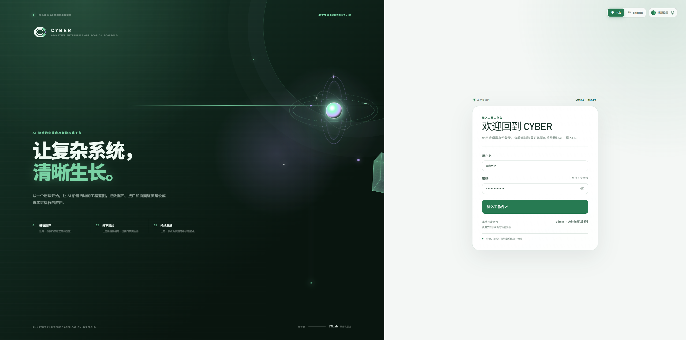
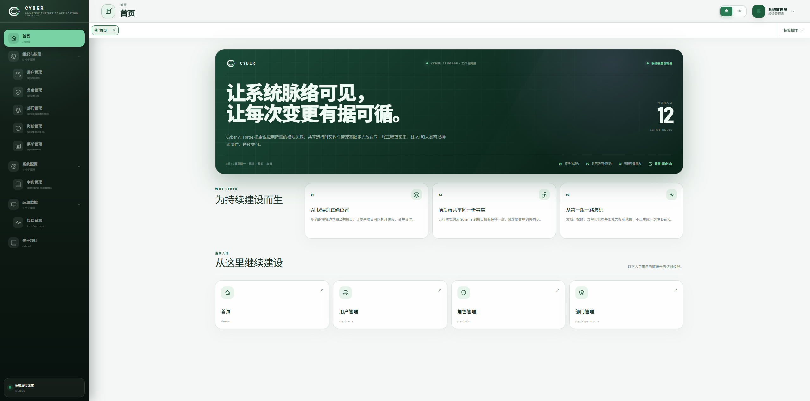
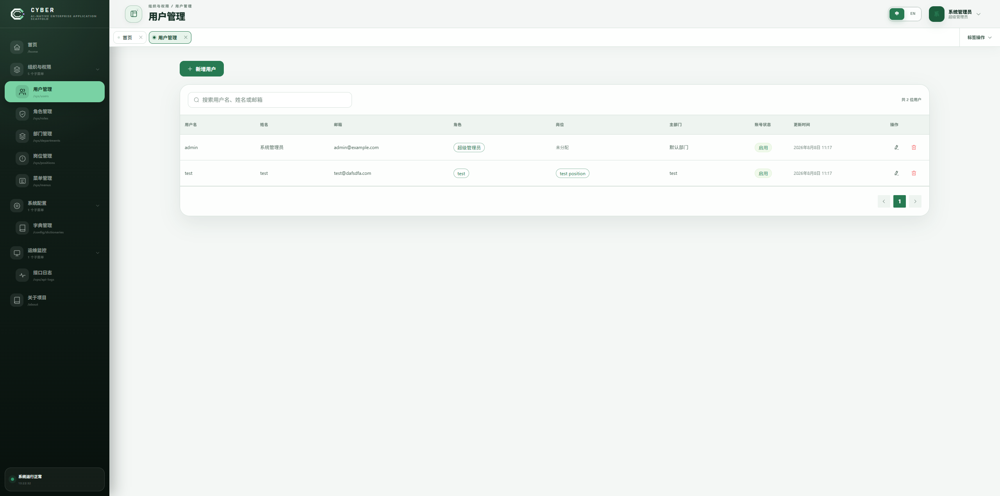
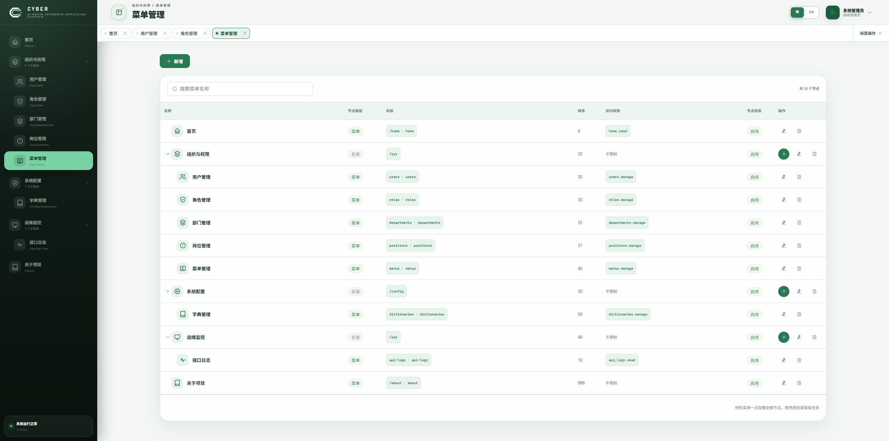
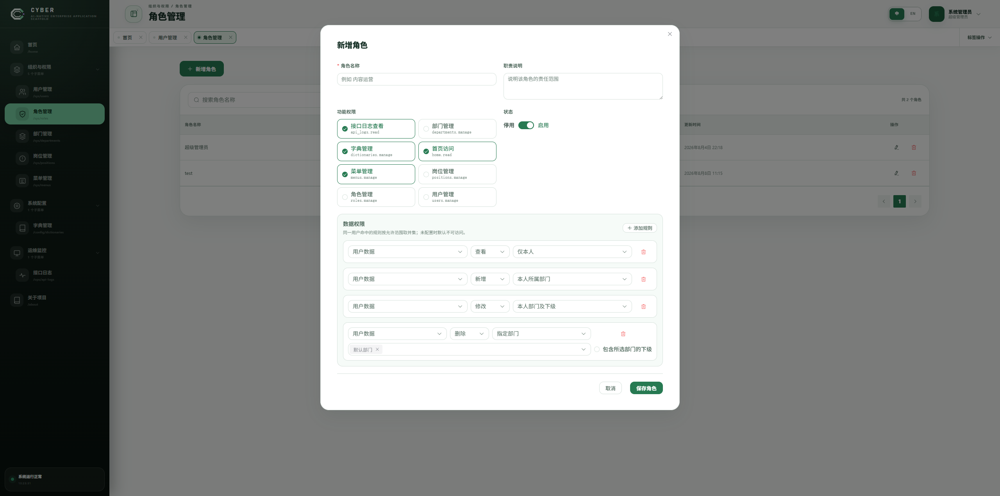
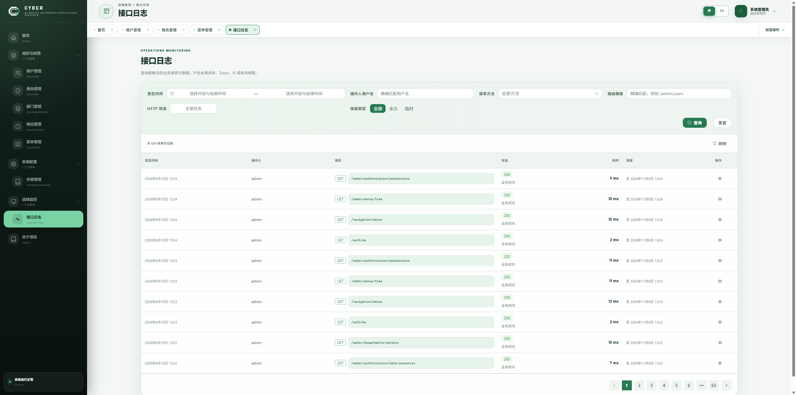
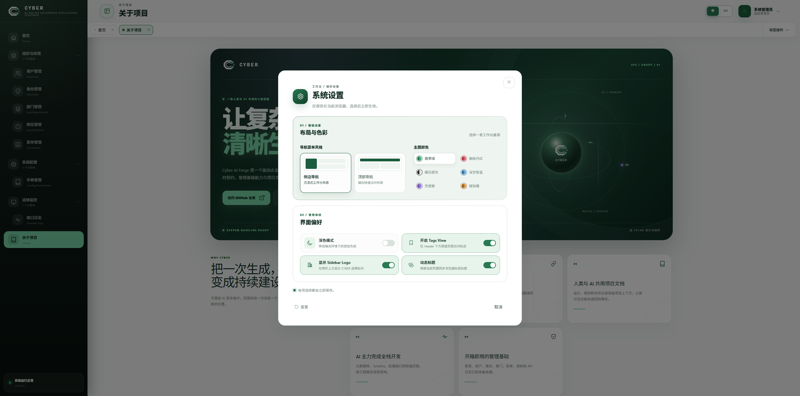

<p align="center">
  
</p>

<h1 align="center">Cyber-Sight</h1>

<p align="center">
  <a href="https://tanghaojie.github.io/Cyber-Sight/">Project Website</a>
  ·
  <a href="https://github.com/tanghaojie/Cyber-AI-Forge">Cyber AI Forge Upstream</a>
  ·
  <a href="./README.en.md">English</a>
  ·
  <a href="./docs/README.md">Documentation</a>
</p>

<p align="center">
  AI-Native Business Application<br />
  AI 原生业务应用
</p>

> 在清晰的工程基线上，让业务能力持续生长。

**Cyber-Sight** 是一个基于 [Cyber AI Forge](https://github.com/tanghaojie/Cyber-AI-Forge) 构建、准备持续增加独立业务能力的全栈应用。

它继承了适合人类与 AI 协作的工程结构、模块边界、后台基础能力和项目文档，并通过独立仓库持续演进产品能力。Cyber-Sight 使用 `origin` 保存自己的业务历史，通过只读 `upstream` 获取 Cyber AI Forge 更新。

> Build clearly. Evolve safely. 让复杂系统清晰生长。  
> Built on Cyber AI Forge. 基于 Cyber AI Forge 构建。

##  01 / Cyber-Sight 的工程基线

AI 已经可以生成大量代码，但“能生成代码”不等于“能持续完成一个项目”。当项目缺少清晰的结构和规则时，AI 很容易遇到这些问题：

- 不知道新代码应该放在哪里
- 重复实现已经存在的能力
- 随意跨模块修改，逐渐破坏项目边界
- 让前后端接口和数据结构失去同步
- 只能生成一次性的 Demo，无法持续演进

Cyber AI Forge 为 Cyber-Sight 提供人类和 AI 可以共同理解、共同使用、共同演进的企业应用工程基础。后续产品业务进入 `src/modules/biz/**`，通用脚手架增强优先回到 Cyber AI Forge，再通过上游同步进入本仓库。

##  02 / 核心亮点

以下工程能力继承自 Cyber AI Forge，并作为 Cyber-Sight 后续业务开发的系统基线。

### 02.1 / 为 AI 理解而组织的工程结构

Cyber AI Forge 不是把 AI 接到一个普通脚手架上，而是从模块边界、文件职责、接口契约和扩展流程开始，就按照 AI 协作开发的方式组织项目。

- 模块职责明确，AI 能找到正确的实现位置
- 对外能力通过稳定的公共文件暴露，减少随意跨模块修改
- 前后端和 API 契约拥有一致的模块命名
- 新增接口和业务模块有明确的实施路径
- 项目可以持续修改，而不是只能生成一次性 Demo

### 02.2 / 人类与 AI 共用的项目文档

Cyber AI Forge 不只提供给人类看的开发文档，也维护面向 AI 协作的项目规则、架构说明、设计文档和实施记录。

- 人类文档帮助维护者理解、运行、开发和维护项目
- AI 文档帮助 AI 恢复上下文、遵循规则并执行修改
- 设计文档记录模块边界、数据流、失败模式和验证策略
- 协作记录保留重要假设、实际改动和验证结果

这意味着，换一个 AI、开启一个新对话，项目仍然有一套正式文档帮助 AI 快速理解当前事实，而不是完全依赖聊天记录。

### 02.3 / AI 主力甚至全量完成全栈开发

人类负责表达想法、描述需求和判断结果，AI 可以主力完成从数据库、API 契约、后端接口到前端页面的实现。

例如，你可以告诉 AI：

> 我想做一个家庭记账系统，需要用户登录、账单分类、收入支出记录、月度统计和管理员功能。请在 Cyber-Sight 中实现这个应用。

AI 可以继续完成数据库设计、Schema 定义、后端路由、前端页面、菜单注册、权限接入、测试和构建。

### 02.4 / 开箱即用的管理系统基础能力

当前版本已经内置：

- 登录、认证与会话管理
- 用户、角色、部门和授权管理
- 数据库动态菜单与页面导航
- 字典管理
- 接口日志
- 工作台与管理后台应用壳
- 前端运行时多语言基础
- Swagger API 文档

### 02.5 / 前后端共享运行时契约

项目使用 Zod 定义 API 运行时 Schema，并在前端、后端之间共享：

- 前端使用 Schema 推导类型
- 后端在 HTTP 边界执行运行时校验
- Nest Pipe、响应校验与 OpenAPI Schema 从共享 Zod 契约派生
- Swagger/OpenAPI 可以从后端路由 Schema 生成

这让 AI 和人类都能围绕同一份接口事实进行开发，减少前后端失同步。

##  03 / 系统界面

README 中展示的截图来自仓库内可运行的管理端界面，覆盖登录入口、工作台、用户与菜单管理、角色权限、接口日志和系统设置。截图仅用于说明当前能力，不代表接入了远程演示环境。

<div align="center">
  
  
</div>

<div align="center">
  
  
</div>

<div align="center">
  
  
</div>

<div align="center">
  
</div>

##  04 / 适合谁使用

### 04.1 / 想通过 AI 做应用的普通人

如果你有一个应用想法，但几乎不会写代码，可以把 Cyber-Sight 当作 AI 的工作台：

1. 启动项目
2. 用自然语言告诉 AI 你想做什么
3. 让 AI 按照项目结构逐步实现功能
4. 在浏览器中查看结果并提出修改意见
5. 让 AI 继续完善、修复和扩展应用

它适合用来构建个人工具、内部管理系统、小型 SaaS、运营后台和其他需要登录、权限、数据库与管理页面的应用。

AI 负责实现，人类仍然负责表达需求、判断产品方向和验收结果。Cyber-Sight 的目标不是让人类失去参与，而是让业务想法可以在清晰工程边界中持续落地。

### 04.2 / 专业开发者

如果你是开发者，可以把 Cyber-Sight 作为真实项目的全栈起点：

- 直接复用登录、权限、菜单、用户和角色等系统能力
- 使用共享 API 契约保持前后端一致
- 按模块边界继续添加业务能力
- 让 AI 在明确的工程规则内协助开发
- 使用已有的测试、构建和设计文档降低维护成本

##  05 / 典型使用场景

- 企业内部管理后台
- 客户关系管理系统
- 订单、库存或业务运营系统
- 内容管理系统
- 项目管理和协作工具
- 个人知识库或家庭记账系统
- 小型 SaaS 产品的管理端
- 通过 AI 快速验证的个人应用

如果你的应用需要登录、权限、后台管理和数据库，Cyber-Sight 已经提供一个可靠的起点。

##  06 / 为什么不直接让 AI 从零搭建

当然可以直接让 AI 从一个空目录开始搭建应用。问题不在于 AI 能不能生成第一版代码，而在于这个项目能不能在第一版之后继续稳定地开发、维护和交接。

| 对比维度    | 直接让 AI 从零搭建                             | 在 Cyber-Sight 中开发                            |
| ----------- | ---------------------------------------------- | ------------------------------------------------ |
| 开始方式    | 从空目录和一次对话开始                         | 从可运行的全栈基础开始                           |
| AI 的上下文 | 主要依赖当前聊天记录                           | 项目结构、设计文档和 AI 协作文档共同提供上下文   |
| 基础能力    | 每个项目都要重新实现登录、权限、菜单和管理后台 | 已经内置登录、用户、角色、菜单、授权等系统能力   |
| 代码位置    | AI 需要自行猜测目录和模块职责                  | 模块边界、公共接口和新增功能路径已经明确         |
| 前后端协作  | 容易出现接口、类型和数据结构不一致             | 使用共享 Zod 运行时契约保持一致                  |
| 持续迭代    | 新对话容易遗忘之前的决定，项目逐渐失控         | 文档和工程规则帮助不同 AI 或新对话恢复项目上下文 |
| 最终结果    | 更容易得到一次性的 Demo                        | 更适合作为可维护、可扩展的真实应用起点           |

所以，Cyber-Sight 并不是替代 AI，而是为 AI 提供一个更可靠的产品与工程环境：

> 直接让 AI 搭建，解决的是“能不能做出第一版”；Cyber-Sight 解决的是“能不能沿着同一套产品事实继续做下去”。

### 06.1 / 项目越复杂，Cyber-Sight 的价值越明显

如果你只是想做一个一次性脚本、简单网页或短期 Demo，直接让 AI 从零搭建完全可以。Cyber-Sight 关注的是业务应用不断变大之后的协作和整合问题。

#### 06.1.1 / 按模块建设复杂项目

复杂应用通常需要把认证、用户、权限、订单、客户、报表等能力拆开，分阶段建设。没有统一的模块规则时，不同阶段很容易出现重复代码、职责混乱和互相影响；Cyber-Sight 继承了明确的模块边界、公共接口和扩展路径，让 AI 可以一次建设一个模块，同时保持整个项目结构稳定。

#### 06.1.2 / 多人和多 AI 协同工作

当一个人、多人，甚至多个 AI 同时开发项目时，大家必须共享同一套项目事实：目录怎么组织、接口怎么定义、模块之间怎么依赖、完成后如何验证。Cyber-Sight 把这些规则沉淀在工程结构和项目文档中，让不同的人和 AI 可以分工工作，最后交付能够合并的结果，而不是各自生成一套互不兼容的代码。

#### 06.1.3 / 整合多个系统和业务能力

整合型项目不仅要写新功能，还要把登录、权限、数据库、前端页面、业务模块以及未来可能接入的外部服务组合起来。Cyber-Sight 使用统一的 API 契约、系统模块和文档入口，帮助 AI 理解各部分如何连接，减少“每个模块单独能运行，合在一起却无法工作”的问题。

可以把 Cyber-Sight 理解成一张所有人和 AI 都能读懂、并在 Cyber AI Forge 基线上持续演进的工程蓝图：

> AI 可以负责各自的施工，Cyber-Sight 负责让所有施工遵循同一套图纸，最后组合成一个可以持续使用的系统。

##  07 / 如果你不懂技术，先把这份 README 交给 AI

如果你几乎不会写代码，不需要先弄懂 `pnpm`、`PostgreSQL`、`Zod` 这些技术词汇。你可以把这份 README 和项目一起交给支持项目文件访问的 AI，让 AI 先成为你的技术向导，再带着你一步一步完成开发。

如果你使用的是只能聊天的 AI，可以直接复制或上传这份 README；如果 AI 可以访问你的项目文件夹，就让它先阅读 `README.md`、`AGENTS.md` 和 `docs/README.md`。

把下面这段话发给 AI，然后补充你想做的应用：

```text
这是 Cyber-Sight 项目的 README，请先完整阅读它，并把我当作一个几乎不会写代码的人。

我想做的应用是：
（在这里用自己的话描述想法，例如：我想做一个家庭记账系统。）

请你作为我的技术向导，按下面的方式带我完成项目：

1. 先用简单中文告诉我这个项目能做什么，以及我们接下来要完成哪些阶段。
2. 先检查我的电脑和项目环境，告诉我缺少什么；不要假设我已经安装过任何工具。
3. 一次只指导我完成一个步骤。每次先说明这一步的目的，再告诉我具体要做什么。
4. 遇到技术词汇时，用普通人能听懂的话解释，不要只给出命令。
5. 每一步完成后等我反馈，再继续下一步；不要一次输出整个项目的所有代码。
6. 如果你可以操作当前项目，请先阅读 README.md、AGENTS.md 和 docs/README.md，再检查项目状态。
7. 任何可能删除文件、覆盖数据或影响数据库的操作，都要先提醒我并征得我的同意。
8. 每完成一个阶段，都告诉我如何在浏览器中检查结果，以及如果不符合预期该怎么告诉你。

请先不要修改代码，先完成项目介绍、环境检查和整体计划。
```

通常，AI 会带你依次完成：

1. 检查并准备运行环境
2. 启动 Cyber-Sight 自带的基础系统
3. 把你的想法拆成可以实现的功能
4. 设计数据库和页面结构
5. 分阶段实现功能并在浏览器中验收
6. 根据你的反馈继续修改和扩展

你不需要一次把需求说得很专业。可以先说“我想做一个客户管理工具”，再和 AI 一起逐步补充用户、页面、权限和业务规则。

##  08 / 快速开始

### 08.1 / 环境要求

- Node.js
- pnpm
- PostgreSQL

### 08.2 / 启动项目

```bash
pnpm install

# Windows PowerShell
Copy-Item apps/backend/.env.example apps/backend/.env
```

编辑 `apps/backend/.env`，填写全新空 PostgreSQL 数据库的连接信息，并设置至少 32 个字符的 `JWT_SECRET`：

```bash
pnpm db:migrate
pnpm dev
```

访问：

- 前端：http://localhost:5173
- 后端 API：http://localhost:3000
- Swagger UI：http://localhost:3000/docs

首次执行迁移会创建本地管理员：

```text
账号：admin
密码：Admin@123456
```

该凭据仅用于本地初始化。进入共享环境或生产环境前，必须修改密码并使用安全的密钥配置。

### 08.3 / 数据库注意事项

当前迁移链面向全新的空 PostgreSQL 数据库系统表基线，不支持旧数据库原地升级。旧数据库不能直接继续作为新版 `DATABASE_URL` 使用；需要保留旧数据时，应先停用旧库，再单独设计数据迁移方案。

详见[数据库基线重建指南](docs/guides/database-baseline-rebuild.md)。

##  09 / 如何让 AI 开发自己的应用

建议在每次较大的任务开始时，让 AI 先阅读项目文档和相关模块设计，再提出实施方案。例如：

```text
请先阅读项目根目录的 AGENTS.md、docs/README.md，以及与本需求相关的设计文档。

请基于当前项目的模块规范，新增一个“客户管理”模块，包含客户表、分页列表、新增、编辑和删除功能。请先说明模块边界、数据模型、API 契约和前端页面计划，再开始实施。完成后运行适用的测试、构建和格式检查，并汇报验证结果。
```

对于普通人来说，需求可以只用自然语言描述；对于开发者来说，可以继续补充数据模型、权限规则、交互细节和验收标准。

##  10 / 如何添加业务模块

新增业务能力时，推荐遵循这条路径：

1. 明确业务模块的职责和边界
2. 在 `packages/api-contract` 定义运行时 Schema 和推导类型
3. 在 `apps/backend/src/modules/<module>/` 实现后端模块与路由
4. 在 `apps/frontend/src/modules/<module>/` 实现前端模块与页面
5. 注册页面、菜单和权限
6. 补充后端与契约测试，列出前端人工验收场景
7. 运行格式检查、测试和生产构建

数据库动态菜单的页面加载器登记在所属模块的 `view-registry.ts` 中。中心注册表会在构建期自动发现它，之后在菜单管理中填写稳定的组件标识。

脚手架自带系统表统一使用 `sys_` 物理前缀、软删除，以及 `is_deleted`、`created_at`、`created_by`、`updated_at`、`updated_by` 五个生命周期字段。

##  11 / 技术架构

```text
人类描述需求
    ↓
AI 阅读项目文档并理解工程结构
    ↓
Vue 3 前端
    ↓
共享 Zod 运行时 API 契约
    ↓
NestJS 后端 + Fastify adapter + Swagger
    ↓
Drizzle ORM
    ↓
PostgreSQL
```

| 层级     | 技术与职责                                                 |
| -------- | ---------------------------------------------------------- |
| 前端     | Vue 3、Vite、Vue Router、Pinia、Element Plus、Tailwind CSS |
| 后端     | TypeScript、NestJS、Fastify adapter、认证与管理 API        |
| API 契约 | Zod 运行时 Schema、推导类型、Nest Pipe 与 OpenAPI Schema   |
| 数据访问 | Drizzle ORM                                                |
| 数据库   | PostgreSQL                                                 |
| 仓库管理 | pnpm monorepo                                              |

##  12 / 项目结构

```text
apps/
├── frontend/                 # Vue 前端和管理后台
├── backend/                  # NestJS/Fastify 服务、数据库和迁移
└── website/                  # 中英文静态推广站和 GitHub Pages 构建入口
packages/
└── api-contract/             # 前后端共享的 API 契约
docs/
├── design/                   # 当前系统与模块设计
├── guides/                   # 人类维护者操作指南
├── reference/                # 错误码等参考资料
└── README.md                 # 人类与 AI 共用的文档入口
```

系统能力和产品业务能力分别按 `src/modules/system/<module>/` 与 `src/modules/biz/<module>/` 组织。跨模块依赖必须通过登记过的公共接口完成。

##  13 / 常用命令

```bash
pnpm dev           # 启动前端、后端和 API 契约开发流程
pnpm build         # TypeScript 检查和生产构建
pnpm test          # 契约构建校验和后端测试
pnpm format        # 格式化项目文件
pnpm format:check  # 检查格式
pnpm lint          # ESLint 检查
pnpm db:generate   # 根据 Drizzle Schema 生成迁移
pnpm db:migrate    # 在全新空数据库应用迁移
pnpm test:db       # 检查 PostgreSQL、系统表和迁移记录
```

前端目前不维护自动化单元、组件或浏览器测试；前端功能和浏览器行为由维护者人工验收。后端和共享契约继续使用自动化测试验证。

##  14 / 项目文档

[项目文档入口](docs/README.md)同时包含面向人类维护者和 AI 协作的当前项目知识：

- [人类维护者开发指南](docs/guides/human-maintainer-development-guide.md)：目录职责、运行时 Schema、Drizzle、后端测试、前端人工验收和数据库维护流程
- [系统与模块设计](docs/design/README.md)：当前架构、模块边界、公共接口、数据流和验证策略
- [数据库基线重建指南](docs/guides/database-baseline-rebuild.md)：新建数据库、执行基线、验证与回滚边界
- [Cyber AI Forge 上游同步指南](docs/guides/upstream-sync.md)：安全配置、同步分支、冲突所有权和验证流程
- [错误码参考](docs/reference/error-codes.md)：统一响应、错误码区间和登记流程

项目根目录的 `AGENTS.md` 记录 AI 修改项目时必须遵守的协作规则。重要的设计、实施和验证结果会继续同步到项目文档，而不是只留在聊天记录中。

##  15 / 品牌与白标配置

Cyber-Sight 由 JTLab 维护，并基于 Cyber AI Forge 构建。正式名称为 `Cyber-Sight`，界面短名称为 `CYBER-SIGHT`；英文副标题为 `AI-Native Business Application`，中文副标题为 `AI 原生业务应用`。前端继续使用石墨黑、暖白、薄荷绿 `#70CFA2` 和电紫节点构成的品牌系统。

根包名、`@cyber-ai-forge/*` workspace 作用域、JWT issuer/audience 和浏览器存储键继续保留 Cyber AI Forge 技术标识，以维持上游同步和运行时兼容；它们不是产品品牌遗漏。

应用文字配置位于 `apps/frontend/src/config/app.config.ts`。也可以复制 `apps/frontend/.env.example`，通过以下变量按部署环境覆盖：

- `VITE_APP_NAME`
- `VITE_APP_FULL_NAME`
- `VITE_APP_TAGLINE`
- `VITE_APP_PRODUCT_LABEL`
- `VITE_APP_GITHUB_URL`

白标部署时，还应同步替换 `CyberLogo.vue` 和 `public/cyber-mark.svg`，避免产品名称与默认 C 形产品标不一致。

##  16 / 当前实现边界

当前版本已经完成上述管理系统基础能力，适合继续添加真实业务模块。为了让使用者正确评估项目，也需要了解这些边界：

- 当前数据库实现绑定 PostgreSQL
- 初始迁移只面向全新空数据库
- 管理端与后端尚无 CI 和生产部署基线；推广站仅提供 GitHub Pages 自动部署
- 生产环境仍需由维护者完成密钥、初始密码、部署和安全配置
- 前端功能和浏览器行为需要人工验收

这些边界不影响项目作为 AI 全栈开发起点，但在进入共享环境或生产环境前必须单独完成相应的工程工作。

##  17 / 项目愿景

Cyber-Sight 希望在可靠的工程基线上，把一个业务想法持续建设为真正可用、可维护、可扩展的应用。

人类提出想法，AI 主力实现；项目结构和文档让 AI 不迷路；清晰的工程边界让应用可以从一个想法，逐步成长为真正可用、可维护、可扩展的系统。

##  18 / 参与项目

欢迎通过 [Cyber-Sight Issues](https://github.com/tanghaojie/Cyber-Sight/issues) 反馈产品问题和业务建议。可复用于其他项目的脚手架增强应优先提交到 [Cyber AI Forge](https://github.com/tanghaojie/Cyber-AI-Forge)，再按[上游同步指南](docs/guides/upstream-sync.md)进入本仓库。提交代码或较大的设计变更前，请先阅读[项目文档](docs/README.md)和根目录的 [AGENTS.md](AGENTS.md)。
