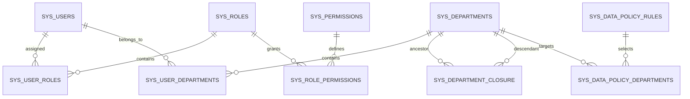

# 授权数据库模型

## 目标与边界

本文面向需要理解数据库设计、排查授权结果或新增受控资源的维护者。它将授权模型分成两层：

1. 功能权限：用户能否使用某项能力或调用某条接口。
2. 数据权限：通过功能权限后，用户能读写哪些业务记录。

功能权限是数据权限的前置条件，但二者使用不同关系表和查询路径。当前只有 users 数据资源启用数据范围；其他系统模块目前只检查功能权限。

岗位模块的 `sys_positions` 和 `sys_user_positions` 属于组织主数据，不属于本授权模型。岗位不能作为角色、权限或数据策略主体；第一版岗位接口只受 `positions.manage` 功能权限保护。

所有物理表为应用系统表，使用 sys_ 前缀。Drizzle 导出名与物理表名的完整映射见[数据库 Schema 与迁移基线](database-schema-and-migrations.md)。



## 共同生命周期字段

除 PostgreSQL 枚举外，所有授权相关系统表都复用以下字段：

| 字段                   | 含义                                                              |
| ---------------------- | ----------------------------------------------------------------- |
| is_deleted             | 软删除标记。运行时仅使用 false 的记录；取消授权不会抹掉审计历史。 |
| created_at、created_by | 创建时间与创建者 ID。                                             |
| updated_at、updated_by | 最近更新时间与操作者 ID。                                         |

关系表的唯一约束几乎都采用 WHERE is_deleted = false 的部分唯一索引。这样可保留历史关联，并在再次授予相同角色、部门或策略时恢复旧记录，同时避免两条相同关系并存为有效状态。

## 功能权限

### 表与字段

| 物理表               | 作用                       | 关键字段与约束                                                                                              |
| -------------------- | -------------------------- | ----------------------------------------------------------------------------------------------------------- |
| sys_users            | 用户主体                   | id 为主键；enabled 决定用户是否可作为有效身份使用。                                                         |
| sys_roles            | 角色定义                   | id 为主键，用于角色关联；name 为展示名称；enabled 可使角色整体失效。                                        |
| sys_user_roles       | 用户与角色的多对多归属     | user_id 指向 sys_users.id，role_id 指向 sys_roles.id；有效的 (user_id, role_id) 唯一。                      |
| sys_permissions      | 稳定功能权限目录           | key 全局唯一，例如 users.manage；另有 module、name、description 和 enabled。key 是不复用的对外稳定标识。    |
| sys_role_permissions | 角色与权限的多对多授予     | role_id 指向 sys_roles.id，permission_key 指向 sys_permissions.key；有效的 (role_id, permission_key) 唯一。 |
| sys_menus            | 导航元数据，非授权决策来源 | required_permission_key 可为空；非空时外键指向 sys_permissions.key，用于筛选菜单可见性。                    |

sys_role_permissions 引用 permission_key 而非 sys_permissions.id。这使路由声明、菜单配置、迁移种子与数据库授予使用同一个稳定权限键，不需要转换内部 ID。

### 有效权限的查询逻辑

请求期的功能权限集合在逻辑上等价于：

```sql
SELECT DISTINCT rp.permission_key
FROM sys_user_roles AS ur
JOIN sys_roles AS r ON r.id = ur.role_id
JOIN sys_role_permissions AS rp ON rp.role_id = r.id
JOIN sys_permissions AS p ON p.key = rp.permission_key
WHERE ur.user_id = :current_user_id
  AND ur.is_deleted = false
  AND r.enabled = true
  AND r.is_deleted = false
  AND rp.is_deleted = false
  AND p.enabled = true
  AND p.is_deleted = false;
```

实现会先取得用户的有效角色 ID，再查询该集合的有效 permission_key，最后去重。它不读取菜单关系；sys_role_menus 仅保留初始兼容数据，不能作为 API 授权依据。

路由要求 users.manage 时，只检查结果集合是否包含该键。多个角色的权限取并集；当前模型没有功能权限 deny、优先级或角色继承。

### 初始数据

初始迁移 apps/backend/drizzle/0000_initial_system_schema.sql 会创建权限目录、超级管理员角色及归属，并授予该初始角色当时已登记的功能权限；后续追加迁移以同一关系模型登记新能力，例如 `0005_dynamic_home_menu.sql` 为超级管理员追加 `home.read`。超级管理员不依赖运行时用户 ID 或角色编码绕过；其能力同样来自上述关系表。

## 数据权限

### 组织关系与范围展开

数据权限除了策略表，还依赖用户、角色和部门上下文。

| 物理表                 | 作用                   | 关键字段与约束                                                                                                                 |
| ---------------------- | ---------------------- | ------------------------------------------------------------------------------------------------------------------------------ |
| sys_departments        | 部门邻接表             | id 用于部门关联；parent_id 保存直接父部门，根部门为 0；name 为展示名称；enabled 控制部门是否参与有效范围。                     |
| sys_department_closure | 部门闭包表             | ancestor_id、descendant_id 均外键指向部门；depth = 0 表示本部门到自身；有效路径 (ancestor_id, descendant_id) 唯一。            |
| sys_user_departments   | 用户与部门的多对多归属 | user_id、department_id 均为外键；is_primary 标记主部门。有效 (user_id, department_id) 唯一，且一个用户最多一条有效主部门记录。 |

sys_departments.parent_id 保存树的直接关系，sys_department_closure 保存全部路径。例如 (10, 35, 2) 表示部门 35 是部门 10 的两级下属。这样，“部门及其下级”可按 ancestor_id 直接查询，不需要在每个授权请求中递归遍历树。部门创建、移动或删除时在同一事务中重建或失效对应闭包路径。

### 策略表与字段

sys_data_policy_rules 是数据权限主表；一条记录表示“某类主体对某资源的某动作拥有一种允许范围”。

| 字段                | 含义                                                                                  |
| ------------------- | ------------------------------------------------------------------------------------- |
| id                  | 策略规则主键。                                                                        |
| subject_type        | PostgreSQL 枚举：user、role、department。                                             |
| subject_id          | 主体 ID；与 subject_type 共同决定引用哪一种主体。                                     |
| resource_key        | 数据资源稳定键，当前登记资源为 users。                                                |
| action              | read、create、update 或 delete。                                                      |
| scope_type          | PostgreSQL 枚举：self、own_department、own_department_tree、custom_departments、all。 |
| inherit_to_children | 仅对部门主体有含义；允许祖先部门的策略传给下级部门成员。                              |
| enabled             | 可在保留规则的同时临时停用它。                                                        |

subject_id 没有直接外键：它是一个多态关联，可能指向用户、角色或部门，普通单列外键无法表达。保存策略时应用会根据 subject_type 验证主体存在；运行时还会过滤无效角色、部门和归属关系。

有效规则的部分唯一索引为：

```text
(subject_type, subject_id, resource_key, action, scope_type)
WHERE is_deleted = false
```

同一个主体可同时拥有 users/read/own_department 和 users/read/custom_departments 两种规则，但不能拥有两条完全相同的有效规则。规则之间按 allow 并集计算。

sys_data_policy_departments 仅承载 custom_departments 的部门明细：

| 字段                | 含义                                  |
| ------------------- | ------------------------------------- |
| rule_id             | 外键，指向 sys_data_policy_rules.id。 |
| department_id       | 外键，指向策略显式选择的部门。        |
| include_descendants | 该部门是否扩展到全部有效下级部门。    |

有效 (rule_id, department_id) 唯一。数据库允许每个部门明细有不同 include_descendants 值；当前管理界面在一次提交中对同一条规则的所有选中部门写入同一个开关值。

### 策略来源与生效筛选

对当前用户 U 和某个 (resource_key, action)，运行时先获得：

```text
U 的有效角色
U 的有效直属部门
U 的直属部门的有效祖先部门
```

随后查询以下四类主体的有效规则：

```text
user:U
role:U 的任一有效角色
department:U 的任一有效直属部门
department:U 的任一祖先部门，且 inherit_to_children = true
```

规则查询还要求 resource_key、action 完全匹配，并过滤 enabled = false 或 is_deleted = true 的规则。禁用或软删除的角色、部门、用户角色归属、用户部门归属不会产生有效策略来源。

### 范围到查询计划的转换

授权模块不向业务模块传递 SQL，而是生成中立计划：

```text
DataAccessPlan {
  unrestricted: boolean
  ownerUserIds: number[]
  departmentIds: number[]
}
```

| scope_type          | 计划结果                                                                          |
| ------------------- | --------------------------------------------------------------------------------- |
| self                | 将当前用户 ID 放入 ownerUserIds。                                                 |
| own_department      | 将当前用户的所有有效部门放入 departmentIds。                                      |
| own_department_tree | 通过闭包表加入当前用户部门及所有有效下级部门。                                    |
| custom_departments  | 加入策略明细中的有效部门；include_descendants = true 的部门再通过闭包表展开下级。 |
| all                 | 直接设置 unrestricted = true。                                                    |

合并时，用户 ID 与部门 ID 都去重并取并集。任一命中规则为 all 时立即得到无范围限制的计划；没有命中规则时得到 unrestricted = false 且两个集合均为空，即默认拒绝。

inherit_to_children 与 include_descendants 的方向不同：前者决定策略从哪个部门主体传给谁，后者决定该策略可覆盖哪些目标部门数据。

### 当前 users 资源的最终过滤

当前只有 users 资源把数据访问计划编译为数据库谓词。逻辑上等价于：

```sql
WHERE u.is_deleted = false
  AND (
    u.id IN (:owner_user_ids)
    OR u.id IN (
      SELECT ud.user_id
      FROM sys_user_departments AS ud
      WHERE ud.department_id IN (:department_ids)
        AND ud.is_deleted = false
    )
  )
```

当 unrestricted = true 时，不追加括号中的范围条件；当两个允许集合都为空时，仓储显式生成恒假条件，而不是查询全部用户。

同一谓词复用在用户列表、分页总数、更新和删除，避免出现“列表不可见但能按 ID 修改或删除”的越权路径。创建没有既存行可过滤，因此创建用户或修改部门归属时，会单独校验目标部门全部落在操作者的允许部门范围中；self 不可用于 create。

## 写入与一致性

策略保存采用整体替换语义，并在一个数据库事务中执行：

1. 验证权限键、资源、动作、范围和部门引用。
2. 对角色主体，软删除旧的 sys_role_permissions 有效关联后恢复或新增请求中的关联。
3. 软删除旧的 sys_data_policy_departments 明细和 sys_data_policy_rules 规则。
4. 恢复既有历史规则或插入新规则，并恢复或插入其自定义部门明细。

这使“当前有效集合”具有替换语义，同时保留完整审计痕迹。功能权限或策略变更不写入 JWT；下一请求会按当前数据库关系重新解析授权结果。

## 安全边界与扩展规则

- 菜单可见性只是导航体验，不能替代后端功能权限检查。
- 数据策略中不存 SQL、物理表名或列名；资源仓储负责把中立计划映射为参数化查询条件。
- 第一版没有 deny、优先级、角色继承、字段级脱敏、租户、通用 ACL 或 PostgreSQL RLS。
- 新增受控资源时，必须先在授权资源目录登记资源、动作和允许范围，再为该资源仓储实现完整的计划编译器，并确保列表、总数、详情、更新、删除与批量操作使用一致范围。

## 相关设计

- [授权与数据范围模块](modules/authorization.md)
- [用户模块](modules/users.md)
- [部门模块](modules/departments.md)
- [数据库 Schema 与迁移基线](database-schema-and-migrations.md)
- [ADR-0025：可插拔功能授权与数据范围](../decisions/ADR-0025-pluggable-authorization-and-data-scope.md)
