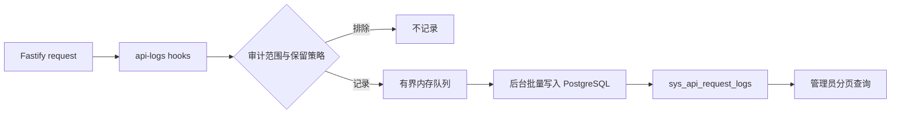

# 接口日志模块

## 目标与范围

`api-logs` 记录业务 HTTP API 的最小请求结果，供具有 `api_logs.read` 权限的管理员按条件分页查询。所有已匹配的业务 API 都记录；`/health` 和 `/docs` 前缀完全排除。非 Swagger、非健康检查的 404，以及业务 API 的 401、权限拒绝和其他失败均作为普通记录保留 90 天。

`POST /auth/login` 的成功、凭据失败和校验失败日志永久保留。用户删除是软删除，仍使用普通 90 天保留期。日志不保存请求或响应 body、查询参数、HTTP 头、Cookie、Token、IP 或 User-Agent；登录日志仅保存尝试或成功的用户名，绝不保存密码。

## 职责与边界

- 模块拥有 `sys_api_request_logs` 表、日志保留期、后台批量持久化和管理员查询 API。
- Fastify Hook 只采集生命周期元数据，并把事件交给模块的有界队列；不把数据库写入、筛选规则或保留策略散落到业务路由。
- `auth` 路由通过显式审计配置声明登录的永久保留和用户名提取规则，不直接写日志表。
- `authorization` 只负责 `api_logs.read` 功能权限；它不读取日志表。
- 模块不负责外部日志采集、监控平台、消息队列、全文检索、请求体/响应体留存或用户可编辑的日志。

## 公共接口

- 后端 `api-logs.plugin.ts`：注册请求采集 Hook、声明审计路由配置类型。
- 后端 `api-logs.routes.ts`：注册 `GET /admin/api-logs`。
- 后端 `api-logs.service.ts`：封装入队、批量落库、关闭时有限 flush 和保留期清理。
- 契约 `api-logs.schema.ts`：导出查询与分页响应 Schema。
- 前端 `api-logs.api.ts`：封装接口日志分页查询。
- 前端 `registerViews.ts`：以稳定 key `api-logs` 登记管理员页面；`pages/ApiLogsPage.vue`
  协调列表和详情抽屉。

## 数据模型和保留期

`sys_api_request_logs` 的每一行保存完成时间、可空过期时间、请求 ID、操作者 ID 与用户名快照、请求方法、路由模板、HTTP 状态、业务状态和耗时。`expires_at IS NULL` 表示永久保留；其他记录在完成时间后 90 天过期。

操作者 ID 不设外键，用户名以快照保存，避免用户软删除或未来清理时破坏历史记录。日志行不可由业务 API 更新；保留期任务以物理删除清理到期普通日志。

## 请求数据流

Hook 在 `onRequest` 记录起始时间，在 `preValidation` 仅从登录请求提取用户名，在 `preSerialization` 提取统一响应外壳的业务 `status`，并在 `onResponse` 形成最终事件。认证 Hook 完成后写入的 `request.accessUser` 会被用于操作者快照。

队列容量固定；写库失败时会在有限重试后保留可容纳的事件，容量耗尽时优先丢弃普通 90 天日志。Pino 记录限频内部错误，但日志失败绝不改变已发送的业务响应。服务关闭时只进行有时限的 flush，避免发布或重启被日志阻塞。

## 保留期任务

进程监听成功后异步执行一次过期清理，之后每 24 小时运行一次。清理使用 PostgreSQL 事务级 advisory lock，避免多实例同时删除；每批最多删除 1,000 条、每轮最多 10 批地物理删除 `expires_at <= now()` 的记录。清理失败只写 Pino 错误，下一次计划任务重试。

## 查询与授权

`GET /admin/api-logs` 使用标准 `pageNum`、`pageSize` 分页，并支持按时间、操作者、方法、路由、HTTP 状态和永久/临时保留类型筛选。该路由要求 `api_logs.read`；查询日志自身也作为普通业务 API 记录。

## 前端审计工作台

前端管理员页面是只读的脱敏审计查询台：筛选栏提供发生时间范围、操作人用户名、请求方法、
路由模板、HTTP 状态和保留类型；页面向 API 传递非空的精确匹配条件，不能把后端的等值查询
误导成模糊搜索。操作人 ID 保留在详情抽屉中，不作为常规筛选条件，避免与用户名同时筛选造成
难以理解的交集。

表格按后端时间倒序展示时间、操作人、方法和路由、HTTP/业务状态、耗时与保留期。详情抽屉只
展示已在共享契约公开的元数据，并提供请求 ID 复制；永久日志明确标记，临时日志显示精确过期
时间。页面无新增、编辑、删除或自动轮询，避免引入不存在的聚合 API、删除能力或额外审计流量。

时间选择器在页面内部保存本地 `Date`，请求边界才转换为 ISO 8601，确保时区和包含式结束时间
与后端 `occurredFrom` / `occurredTo` 的语义一致。加载或业务失败清空旧列表并显示本地化错误；
窄屏时筛选栏改为单列，表格横向滚动，详情由抽屉完整呈现。

## 失败模式与验证

- 数据库短暂不可用：队列重试；溢出可丢日志而不影响业务请求。
- 登录输入无效：仍永久记录请求结果，但可能没有用户名快照。
- 404 没有路由模板：记录固定未匹配标识，不保存原始 URL 或查询参数。
- 未配置审计策略的新业务路由：默认记录 90 天；只有显式排除的基础设施路由不记录。

后端测试覆盖保留期选择、敏感字段不入库、Hook 采集、队列降级、权限、分页与清理；数据库 Schema
和迁移测试覆盖表、索引、菜单种子和初始超级管理员权限。AI 执行前端格式、静态检查、TypeScript
检查与生产构建；维护者人工验收筛选、详情抽屉、权限过滤、菜单导航及窄屏布局。
