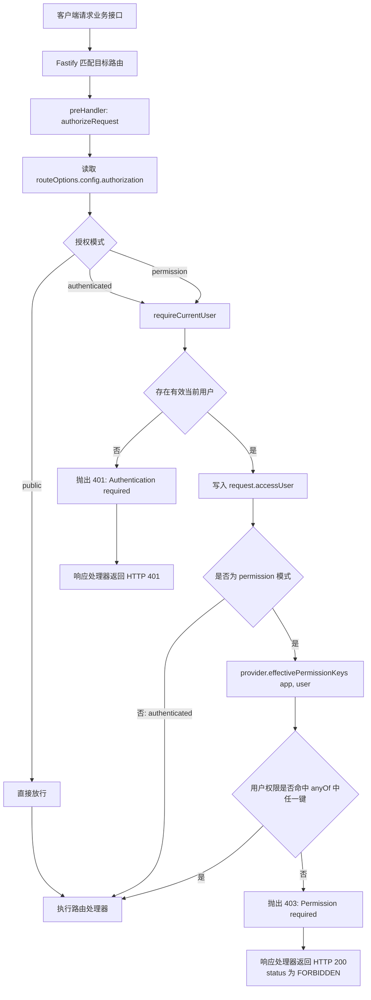

# 授权与数据范围模块

## 背景与目标

`authorization` 在认证之后统一完成两类决策：用户是否能够调用一个业务能力，以及能力被允许后能够读取或修改哪些业务记录。它以本地 PostgreSQL 策略提供器作为默认实现，并通过稳定端口允许以后接入 Cerbos 等外置策略决策点。

认证、菜单可见性和数据过滤不能互相替代。前端菜单只提供导航体验；所有非公开后端路由仍必须显式声明 `public`、`authenticated` 或一个或多个稳定权限键。

## 范围与非目标

当前范围包括权限目录、角色功能授权、用户/角色/部门数据策略、有效权限解析、数据查询计划、Fastify 路由门禁、管理 API 和前端策略编辑器。

第一版不实现 deny、优先级、角色继承、字段级脱敏、租户、通用资源 ACL、PostgreSQL RLS 或 Cerbos 运行时。多角色和多策略按 allow 并集计算；无匹配规则默认拒绝。

## 职责与边界

- `auth` 只确认会话身份并提供当前用户，不把权限写入 JWT。
- `roles` 拥有角色定义，`users` 拥有用户及角色/部门归属，`departments` 拥有组织树。
- `authorization` 拥有物理表 `sys_permissions`、`sys_role_permissions`、`sys_data_policy_rules` 和 `sys_data_policy_departments`，并读取有效角色和部门上下文完成决策。
- `sys_menus` 保存可选的 `required_permission_key`，导航通过本模块返回的有效权限过滤，不再把 `sys_role_menus` 作为运行时授权来源。
- 业务资源拥有自己的 Drizzle 表和数据范围编译器；本模块只返回受限的中立计划，不接收或保存原始 SQL。

## 公共接口

后端公共文件：

- `authorization.route.ts`：注册权限目录、数据资源目录和主体访问配置 HTTP API。
- `authorization.provider.ts`：定义 `AuthorizationProvider` 端口和默认 `LocalAuthorizationProvider`；`buildApp()` 支持注入替代实现。
- `authorization.service.ts`：实现有效权限解析、`resolveDataAccess`、allow 并集合并与主体策略事务替换。
- `authorization.plugin.ts`：校验路由授权声明并在请求前执行认证或功能权限检查。
- `authorization.references.ts`：向部门删除校验公开策略引用查询。

前端公共文件：

- `authorization.api.ts`：读取权限/资源目录以及用户、角色、部门访问配置。
- `DataPolicyEditor.vue`：供用户、角色和部门管理弹窗复用的数据策略编辑器。

HTTP API：

- `GET /admin/authorization/permissions`
- `GET /admin/authorization/data-resources`
- `GET/PUT /admin/authorization/roles/{id}`
- `GET/PUT /admin/authorization/users/{id}`
- `GET/PUT /admin/authorization/departments/{id}`

## 功能权限模型

模块在代码和迁移中登记稳定权限键，例如 `users.manage`、`roles.manage`、`departments.manage`、`menus.manage` 和 `dictionaries.manage`。`sys_permissions.key` 全局唯一且不复用；角色通过 `sys_role_permissions` 获得权限。

菜单可引用一个权限键。当前用户拥有该权限时菜单节点可见，目录祖先仅作为结构节点自动补齐。没有权限键的菜单对所有已认证用户可见。管理接口使用与对应页面相同的模块级权限键；后续可增加 `users.read`、`users.delete` 等细分键而无需替换数据模型。

Fastify 路由必须声明：

```text
public
authenticated
permission(anyOf: [...])
```

缺少声明会在应用组装时失败。功能权限不足由响应处理器转换为 HTTP 200 的 `FORBIDDEN` 业务错误；未认证仍返回 HTTP 401。

## 请求期授权调用流程

`registerAuthorization()` 必须先于业务路由注册。它在路由注册期通过 `onRoute` 拒绝没有 `config.authorization` 的路由；在每个匹配请求的 `preHandler` 阶段执行以下流程：



`public` 不读取当前用户；`authenticated` 只要求登录；`permission` 在登录后通过 `AuthorizationProvider` 解析有效权限，且只要命中 `anyOf` 中任意一个权限键即可继续。通过认证的用户会缓存到当前请求的 `request.accessUser`，路由处理器无需再次解析会话。

## 数据策略与继承

每条策略由授权主体、业务资源、动作和数据范围组成。主体可以是 `user`、`role` 或 `department`；范围可以是：

- `self`：资源的用户归属等于当前用户。
- `own_department`：资源属于当前用户任一有效部门。
- `own_department_tree`：资源属于当前用户部门或其后代。
- `custom_departments`：资源属于策略显式选择的部门，可分别包含后代。
- `all`：不追加数据过滤。

用户的有效策略是用户直接策略、所有有效角色策略、所在部门直接策略以及允许向下继承的祖先部门策略的并集。禁用或软删除的用户、角色、部门、归属和策略不生效。

部门主体策略的 `inherit_to_children` 只控制祖先部门策略是否传给后代部门成员；它与目标范围中的“包含部门后代”是两个独立方向。

## 数据查询计划

`AuthorizationProvider.resolveDataAccess(app, principal, resource, action)` 返回：

```text
unrestricted
ownerUserIds
departmentIds
```

无匹配策略时两个集合为空且 `unrestricted = false`，业务仓储必须生成恒假条件。任意 `all` 策略使计划短路为 unrestricted。

业务资源显式登记支持的归属维度。公共资源不登记数据维度，只做功能权限；用户归属资源映射用户列；组织归属资源映射部门列；确有角色业务归属时可登记有明确语义的 `assigned_role_id`，但角色作为授权来源时不复制到业务记录。

第一批只有 `users` 资源启用数据范围。用户列表、总数、更新和删除使用相同条件；创建用户校验目标部门都位于创建范围。详情不可见时按资源不存在处理，避免泄漏存在性。

## 数据模型与迁移

- `sys_permissions`：稳定权限目录。
- `sys_role_permissions`：角色功能授权。
- `sys_data_policy_rules`：主体、资源、动作、范围和部门继承开关。
- `sys_data_policy_departments`：自定义部门范围。
- `sys_menus.required_permission_key`：导航与功能权限的关联。

全新数据库基线直接创建权限菜单并为初始超级管理员角色写入所有登记权限及 `users` 所有动作的 `all` 数据策略。`sys_role_menus` 同步写入初始兼容关系，但运行时不再将其作为授权来源。

面向维护者的表关系、字段语义、唯一约束和查询展开过程见[授权数据库模型](../authorization-database-model.md)。

## 失败模式与安全考虑

- 不允许保存资源未登记的动作或范围。
- 数据策略永远不接受 SQL、表名或列名。
- 数据范围必须同时作用于列表、count、单条写入、删除和批量操作。
- 功能权限与数据策略变更不进入 JWT；默认本地提供器每次从数据库解析，保证下一请求生效。
- 多实例仍受 auth 进程内会话缓存的既有一致性边界影响，但授权决策本身不使用该角色快照。
- 超级管理员通过显式授权获得权限，不以用户 ID 或名称在运行时绕过。

## 测试与验证策略

- Schema 和迁移测试覆盖系统表前缀、审计字段、唯一性、单一基线与超级管理员种子。
- 纯函数测试覆盖 allow 并集、默认拒绝和 all 短路。
- 路由测试覆盖未认证、功能权限不足以及全部路由存在声明。
- 用户仓储通过同一谓词实现列表/count/更新/删除范围，创建和归属变更执行目标部门校验；数据库级集成验证留给独立环境。
- 前端只执行格式、类型和生产构建；策略编辑、菜单过滤和三类主体弹窗由维护者人工验收。

## 兼容性与迁移

单一基线在应用启动前一次性创建权限目录、角色授权和超级管理员策略，避免管理员被锁定。`sys_role_menus` 只保留兼容关系，不是权威来源。前端角色弹窗从菜单 ID 改为权限目录复选项，并同时编辑角色数据策略。角色、用户和部门定义与授权配置使用连续两次 API 保存；若第二步失败，界面保留弹窗并明确提示主体已保存但授权未完成。

## 未决问题

无。用户已确认一个主部门加多个附属部门、allow 并集、可选部门向下继承、无角色继承、第一版无 deny、按资源和动作配置以及本地 Provider 默认/Cerbos 可选。

## 相关 ADR、计划和 AI 日志

- [ADR-0025](../../decisions/ADR-0025-pluggable-authorization-and-data-scope.md)
- [实施计划](../../archive/plans/2026-07-30-pluggable-authorization.md)
- [AI 协作记录](../../archive/ai-logs/2026/07/2026-07-30-pluggable-authorization.md)
