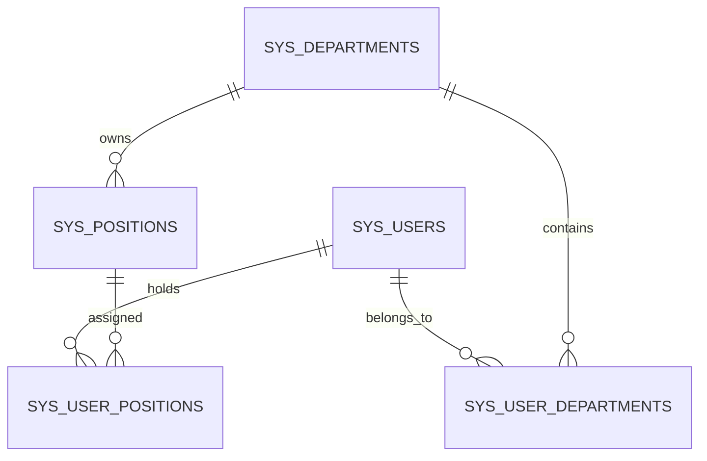
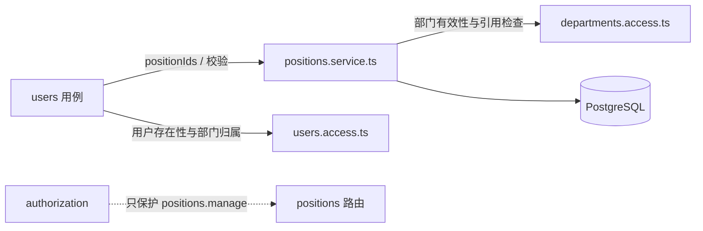

# 岗位管理模块

## 定位

`positions` 是脚手架内置的组织主数据模块，稳定模块名为 `positions`，前后端均归入 `system`。它描述“用户在组织中担任什么岗位”，不描述“用户可以使用什么功能”。

本设计是实现前的提案；在维护者确认岗位是否按部门归属、是否需要主岗位之前，不创建代码、契约或数据库迁移。

## 职责与边界

### 职责

- 管理岗位定义：编码、名称、所属部门、说明、排序和启用状态。
- 管理用户与岗位的多对多任职关系。
- 校验岗位所属部门、用户部门归属和岗位任职关系的一致性。
- 提供岗位列表、启用岗位选项和用户岗位归属所需的公共查询。
- 通过稳定的 `positions.manage` 功能权限保护岗位管理 API。

### 不负责的内容

- 不拥有用户主表、用户—部门关系、部门树或角色定义。
- 不把岗位当作角色；岗位不授予功能权限、菜单权限或数据权限。
- 不拥有部门负责人、汇报关系、编制、职级、薪酬、任职历史、租户或虚拟团队。
- 不在第一版实现岗位层级、岗位继承、一个岗位跨多个部门的复用或岗位数据范围。

### 数据所有权

| 数据                    | 所有模块        | 其他模块的访问方式                                            |
| ----------------------- | --------------- | ------------------------------------------------------------- |
| 岗位定义                | `positions`     | 通过 `positions.access.ts` 和岗位管理 API                     |
| 用户—岗位有效/历史关系  | `positions`     | 通过 `positions.access.ts`、`positions.service.ts` 的公共命令 |
| 用户主表、用户—部门关系 | `users`         | 通过 `users.access.ts`                                        |
| 部门树、部门闭包        | `departments`   | 通过 `departments.access.ts`                                  |
| 功能权限和数据策略      | `authorization` | 通过 `authorization` 公共 API                                 |

`users` 可以在用户创建/编辑用例中提交 `positionIds`，但不得直接写 `sys_user_positions`；用户岗位关系的替换必须调用 `positions` 对外公开的应用服务。`positions` 消费 `departments` 的公共查询校验岗位所属部门；`departments` 不反向依赖岗位模块，从而保持模块依赖单向。

## 领域语义

### 岗位按单个部门归属

第一版选择“一个岗位定义属于一个部门”的模型：`sys_positions.department_id` 为必填外键。不同部门可以各自创建名称相同的岗位，例如“经理”；同一岗位定义不能同时属于多个部门。

这样可以使岗位的组织语义明确，并把用户任职校验简化为：用户必须有效归属于岗位所属部门。若未来确实需要“同一岗位定义跨多个部门复用”，应新增岗位—部门关系表并通过 ADR 重新定义唯一性、移动和授权范围，不在本设计中偷偷把 `department_id` 改成可空或数组。

### 用户可以多岗位，但第一版没有主岗位

用户可以没有岗位，也可以有多个岗位；岗位不是用户创建的必填条件。第一版不增加 `is_primary`，因为当前项目只对部门定义主部门，尚未定义“主岗位”影响哪些业务规则。未来需要主岗位时，应增加部分唯一索引保证每个用户最多一个有效主岗位，并明确它是否必须位于用户主部门。

### 岗位不是授权主体

岗位不会出现在 `authorizationSubjectType`、`sys_role_permissions` 或数据策略主体中。用户的功能权限继续来自角色，数据范围继续来自用户、角色和部门策略。岗位管理接口只检查 `positions.manage`；第一版不向授权资源目录登记 `positions` 数据资源。

## 公共接口

公共文件必须使用表意名称，未登记文件均为模块内部实现；不创建模块级 `index.ts` barrel。

### 后端公共文件

- `positions.module.ts`：Nest 模块组装入口，只注册 Controller、依赖和公共 provider。
- `positions.controller.ts`：岗位管理 HTTP 路由、契约绑定和响应映射。
- `positions.service.ts`：岗位创建/更新、用户岗位关系整体替换、跨模块校验和事务编排；向 `users` 暴露关系写入命令。
- `positions.access.ts`：向 `users` 和未来其他模块暴露只读查询与引用检查，例如启用岗位 ID 校验、用户岗位部门校验；部门模块不反向导入该文件。

仓储、SQL 查询和数据库表对象留在模块内部，不被其他模块导入。若实现需要 `positions.repository.ts`，它只由本模块的 service/controller 使用。

### 前端公共文件

- `positions.api.ts`：岗位分页、CRUD、启用岗位选项和用户岗位选项请求。
- `registerViews.ts`：登记岗位管理页面，供动态菜单通过稳定页面 key 加载。
- `positions.locales.ts`：岗位模块固定中英文文案。

岗位列表页及 Dialog 只属于 `positions`；用户弹窗如提供岗位选择，只通过 `positions.api.ts` 读取选项，不导入岗位页面或私有组件。

### 契约公共文件

- `packages/api-contract/src/modules/positions/positions.schema.ts`：岗位摘要、岗位请求、岗位选项、列表响应及错误结果 Schema。

契约包发布入口显式导出该文件中的稳定 Schema 和推导类型；不新增契约模块 barrel。实现阶段先改共享 Zod 4 Schema，再实现 Nest Controller。

### HTTP 草案

| 方法     | 路径                       | 用途                                            | 授权                                 |
| -------- | -------------------------- | ----------------------------------------------- | ------------------------------------ |
| `GET`    | `/admin/positions`         | 分页查询岗位，支持编码/名称、部门和启用状态筛选 | `positions.manage`                   |
| `GET`    | `/admin/positions/options` | 查询启用岗位选项，可按一个或多个部门过滤        | `positions.manage` 或 `users.manage` |
| `POST`   | `/admin/positions`         | 创建岗位                                        | `positions.manage`                   |
| `PUT`    | `/admin/positions/{id}`    | 更新岗位                                        | `positions.manage`                   |
| `DELETE` | `/admin/positions/{id}`    | 软删除岗位                                      | `positions.manage`                   |

列表请求沿用项目的 `pageNum`、`pageSize` 默认值 `1`、`10`；成功响应沿用 `{ status: 0, data }` 或分页响应，失败使用现有 `INVALID_REQUEST`、`FORBIDDEN`、`RESOURCE_NOT_FOUND`、`RESOURCE_CONFLICT`，本设计不新增错误码。

## 数据库设计

### 表关系



部门树和部门—用户关系仍由 `departments`/`users` 所有；岗位模块只增加部门—岗位和用户—岗位两条关联路径。

### `sys_positions` 岗位定义表

| 字段                        | 类型/约束                                    | 语义                                                               |
| --------------------------- | -------------------------------------------- | ------------------------------------------------------------------ |
| `id`                        | `serial` 主键                                | 岗位内部关联 ID，不对外作为稳定业务编码使用。                      |
| `department_id`             | `integer`，非空，外键到 `sys_departments.id` | 岗位所属部门；必须指向未删除且启用的真实部门，不能使用虚拟根 `0`。 |
| `code`                      | `varchar(50)`，非空                          | 岗位编码；去除首尾空白后按大小写不敏感规则校验，活动记录全局唯一。 |
| `name`                      | `varchar(80)`，非空                          | 岗位名称；同一部门内活动岗位名称唯一，不同部门可重名。             |
| `description`               | `varchar(200)`，非空默认空串                 | 岗位说明。                                                         |
| `sort_order`                | `integer`，非负，默认 `0`                    | 同一部门中选项和列表的稳定排序字段。                               |
| `enabled`                   | `boolean`，默认 `true`                       | 是否允许作为新的岗位选项和有效任职。                               |
| `is_deleted`                | `boolean`，默认 `false`                      | 软删除标记。                                                       |
| `created_at` / `created_by` | 既有审计字段                                 | 创建时间和创建者。                                                 |
| `updated_at` / `updated_by` | 既有审计字段                                 | 最近更新时间和操作者。                                             |

实现时使用 `auditColumns()`，物理表、约束和索引名称均使用 `sys_` 前缀。`code` 的大小写不敏感唯一性应通过规范化写入或 PostgreSQL 表达式/`citext` 方案实现；具体技术选择在实现 ADR/迁移评审中确认，不能只依赖应用层比较。

### `sys_user_positions` 用户岗位关系表

| 字段                   | 类型/约束                                  | 语义                                                   |
| ---------------------- | ------------------------------------------ | ------------------------------------------------------ |
| `id`                   | `serial` 主键                              | 关系记录内部 ID。                                      |
| `user_id`              | `integer`，非空，外键到 `sys_users.id`     | 任职用户。                                             |
| `position_id`          | `integer`，非空，外键到 `sys_positions.id` | 任职岗位；所属部门通过岗位表推导，不在关系表重复保存。 |
| `is_deleted`、审计字段 | 与系统关系表一致                           | 取消任职保留历史；有效记录参与运行时查询。             |

约束和索引：

- 活动 `(user_id, position_id)` 部分唯一索引，防止同一用户重复任职同一岗位，同时允许恢复历史关系。
- `position_id`、`user_id` 分别建立活动查询索引；岗位列表的用户数统计不得依赖未过滤软删除记录。
- 外键采用现有系统表的 `ON DELETE NO ACTION` 语义；业务层先做引用检查，系统不执行硬删除级联。

关系表不保存 `department_id`，避免出现“岗位所属部门”和“任职部门”两个可能不一致的事实来源。用户能否任职由以下联结条件决定：

```text
user.is_deleted = false
user.enabled = true
position.is_deleted = false
position.enabled = true
department.is_deleted = false
department.enabled = true
user_positions.is_deleted = false
user_departments(user, position.department_id).is_deleted = false
```

### 生命周期、唯一性和事务

- 创建岗位：校验部门真实存在、未删除且启用；写入岗位定义和审计字段。
- 更新岗位：编码、名称、排序、启用状态可更新；若改变 `department_id`，必须没有活动用户任职，否则返回资源冲突。这样不会把已存在的任职静默变成跨部门关系。
- 删除岗位：只允许软删除；存在活动用户任职时拒绝删除。删除后保留历史编码、名称和关系记录。
- 禁用岗位：禁止新的用户任职和选项展示；已有关系保留，但不再形成“有效任职”。重新启用前仍需通过部门有效性校验。
- 替换用户岗位：在同一事务中校验最终岗位集合、软删除不再需要的活动关系、恢复可复用历史关系或插入新关系。请求中的岗位 ID 必须唯一、均为启用岗位，并且其所属部门都在用户最终有效部门集合中。
- 用户部门变更：如果会移除某个岗位所属部门，必须先移除对应岗位关系，或由同一应用事务完成关系替换；不能留下“用户没有岗位所属部门成员资格”的有效任职。
- 部门软删除：不硬删除或级联删除岗位；岗位有效性查询会过滤已删除部门，原岗位定义和任职关系作为历史保留。若未来要求“有岗位就不能删部门”，应由独立的组织生命周期编排方案解决，不能让部门模块反向导入岗位内部实现。

### 迁移与种子

当前 `0000` 初始迁移和既有迁移不可改写。实现阶段应追加下一条迁移，创建两张 `sys_` 表、外键、索引、`positions.manage` 权限和岗位管理菜单；对已有超级管理员角色显式补授该权限，避免只为新数据库写种子而导致已有基线管理员看不到模块。除非维护者另行要求，不写入示例岗位数据。

## 部门与用户关联方案

### 部门侧

部门是岗位定义的直接所有者：一个部门有零到多个岗位，一个岗位只能属于一个部门。部门模块仍只负责树结构和部门生命周期，不直接导入岗位模块。部门软删除后，岗位通过有效性查询自动失效，岗位定义和历史任职关系仍保留。

部门移动不会自动移动岗位。岗位仍绑定原部门；若需要把岗位随部门移动，维护者必须先定义批量迁移岗位和已有用户任职的事务语义。本设计第一版只允许岗位单独修改所属部门，且存在任职时拒绝修改。

部门禁用后，部门选项不再允许新用户归属、新岗位创建或岗位任职；历史岗位与关系保留。有效岗位查询同时过滤部门启用状态，避免禁用部门继续出现在用户的有效岗位上下文中。

### 用户侧

用户与岗位是多对多关系：

1. 用户可以没有岗位，或拥有多个岗位。
2. 用户的每个岗位所属部门都必须是用户当前有效的一个部门；用户的主部门不自动决定岗位，也不限制用户只能有一个岗位。
3. 用户创建/编辑请求可以增加 `positionIds: number[]`；该字段不是用户表列，而是由用户应用用例传给 `positions.service.ts` 执行关系替换。
4. `UserSummary` 可返回 `positionIds`，名称由岗位选项 API 映射；用户模块不复制岗位名称，避免名称修改后出现双份事实。
5. 取消用户部门归属前，用户模块调用岗位公共服务检查受影响部门是否仍有岗位任职；检查失败返回资源冲突，并提示先解除岗位关系。
6. 用户软删除后，运行时有效岗位查询必须过滤已删除/禁用用户；实现阶段应在用户删除用例中通过岗位公共命令失效其活动关系，或明确记录同一事务的跨模块失效策略，不能靠页面隐藏。

用户弹窗和岗位页面都可以作为关系编辑入口，但只有 `positions.service.ts` 能写 `sys_user_positions`。如果用户模块没有注入岗位服务，岗位分配可以暂时只在岗位页面完成；这不会改变数据所有权。

### 跨模块调用与依赖方向



依赖是单向的：`positions` 消费 `departments.access.ts` 校验岗位部门；`users` 需要岗位关系时消费 `positions.service.ts`，并把最终用户部门 ID 集合作为已知上下文传入岗位服务。岗位模块不导入 `users`，部门模块也不导入岗位模块的内部实现；任一模块都不得导入另一个模块的仓储、Schema 分片或页面。跨模块事务由应用服务编排，不能通过共享全局状态或直接写表实现。

## 数据流与授权

```text
HTTP request
  -> positions.controller.ts（ZodValidationPipe + ContractRoute）
  -> positions.service.ts（权限后业务校验、跨模块查询、事务）
  -> positions.repository.ts（Drizzle 查询/写入）
  -> PostgreSQL
```

岗位 CRUD 和岗位选项接口必须在 Controller 上声明授权元数据。菜单可见性只影响导航，后端仍强制检查 `positions.manage`。岗位本身不成为角色、功能权限或数据策略的来源；任何未来让部门管理员按部门管理岗位的需求，都需要把 `positions` 登记为带 `department_id` 归属的数据资源，并单独补充授权设计。

## 失败模式与安全边界

- 请求包含不存在、禁用或已删除部门/岗位：返回 `INVALID_REQUEST`。
- 编码或同部门名称违反活动唯一性：返回 `RESOURCE_CONFLICT`，数据库唯一索引是并发下的最终边界。
- 岗位所属部门存在活动任职、或部门变更会使任职失效：拒绝操作并返回 `RESOURCE_CONFLICT`。
- 用户最终部门集合不覆盖其岗位所属部门：拒绝用户创建/更新，不能只在前端过滤选项。
- 未授权的岗位管理请求：使用现有 `FORBIDDEN` 业务错误；未认证仍由共享授权层返回 `401`。
- 访问已删除岗位：按现有资源语义返回 `RESOURCE_NOT_FOUND`，不泄漏历史记录存在性。
- 任何跨表更新失败：事务回滚，不留下只有岗位定义、只有关系或只有部门成员资格的半完成状态。
- 查询有效任职时始终过滤所有相关表的 `is_deleted` 和 `enabled`；不把历史关系误当成当前组织上下文。

## 测试与验证策略

### 后端、契约和数据库

实现阶段应覆盖：

- Zod Schema：编码、名称、部门 ID、排序、启用状态、分页和 `positionIds` 唯一性。
- Repository/Service：编码和同部门名称唯一性、岗位部门校验、岗位移动有任职时拒绝、软删除和历史关系恢复。
- 关联规则：用户可多岗位、空岗位集合、用户部门覆盖校验、移除部门时保护任职、禁用部门/岗位不产生有效任职。
- 路由：未认证、缺少 `positions.manage`、`users.manage` 读取岗位选项、资源不存在和业务冲突。
- 数据库：所有新表使用 `sys_` 前缀、审计字段、外键、部分唯一索引、迁移 journal/snapshot 连续性以及超级管理员权限种子。
- 授权边界：岗位不能出现在角色权限、菜单授权决策或数据策略主体中。

### 前端人工验收

遵守当前前端边界，不创建自动化或浏览器测试；维护者人工验收：岗位树/列表筛选、同部门重名提示、部门筛选后的岗位选项、多岗位用户编辑、禁用岗位/部门后的展示、冲突错误提示、窄屏布局、动态菜单和权限隐藏。

## 兼容性、实施顺序与未决问题

建议实现顺序：

1. 维护者确认本提案，确定岗位是否按部门归属、是否暂不设主岗位。
2. 先更新共享契约和数据库 Schema 设计，再追加迁移和权限/菜单种子。
3. 实现 `positions` 后端模块及其 access/application 公共边界。
4. 实现岗位页面和岗位选项 API；再把 `positionIds` 接入用户创建/编辑流程。
5. 更新部门删除校验、用户部门变更校验、授权资源索引和设计文档。

未决问题只有实现入口选择：用户弹窗是否在第一版直接维护岗位关系。它不改变数据模型、数据所有权或校验规则。若后续需求出现跨部门共享岗位、主岗位、岗位层级、岗位历史或按部门授权，应另开设计/ADR，不能在当前模型上隐式扩展。

## 相关设计与决策

- [模块边界](../module-boundaries.md)
- [数据库 Schema 与迁移基线](../database-schema-and-migrations.md)
- [部门模块](departments.md)
- [用户模块](users.md)
- [授权与数据范围模块](authorization.md)
- [岗位与组织归属 ADR](../../decisions/ADR-0034-position-organization-ownership.md)
