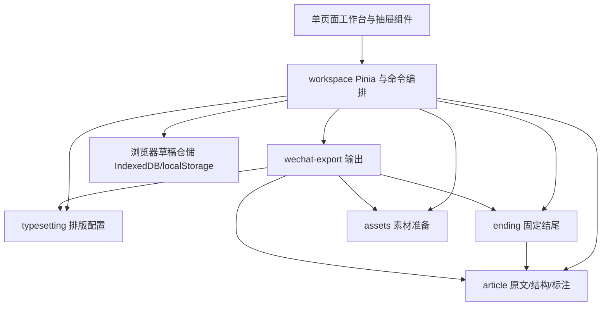
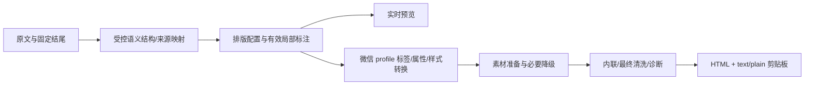

# 桀士排版 · Markdown 公众号排版助手

## 1. 产品定位与本轮状态

中文全名为 **桀士排版 · Markdown 公众号排版助手**，英文名为 **JLab WeChat Editor**。它是在 Cyber-Sight monorepo 中独立交付的纯前端应用，计划路径为 `apps/wechat-editor/`，建议 workspace 名为 `@jlab/wechat-editor`。

应用目录和包名是本方案选定的工程命名，尚未创建。独立应用、名称、技术栈、功能裁剪和交互方向已由维护者确认；尺寸、内部接口和实现分期是实施准备。`accepted` 表示产品方案约束已确认，不表示应用已经实现。本轮只修改文档。

沿用 Vue 3、Pinia、Element Plus、Vite、TypeScript。只有一个工作台页面，不引入 Vue Router；无后端、HTTP 业务 API、数据库服务器、账号或权限依赖。单独开发、构建和静态部署，不注册到 `apps/frontend` 的菜单、路由、AdminLayout 或页面模块。

## 2. 范围

| 能力                | 当前方案                                                            |
| ------------------- | ------------------------------------------------------------------- |
| Markdown 编辑与预览 | 保留左侧源文本、右侧排版预览，实时渲染                              |
| 导入                | 保留单个 `.md`/`.txt` 文件；不接收文章文件夹、压缩包或文章包        |
| 基础排版            | 正文色、局部字色、章节样式直接可用                                  |
| 文字设置            | 字号、间距、字体集中在一个抽屉                                      |
| 配色实验室          | 预设配色与元素颜色角色调整，不含 IP 上传/提色                       |
| 固定结尾            | 独立 Markdown、启停、本地保存，追加到预览和复制内容                 |
| 本地保存            | 文章、排版、局部标注、结尾和必要本地素材可恢复                      |
| 公众号复制          | 受控 HTML 与纯文字共同写入剪贴板，保留兼容诊断                      |
| 工作区              | 可拖拽双栏比例；保留专注预览和手机/电脑预览宽度切换                 |
| 不纳入              | 新手教程、文章包导入、IP 形象/去底/提色/配色推荐/保存               |
| 不属于当前路线      | 云草稿、公众号 API、账号系统、服务端图片托管、AI 排版和其他发布渠道 |

原站能力和算法只作研究依据，见[微排技术调研](../wechat-editor-research.md)。数学公式、Mermaid、图表和复杂 SVG 没有进入已确认功能；基础 Markdown 的代码块和表格属于当前排版范围，需要真实公众号验收。

## 3. 单层工具栏与主工作区

合并原站的两层标题栏为一个工作台顶栏。默认直接展开的排版控件只有“正文色”“局部字色”“章节样式”；“文字设置”“配色实验室”“固定结尾”以平行按钮呈现，点开抽屉后才显示具体选项。导入、预览模式和复制等操作也归入这一层，不再形成第二条排版栏。

```text
┌ 桀士排版 ─ 正文色 ─ 局部字色 ─ 章节样式 ─ 文字设置 ─ 配色实验室 ─ 固定结尾 ─ 导入/预览/复制 ┐
├───────────────────────────────────────────────────────────────────────────────────────────────┤
│ 左侧设置抽屉（关闭时不占位） │ Markdown 源文本 │ 可拖拽分隔线 │ 文章实时预览                    │
└───────────────────────────────────────────────────────────────────────────────────────────────┘
```

品牌短名使用“桀士排版”，完整产品名用于浏览器标题、说明及发布元信息。工具栏不重复显示高级参数值；窄宽度时可收紧控件标签、隐藏品牌副说明或让同一栏横向滚动，不增加第二层标题栏。

正文色修改普通正文的默认颜色，不覆写显式局部标注。局部字色作用于预览中的有效选中文字；章节样式作用于章节标题的视觉表达，保持 Markdown 原有标题层级和内容。

## 4. 左侧抽屉交互

三类设置均从左向右展开，使用占位式、非模态抽屉面板：无遮罩，不锁住主工作区，不把键盘焦点困在面板内，也不覆盖预览。面板位于顶栏下方左侧，占用内容区宽度后，剩余空间继续显示 Markdown 和预览。

| 抽屉       | 内容                                               | 生效方式                                |
| ---------- | -------------------------------------------------- | --------------------------------------- |
| 文字设置   | 字号、行距/段距等间距、字体                        | 修改即更新排版模型与预览                |
| 配色实验室 | 原站预设配色的复刻、颜色角色与元素映射、对比度提示 | 修改即更新主题，不改变 Markdown         |
| 固定结尾   | 开关、Markdown 编辑、清空/本地保存状态             | 启用时实时追加一次；不写回正文 Markdown |

一次只打开一个抽屉。再次点击当前按钮关闭；点击其他按钮在同一面板切换内容。关闭、切换与重新打开保留已生效设置，不设“确认/取消”提交步骤。需要清空或重置时用明确动作，不通过关闭面板隐式丢弃设置。

默认关闭抽屉。建议桌面面板宽度 320px，可在空间不足时收至 280px；这些是方案参数，可在人工验收后调整。抽屉开关只改变布局，不触发全文重新载入或重置局部标注。

字号和间距沿用原站可调参数作为初始参考，默认字号 16px、行高 1.9，具体选项在实施前核对并写入配置。默认字体选“公众号默认”，预览继承适当字体栈，导出不设置自定义 `font-family`。若提供思源黑体/微软雅黑等显式选择，应同步用于预览与导出，并提示设备相关的显示差异；不能选择后在复制时静默丢弃。它们属于兼容扩展，不能保证设备安装或微信保真。

颜色、字号、间距都通过文章配置影响预览；应用自身 Element Plus 控件样式和文章主题独立。当前方案不依赖管理系统 PRISM 壳，也不把应用主题视为微信深色算法。

## 5. 双栏拖拽与空间约束

主功能区保留 Markdown 在左、预览在右。建议默认比例 50:50；分隔手柄拖拽改变两栏在**剩余工作区**中的比例，抽屉宽度不纳入比例计算。

建议桌面两栏最低宽度：编辑栏 280px、预览栏 320px；拖拽根据容器宽度与两栏最低值动态限制，不能简单固定为 30%–70%。建议可见分隔线 1px，操作命中区域至少 12px，避免难以抓取。比例可作为应用偏好保存；容器变窄时只钳制实际显示，不改掉用户原先偏好，空间恢复后重新应用。

鼠标与触摸共享比例模型，处理指针捕获、释放、取消与失焦清理；只在手柄处抑制文本选择/触摸默认行为。手柄可键盘聚焦，用左右方向键调整，提供 separator 语义、当前比例和边界。专注预览临时隐藏编辑栏与手柄，退出后恢复原比例；它是页面状态，不是新路由。

空间不足时先收紧抽屉至 280px；仍不足则保持工作区最小尺寸并允许该区域横向滚动，不把抽屉切为模态遮罩，也不新增编辑/预览导航页面。首期建议以 1280×720 和 1440×900 桌面为完整工作台验收基线；窄屏需要验收控件可达性、滚动和比例边界，不承诺极窄屏同时显示三块桌面宽度的内容。

手机/电脑预览切换改变文章阅读宽度模拟，不改变实际应用布局和输出内容。预览宽度过大时内部自适应或滚动，不能强迫整个应用超出最低尺寸；它不替代真机公众号验收。

## 6. 应用与内部职责

独立应用是交付单元。内部能力按组件和职责组织，遵守仓库的 Foundation/Platform 所有权规则，不把新产品注册成现有 frontend 的一个模块。

```text
apps/wechat-editor/
  package.json / index.html / vite.config.ts / tsconfig*.json
  src/
    main.ts / App.vue                 单页面组装与初始化
    platform/
      app.config.ts                   应用名称、存储命名空间、默认值
      modules/
        workspace/                    单层工具栏、抽屉宿主、分栏、Pinia 与本地持久化
        article/                      原文输入、Markdown 解析、预览、选区映射
        typesetting/                  字体间距、颜色角色、章节样式与设置组件
        ending/                       固定结尾模型、编辑面板与追加规则
        assets/                       单个图片文件/远程图引用、尺寸和本地素材处理
        wechat-export/                微信兼容结构、内联、素材转换与剪贴板
```

这是未来目录示意，本轮不创建应用目录或空层级。各能力内部按实际需要建立 `components/`、`domain/`、`application/`、`adapters/`。Vue 组件负责展示与事件，解析、标注迁移、主题规则、素材处理和导出规则留在与 Vue 解耦的具名服务中。

### 建议公共文件

| 能力          | 公共文件职责                                                                     | 依赖与边界                                   |
| ------------- | -------------------------------------------------------------------------------- | -------------------------------------------- |
| article       | `article.model.ts`、`article.service.ts`：文档模型、解析结果、位置映射和标注命令 | 不依赖工作台或其 store                       |
| typesetting   | `typesetting.model.ts`、`typesetting.service.ts`：配置、预设、颜色/章节计算      | 接受显式文章结构，不读取其他模块私有状态     |
| ending        | `ending.model.ts`、`ending.service.ts`：结尾配置与渲染                           | 可依赖 article 的公开解析能力                |
| assets        | `assets.model.ts`、`assets.service.ts`：素材准备、Blob/URL 与生命周期            | 浏览器文件和 Canvas 适配在内部，不上传服务端 |
| wechat-export | `wechat-export.model.ts`、`wechat-export.service.ts`：版本化输出及复制           | 接收只读快照，通过公共模型/端口协作          |
| workspace     | `workspace.store.ts`、`draft-storage.port.ts`：应用状态、命令与持久化端口        | 组装上列能力；拥有完整草稿的本地仓储         |

公共文件是接口职责方案，不是已存在或已批准发布的 API。禁止 barrel，跨能力仅依赖登记公共文件；纯业务服务不能反向依赖 workspace。配置组件尽量以 props/events 对接宿主，避免多个组件直接改写同一草稿或互相读取私有 store。



不依赖 `apps/frontend` 的组件、状态、路由或认证；不创建 backend、api-contract 或服务端迁移。必要 Markdown/HTML 清洗依赖在实施时确认版本和许可、写入新应用 package；现有技术栈不意味着已经提供 Markdown 解析器。UI 默认采用 Element Plus 与应用样式，不增设其他 UI 框架。

## 7. 数据模型、选区与本地恢复

| 数据                | 内容                                                             | 持久化                                      |
| ------------------- | ---------------------------------------------------------------- | ------------------------------------------- |
| ArticleDocument     | schemaVersion、id、Markdown、revision、updatedAt、标注、素材引用 | IndexedDB                                   |
| TypesettingConfig   | 配色预设/具体角色、正文色、章节样式、字号/间距/字体              | 随草稿保存                                  |
| Annotation          | 标注 id、原文/渲染位置映射、revision、颜色、失效状态             | 随草稿保存                                  |
| FixedEnding         | Markdown、enabled、版本                                          | 应用本地配置；快照时纳入输出                |
| PreparedAsset       | 稳定 assetId、Blob/受控远程 URL、mime、真实尺寸                  | 本地 Blob 与引用存储，不保存临时 object URL |
| WorkspacePreference | 两栏期望比例、预览宽度模式                                       | 应用专属本地键                              |
| UiState             | 打开的抽屉、焦点、临时 Range、拖拽、复制状态                     | 不写入文章草稿                              |

建议存储命名空间使用 `jlab-wechat-editor`，不复用微排或管理系统键。小型偏好可用 localStorage；完整草稿、设置和 Blob 用 IndexedDB，由 workspace 的仓储适配器统一管理一致性。浏览器存储仍可能因清理、隐私模式或配额丢失，不能把“自动保存”当成云备份；保存成功状态必须来自实际写入结果。

### 局部字色

点击控件前保存预览正文内的有效选区锚点。正文默认色与局部标注分开存储，标注覆盖默认色；改变配色、字体、字号、章节样式或关闭抽屉不清除标注。

不要只对预览 DOM 调用 Range 包裹。用渲染来源映射把选区转换成可序列化的片段，跨加粗、链接或段落的选择拆为多个合法文本片段。代码、图片、装饰和非文章区域不作为普通正文改色目标；混合选区含不可处理内容时整次拒绝并提示重新选择，不静默部分改色。

修改 Markdown 后，能确定映射的标注随编辑迁移；被删除或对应关系不唯一的标注标为失效并提示，不猜测迁移到另一段文字。重叠标注按最近一次操作确定颜色，相邻同色片段合并，避免反复嵌套 span。刷新后重建标注，不能依赖失效的浏览器 Selection 或 Range。

### 素材边界

删除文章包导入并不意味着所有图片消失：仍可处理 Markdown 中远程图片。单文件导入的相对图片路径不会自动访问用户文件夹；缺失素材需显示状态。单个图片选择绑定可作为素材恢复适配候选，或由维护者在公众号后台补图；不扩展成素材库。无文件夹扫描、路径猜测、ZIP 解包或本地目录授权流程。

素材异步处理以 document revision 为基准；完成时核对版本，淘汰过期结果。替换/删除/关闭时释放 object URL，持久化以稳定 id/Blob 为准。

## 8. Markdown、主题与公众号输出

保留基础 Markdown、标题、引用、列表、代码、表格和图片。章标题按明确语法与受控规则计算，原站九种章节样式作为视觉复刻参考，不增加 AI 分类。原站对纯文字章节的启发式属于候选兼容规则，实施时需与明确 Markdown 标题的优先级一起登记。

预览和复制共用文章语义、配置与有效标注。固定结尾独立渲染，启用时在尾部追加一次；不参加正文自动编号，也不修改原文。预览 CSS 限定在文章容器，不影响 Element Plus 或工具栏。



规则以[公众号兼容文档](../wechat-editor-wechat-compatibility.md)为来源，当前只实现手动复制链路。HTTP 草稿 API 内容与大小规则仅作研究参照，不进入本应用方案。

导出固定文章 revision、配置与结尾快照，等素材完成或生成明确失败诊断。复制按钮应表达处理中、成功和失败状态；失败不能静默只复制纯文字。普通文本保持可编辑，宽表/长代码/外链/字体/图片状态按 profile 明确处理，不能承诺复制即完成微信托管或最终色值保真。

原始 HTML 不直接透传：经允许标签、属性、URL、CSS 值清洗，再进入预览和输出。禁止依靠微信清除脚本来保护本地应用；禁止输入读取应用本地存储或发起主动嵌入行为。应用静态部署建议使用独立 origin，隔离管理系统登录与草稿；实际部署地址在实施时确认。

## 9. monorepo 接入与实施前置检查

当前 workspace 已包含 `apps/*`；新应用建立后会进入 workspace。根 `build` 为递归构建，应用声明 build 后需纳入验证；根 dev 显式筛选既有应用，新应用需独立 dev 命令，不为了启动排版工具同时启动后台。

当前 `.forge-sync.yml` 尚未分类 `apps/wechat-editor/**`，现有架构检查只覆盖既有应用根。正式写代码前须登记新应用的 Platform 所有权及检查覆盖方式，不能把旧检查通过当成新应用已被检查。涉及共享检查器的通用增强按 Forge 所有权流程处理，本轮不改清单、脚本或 Foundation。

不导入现有 frontend 的 Vite 私有别名或依赖运行时环境。独立应用只要求静态资源服务和浏览器能力；开发端口、部署 base path、输出目录、浏览器最低版本及新增解析/清洗依赖在实施前锁定，不在本文虚构已验证值。

## 10. 分期方案与验收

以下阶段尚未开始。用户当前只授权设计文档调整，后续写代码须有明确实施指令。

| 阶段              | 内容                                                                             | 验收条件                                             |
| ----------------- | -------------------------------------------------------------------------------- | ---------------------------------------------------- |
| P0 接入与兼容准备 | 依赖/许可、应用所有权、静态部署、代表性样稿与输出 profile                        | 最小样稿经人工粘贴/保存/手机明暗验收；环境可独立启动 |
| P1 独立工作台     | Vue/Pinia 单页、单层顶栏、编辑/预览、三类左抽屉、拖拽分栏                        | 抽屉不遮预览、实时修改、关闭保留、拖拽和键盘可用     |
| P2 排版与恢复     | 四类预设配色/角色、九种章节、字号间距字体、标注、固定结尾、单文件/图片与本地草稿 | 改稿、换设置、刷新后状态可靠；素材/标注失败可识别    |
| P3 公众号闭环     | 内联、最终清洗、图片/长行/表格/外链处理、HTML+纯文复制、错误状态、专注与预览宽度 | 完整写稿→预览→复制→公众号保存闭环与人工兼容记录      |

P0 可提前暴露兼容风险，但最终输出适配随 P1/P2 功能继续核验；不是仅凭一次样稿通过就放行所有高级效果。P3 是纯前端产品收尾，没有云端扩展阶段。

人工验收至少包含：单层顶栏范围、抽屉占位/切换/实时预览、比例恢复及最小宽度、中文输入法、跨片段选区、改稿后失效标注、固定结尾启停、单文件编码/缺图、存储失败和刷新恢复、长代码/宽表、复制权限及真机明暗。教程/文章包/IP 不应出现在 UI、持久化模型或验收清单。

实施阶段 AI 可执行适用格式、Lint、TypeScript、生产构建、所有权与归档检查；按仓库规则默认不创建或运行前端单元、组件、E2E 或浏览器自动化测试，技术检查不替代维护者人工验收。本轮没有应用代码，因此只执行文档验证。

## 11. 关联与待实施事项

当前待实施事项是依赖锁定、所有权覆盖、部署地址和人工兼容结果，产品名称/独立应用/技术栈/裁剪功能/抽屉与分栏方向不再列为待定。新增需求不能以复刻原站为由自动恢复已排除功能。

- [独立应用决策](../../decisions/ADR-20261004-jlab-wechat-editor-standalone-app.md)
- [微排技术调研](../wechat-editor-research.md)
- [公众号 HTML/CSS 兼容规则](../wechat-editor-wechat-compatibility.md)
- [Platform 历史与本轮完成记录](../../archive/README.md)
