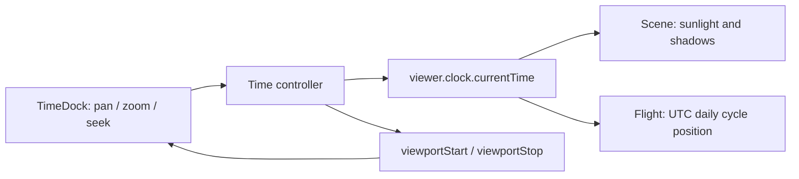

# Geo 无界时间轴与每日循环航线方案

## 背景与目标

当前 Time 插件把 `viewer.clock.startTime` 和 `stopTime` 固定为当天 UTC 00:00 至次日 00:00，并以 `LOOP_STOP` 循环；底部 UI 以一个 0–100% range 选择该区间内的时刻。这是首版策略，不是 Cesium 或太阳光照的限制。

本方案把时间轴改为具有 Cesium 原生时间轴交互语义的自定义工作台控件：用户可持续平移时间窗口、围绕指针缩放窗口并获得自动适配的 UTC 刻度；地图、太阳光照、阴影和模拟航班仍只使用一个 `viewer.clock`。原生 Cesium `Animation` 与 `Timeline` 继续保持关闭，以保留现有底部工作台外观、折叠行为和插件边界。

## 范围与非目标

范围：

- 以 UTC 表示和编辑任意可操作的仿真时刻；
- 时间轴窗口的平移、缩放、刻度渲染、游标定位、播放/暂停、倍速和“回到现在”；
- 每日固定时刻起飞、在航段内显示、跨日期重复的内置模拟航线；
- Time、Flight、Scene 与底部工作台的状态、生命周期和人工验收调整。

非目标：

- 不重新启用或嵌入 Cesium 原生 Timeline/Animation，不新增第二个 `Clock`；
- 不接入真实航班、历史轨迹、后端、持久化、时区选择或夏令时规则；
- 不把时间窗口当作数据过滤器，也不修改外部影像、模型或地形的时间维度；
- 不扩展太阳光照为月光、天气、人工光源或大气模拟。

## 时间语义

时间轴有两个独立状态，均由 Time 插件拥有：

```text
可见窗口 [viewportStart, viewportStop]  -- 只决定屏幕显示哪段刻度
                 |
                 | 游标定位或播放
                 v
仿真时间 viewer.clock.currentTime        -- 决定太阳、阴影与飞机的位置
```

- `viewer.clock.currentTime` 是唯一仿真时间源；Scene 与 Flight 只读取它，不能创建或维护自己的 Clock。
- Time 插件将 `clockRange` 设为 `ClockRange.UNBOUNDED`，保留 `SYSTEM_CLOCK_MULTIPLIER`。`startTime`、`stopTime` 不再是播放或拖动边界，也不再用作 UI range 的端点。
- 可见窗口不改变场景；用户平移或缩放刻度时，`currentTime`、播放状态和场景画面保持不变。
- 拖动游标、点击刻度或将游标拖出边界后自动滚动时，才写入 `currentTime`；此操作按 Cesium 原生 Timeline 语义暂停播放。
- “回到现在”将 `currentTime` 设为当前 UTC 时刻，并把窗口复位为该 UTC 日的 24 小时范围。播放只正向推进，沿用现有 `1×`、`10×`、`60×`、`600×`、`3600×` 倍速，反向播放不在本期范围。

### 缩放与刻度

可见窗口最小为 1 分钟、最大为 10 年；这个上限只约束一次屏幕呈现，不限制用户持续向过去或未来平移。缩放以指针所在时间为锚点，滚轮向上缩小、向下放大；拖动空白刻度区域平移窗口。

主刻度由窗口长度和可用像素自动选择，标签全部为 UTC：

| 可见窗口        | 主刻度候选                         | 次刻度候选         |
| --------------- | ---------------------------------- | ------------------ |
| 1 分钟至 1 小时 | 1、5、10 秒                        | 1 秒以下不显示标签 |
| 1 小时至 1 天   | 1、5、10、30 分钟；1、2、3、6 小时 | 分钟或小时         |
| 1 天至 1 月     | 天                                 | 小时或天           |
| 1 月至 1 年     | 周或月                             | 天或周             |
| 1 年至 10 年    | 年                                 | 月或季度           |

标签之间至少保留可读间距；空间不足时减少标签，而不是重叠。键盘提供聚焦、左右平移、`+`/`-` 缩放和游标定位的等价操作，光照开关、播放和折叠行为保持可访问。

## 每日循环航线

模拟航班使用 UTC 日周期，而非 Time 视窗或 Clock 的 `startTime`/`stopTime`：

- 每条内置航线定义每日起飞秒数、飞行时长、起点和终点；同一 UTC 时刻每天重复相同的航段。
- 当前时刻落在该航线的当日航段内时，飞机按大圆路线性插值显示；起飞前和降落后不显示飞机。完整起终点大圆线始终显示。
- 到次日相同 UTC 起飞时刻，飞机从起点开始下一次循环。跨任意年份拖动都得到相同的每日航班语义，不需要重建全局 Clock 范围。
- Flight 工具以确定性的、按 `JulianDate` 求值的位置属性表达循环位置；不得在 `clock.onTick` 中手工写实体位置。Flight 不读取 Time controller 的私有窗口状态。

这会取代当前“开启 Flight 时复制 `viewer.clock.startTime/stopTime` 并据此生成一天样本”的耦合方式。实施时应更新相关模拟航班 ADR，使其不再把有限 `SampledPositionProperty` 区间描述为长期契约。

## 职责、接口与数据流

Time controller 对 UI 暴露只读状态：`currentTime`、`viewportStart`、`viewportStop`、`multiplier`、`playing`；并提供 `seek`、`panViewport`、`zoomViewport`、`setPlaying`、`setMultiplier`、`resetToNow` 和 `dispose`。UI 不直接赋值 Cesium Clock。



- Time 继续通过 `bottomDocks` contribution 提供 UI；Shell 不导入 Time 或 Flight 组件。
- Scene 继续仅经既有太阳光照 capability 被 Time UI 调用；时间变化本身由共享 Clock 驱动。
- Flight 只依赖真实 Viewer 和自身纯工具，不跨插件导入 Time controller。

## 失败模式与性能

- 小于 1 分钟或大于 10 年的缩放请求被钳制，不产生无效日期或除零比例；日期转换失败时保留上一个有效窗口并反馈可诊断错误。
- 平移、缩放不会触发场景渲染；`seek` 和播放才请求渲染。播放期间 UI 状态同步维持低频，避免每个 Clock tick 触发 Vue 更新。
- Flight 循环计算必须在当前时间不处于航段时返回不可见结果，不得留下上一日的位置或重复实体；关闭插件与离开页面仍清空数据源和监听器。
- 太阳阴影仍是独立、默认关闭的高 GPU 成本功能；无界时间不改变其开关或显式渲染策略。

## 验证与迁移

静态验证沿用格式、TypeScript、lint、架构、生产构建、文档归档检查和 diff 检查。前端自动化与浏览器测试不在仓库范围内。

维护者人工验收至少覆盖：1 分钟、24 小时、1 月和 10 年窗口的刻度可读性；持续向过去/未来平移；缩放锚点稳定；平移不改变昼夜而定位改变昼夜；播放、暂停、倍速和回到现在；每日航班在不同日期同一 UTC 时刻复现、航段外隐藏；以及重复进入/退出后无重复监听器或实体。

当前 24 小时循环实现保持有效，直到本方案的实施计划完成并通过验证。届时更新 Geo 模块设计和两份相关 ADR，以实际实现替换当前事实。

## 相关计划和 AI 日志

- [实施计划](../../plans/active/2026-08-31-geo-unbounded-timeline-and-daily-flight-cycle.md)
- [协作记录](../../ai-logs/2026/08/2026-08-31-geo-unbounded-timeline-and-daily-flight-cycle.md)
- [当前单一仿真时间 ADR](../../decisions/ADR-20260830-geo-simulation-time-and-solar-lighting.md)
- [当前模拟航班 ADR](../../decisions/ADR-20260831-geo-simulated-flight-data.md)
