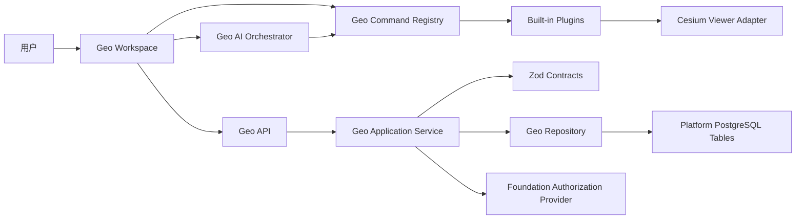

# Geo 空间可视化模块

## 背景与目标

Geo 是 Cyber-Sight 首个复杂 Platform 业务模块。它继承维护者在
`vue3-cesium-typescript-start-up-template` 中积累的 Cesium 功能经验，但不复制旧项目以全局
Cesium 实例和页面目录为中心的应用架构。旧项目只作为功能需求、交互经验和可复用算法的证据源；
Cyber-Sight 的实现服从当前模块边界、运行时契约、授权和 Platform 所有权规则。

首版目标是交付一个可保存、可恢复、可扩展的三维空间工作区，并通过真实能力验证
Cyber-Sight 承载复杂业务模块的完整链路：

- 在统一工作区中浏览三维地球、管理场景和图层、绘制与测量；
- 以编译期内置插件注册能力，隔离 Cesium 生命周期和不同工具状态；
- 通过共享 Zod 契约、Nest 应用服务和 Platform 数据表持久化场景；
- 复用 Foundation 的认证、授权、菜单、导航和审计边界；
- 建立 UI 与 AI 共用的类型化命令目录，使模块“AI-ready”但不依赖 AI 才能工作；
- 形成后续 Market 模块可以参考的 Platform 纵向实现样板。

## 范围与非目标

### 首版范围

- 桌面优先的 Geo 工作区，包括场景列表、图层树、三维视图、属性面板和状态栏；
- 相机定位、基础环境设置、图层显隐、透明度、排序和移除；
- 首批内置图层适配器：XYZ 影像、WMS、GeoJSON 和 Cesium 3D Tiles；
- 首批内置工具：绘制、距离测量、面积测量和结果清除；
- 场景、图层配置、绘制要素和相机状态的保存、读取、更新、删除；
- 所有者数据隔离、角色功能权限和服务端运行时校验；
- 一个受控 AI 纵向能力：把自然语言转换为允许列表中的 Geo 命令，并在执行持久化或外部资源加载前要求确认；
- 缺少令牌、WebGL 不可用、跨域失败、插件加载失败和保存冲突的明确降级反馈。

### 非目标

- 不加载远程 JavaScript、第三方 npm 包或用户上传代码作为运行时插件；
- 不提供地图服务代理、瓦片生产、对象存储、海量数据托管或服务器端空间分析；
- 不在首版引入 PostGIS、实时协同编辑、离线地图、移动端专业作业或多租户；
- 不整体迁移旧项目的目录、全局对象、页面组件和示例数据；
- 不默认携带来源、授权或商业用途不明确的影像、地形、3D Tiles 和访问令牌；
- 不在 Geo 单一用例尚未验证前建立跨业务通用 AI Foundation 或通用远程插件市场；
- 不创建或运行前端自动化、端到端或浏览器测试；交互行为由维护者人工验收。

## 职责与边界

稳定模块名统一为 `geo`：

```text
apps/frontend/src/platform/modules/geo/
apps/backend/src/platform/modules/geo/
packages/api-contract/src/platform/modules/geo/
```

`geo` 拥有场景、图层配置、绘制要素、Cesium 运行时适配、插件注册、命令执行和 Geo 专属
AI 编排。应用组合根只注册模块，不承载 Geo 规则。

模块内部按职责分层，但不拆成互相穿透的伪模块：

```text
geo/
├─ application/     场景用例、命令调度和保存协调
├─ domain/          场景快照、修订号和插件状态规则
├─ infrastructure/  Cesium、HTTP、仓储和模型提供器适配
├─ plugins/         编译期内置插件
└─ pages/           工作区页面与展示组件
```

具体目录可以在实施时按前后端职责裁剪；不得创建无内容的平行层，也不得将 Geo 业务规则放入
`shared/`、Vue 页面、Nest Controller 或 Platform 组合入口。

### 公共文件

前端允许外部依赖的公共文件：

- `registerViews.ts`：登记动态菜单可加载的稳定视图键 `geo-workspace`；
- `geo.api.ts`：Geo HTTP 调用边界；
- `geo.store.ts`：工作区应用状态和场景生命周期；
- `geo.commands.ts`：类型化命令目录、命令安全级别和执行入口；
- `geo.plugins.ts`：内置插件贡献类型和注册函数，不导出 Cesium 私有实例。

后端允许外部依赖的公共文件：

- `geo.module.ts`：Nest 模块装配入口；
- `geo.controller.ts`：HTTP 传输入口；
- `geo.service.ts`：场景用例和事务边界；
- `geo.schema.ts`：Drizzle 表定义，仅供 Platform Schema 聚合入口显式导出；
- `geo.authorization.ts`：Geo 权限键、数据资源贡献和仓储过滤适配。

契约公共文件：

- `geo.schema.ts`：请求、响应、图层配置、场景快照和 AI 命令的 Zod 4 运行时 Schema；
- `platform.contracts.ts`：只显式重新导出 Geo 的稳定契约。

未在本设计登记的页面、插件实现、Cesium 适配器、仓储和内部 Schema 均为私有实现，其他模块不得
穿透导入。

## 总体架构与数据流



正常交互不经过 AI。页面和 AI 都只能调用命令目录；插件通过受限上下文访问 Viewer、工作区状态和
命令执行器，不直接读写其他插件的私有状态。服务端持久化前重新校验所有输入，不能信任浏览器中的
插件校验结果。

## 插件与命令模型

Geo 采用编译期内置插件，而不是运行时远程插件。插件代码随 Cyber-Sight 构建、审阅和发布，通过
`geo.plugins.ts` 注册。首版定义三类最小扩展点：

- `GeoLayerAdapter`：识别一种图层配置，负责校验、创建、更新、销毁和序列化 Cesium 资源；
- `GeoTool`：管理绘制、测量等有激活态的交互工具，并在停用时释放事件、实体和临时资源；
- `GeoCommand`：声明稳定命令 ID、输入 Schema、安全级别和执行函数，供按钮、快捷入口和 AI 共同使用。

插件声明稳定 `id`、本地化名称、版本、贡献项和清理函数。插件 ID 一旦进入已保存场景不得无迁移
重用。未知或版本不兼容的插件配置保留原始记录并标记不可用，不阻止场景其他部分恢复。

命令按副作用分为：

- `view`：相机移动、面板开关等可逆的本地视图变化；
- `workspace`：图层显隐、透明度、绘制等未持久化工作区变化；
- `persist`：保存、覆盖或删除服务端数据；
- `external`：加载新的外部 URL 或调用外部服务。

AI 可以自动执行 `view` 命令；`workspace`、`persist` 和 `external` 默认先展示结构化预览并由用户
确认。任何调用者都必须通过同一命令 Schema，不提供 AI 直接执行任意 JavaScript、SQL、URL 请求或
Cesium API 的通道。

Cesium Viewer 保持非响应式，由单一 `GeoViewerAdapter` 创建和销毁；Vue 状态只保存可序列化的场景
状态、选择状态和插件状态。切换路由、热更新或工作区销毁时必须释放 ScreenSpaceEventHandler、
DataSource、Primitive、定时器和订阅。

## 用户体验与视觉结构

Geo 在现有 `AdminLayout` 内提供专用工作区，不替换 Foundation 应用壳：

- 左侧：场景选择、搜索和图层树，可折叠；
- 中央：Cesium 画布和低干扰浮动工具条；
- 右侧：当前图层、对象或工具的属性检查器，可切换 AI 助手；
- 底部：坐标、高程、相机高度、加载和错误状态；
- 窄屏：左右面板改为互斥抽屉，保留浏览和基础图层操作，不承诺专业移动作业体验。

视觉沿用 Cyber-Sight 的石墨黑、暖白和主题强调色，地图画布周围减少装饰性网格和持续动画。按钮、
图层节点和属性控件使用现有 Element Plus 与平台图标能力；新增图标进入受控图标注册表，不引入另一套
组件系统。键盘焦点、文本对比度、错误信息和 `prefers-reduced-motion` 必须可用。

## 数据模型与持久化

首版使用 PostgreSQL JSONB 保存经过契约约束的 Cesium 配置和 GeoJSON，不引入 PostGIS。只有出现
服务器端空间筛选、相交、距离、索引或大规模要素查询的真实需求时再提出迁移设计。

### `geo_scenes`

- `id`：数据库原生 UUIDv7；
- `name`、`description`：场景元数据；
- `owner_user_id`：引用 Foundation `sys_users.id`，由服务端从当前会话写入；
- `camera_state`、`environment_settings`：经共享 Schema 校验的 JSONB；
- `revision`：从 `1` 开始的乐观并发修订号；
- 通用创建、更新、软删除和审计字段。

### `geo_scene_layers`

- `scene_id`：所属场景；
- `plugin_id`、`layer_type`、`plugin_version`：确定负责恢复该图层的内置适配器；
- `name`、`visible`、`opacity`、`display_order`：通用展示状态；
- `config`：按 `layer_type` 判别并校验的 JSONB；
- 通用 UUIDv7、审计和软删除字段。

### `geo_scene_features`

- `scene_id`：所属场景；
- `feature_type`：首版为绘制或测量结果；
- `geometry`：符合约束的 GeoJSON Geometry JSONB；
- `properties`、`style`：限制深度和大小的 JSONB；
- 通用 UUIDv7、审计和软删除字段。

场景详情一次返回场景、图层和要素。保存使用单个事务和 `expectedRevision`：修订号不匹配时返回稳定
业务错误，不覆盖其他会话已经保存的状态。外部影像、地形、GeoJSON 和 3D Tiles 原始数据不复制进
数据库，只保存非敏感配置和 URL；访问令牌、私钥、Cookie 和临时签名 URL 不进入场景记录。

## HTTP 契约

首版公开以下业务 API：

- `GET /geo/scenes`：按 `pageNum`、`pageSize` 返回当前用户可见场景；
- `POST /geo/scenes`：创建空场景，所有者固定为当前用户；
- `GET /geo/scenes/{id}`：读取完整场景；
- `PUT /geo/scenes/{id}`：更新名称和描述；
- `PUT /geo/scenes/{id}/snapshot`：以事务保存相机、环境、图层和要素快照；
- `DELETE /geo/scenes/{id}`：软删除场景及其活动子记录；
- `POST /geo/ai/commands:propose`：返回经过 Schema 校验的命令提案，不直接执行命令。

所有请求、查询和路径参数由 `ZodValidationPipe` 在运行时校验，Controller 使用 `ContractRoute` 绑定
响应。成功、失败、分页和 HTTP 状态遵循仓库统一协议；若新增错误码，同步更新
`docs/reference/error-codes.md`。

## 授权与数据隔离

稳定功能权限键为：

- `geo.workspace.read`：查看 Geo 菜单、场景列表和工作区；
- `geo.scenes.manage`：创建、修改、保存和删除场景；
- `geo.ai.use`：请求 Geo AI 命令提案。

菜单 `/geo` 使用组件键 `geo-workspace` 并要求 `geo.workspace.read`。所有 Geo Controller 处理器显式
声明权限，不把菜单可见性当作后端授权。

数据资源键为 `geo_scenes`。读取、更新和删除首版支持 `self` 与 `all`；创建由
`geo.scenes.manage` 控制，服务端无条件把 `owner_user_id` 设为当前用户，因此不接受客户端指定所有者。
仓储必须把同一数据访问谓词用于列表、count、详情、更新、快照保存和删除；范围外详情按不存在处理。

当前 Foundation 的权限键和数据资源目录为硬编码实现，Platform 尚无贡献入口。Geo 实施前必须先在
Cyber AI Forge 设计并实现通用的 Platform 授权贡献机制，再按上游同步协议进入 Cyber-Sight。Geo
不得直接修改 Foundation 文件、由 Platform migration 写入 Foundation 表、退化为仅登录即可访问，
或在仓储中复制一套不可配置的授权系统。

## AI 接入边界

当前仓库没有模型提供器、提示词治理或 Agent 运行时。Geo 首先实现与模型无关的命令目录，核心功能
不依赖 AI。核心场景和插件通过验收后，再在 `geo` 模块内增加最小 `GeoModelProvider` 端口和一个
服务端适配器：

1. 浏览器只提交用户问题、场景 ID 和必要的结构化上下文摘要；
2. 服务端按当前权限读取可见场景，并向模型提供允许的命令 Schema；
3. 模型输出只被解析为 `GeoCommandProposal[]`，解析或权限校验失败即拒绝；
4. 浏览器展示命令、参数、影响范围和确认要求；
5. 用户确认后由前端命令执行器执行，服务端数据变化仍走正常 Geo API；
6. 首版不保存对话历史，不把外部图层属性文本默认拼入提示词。

模型密钥只允许存在于后端环境变量或未来的安全密钥提供器中。AI 提案不是权限主体，不能扩大当前
用户的数据和功能权限。Market 出现第二个真实 AI 用例后，再评估是否把提供器端口、审计和工具协议
提取到 Foundation；Geo 不提前定义跨业务通用抽象。

## 依赖关系

```text
geo -> Foundation auth / authorization / navigation / HTTP / database provider
geo -> Platform runtime configuration
geo -> shared Platform API contracts
geo -> Vue / Pinia / Element Plus / Cesium
Foundation -X-> geo
```

`cesium` 是前端直接依赖。具体版本在实施时选择与当前 Node、Vite 和浏览器基线兼容的稳定版本并精确
记录锁文件结果，不从旧项目沿用版本约束。Geo AI 的具体模型 SDK不是核心阶段前置依赖；优先使用窄的
HTTP 适配器或已确认的官方 SDK，避免把供应商类型泄漏到领域和命令层。

## 失败模式与安全考虑

- WebGL 或浏览器能力不足：显示阻塞说明，场景列表和配置管理仍可访问；
- Cesium 初始化失败：销毁部分资源并提供重试，不重复创建 Viewer；
- 外部 URL 跨域、超时或格式错误：只把对应图层标记失败，不阻断其他图层；
- 未知插件或版本：保留配置、禁用该图层并显示迁移提示；
- 保存冲突：返回修订冲突，保留本地未保存状态，由用户选择重新加载或另存；
- 超大 GeoJSON 或深层 JSON：契约限制请求大小、要素数量、属性深度和字符串长度；
- XSS：外部属性默认作为纯文本显示，不使用未经清洗的 HTML；
- SSRF：首版不提供通用服务端 URL 代理或抓取接口；
- 凭据泄漏：场景配置禁止秘密字段，日志、AI 上下文和错误信息不输出令牌；
- 资源泄漏：插件和 Viewer 销毁路径必须幂等，切换场景前释放事件和 Cesium 对象；
- AI 越权或提示注入：模型只产生结构化提案，命令重新校验权限和参数，外部内容不作为可信指令。

## 测试与验证策略

### 自动化验证

- API 契约构建和测试覆盖场景、图层判别联合、GeoJSON 限制、命令提案和错误响应；
- 后端单元测试覆盖所有者强制写入、数据范围、修订冲突、事务保存、软删除和未知插件；
- Schema 与 migration 测试覆盖 UUIDv7、外键、索引、软删除唯一性和 Platform 独立迁移链；
- 路由测试覆盖未认证、缺少三类功能权限、范围外资源和无授权声明；
- 运行 `pnpm format`、`pnpm format:check`、`pnpm lint`、`pnpm test`、`pnpm build`、
  `pnpm architecture:check` 和 `pnpm docs:archive:check:ci`；
- 有空 PostgreSQL 18 数据库时执行 Platform migration 和 `pnpm test:db`。

### 维护者人工验收

- 桌面与窄屏工作区布局、面板折叠、主题和减少动效；
- Viewer 重复进入/离开、场景切换和长时间使用后无明显重复事件或图层；
- XYZ、WMS、GeoJSON、3D Tiles 的加载、失败、显隐、排序和透明度恢复；
- 绘制、距离、面积、清除和保存后恢复；
- 修订冲突、CORS 失败、无 WebGL、缺少令牌和未知插件提示；
- AI 提案预览、确认、取消、非法参数拒绝和权限不足；
- 前端人工验收不被格式、类型和生产构建结果替代。

## 兼容性与迁移

Geo 是 Cyber-Sight 新模块，不承诺旧项目状态、URL、LocalStorage 或目录结构兼容。可复用算法必须以
当前许可证、类型和模块边界重新审阅后移植。旧项目示例数据默认不进入生产种子。

首版场景快照包含 `schemaVersion`，插件配置包含 `pluginVersion`。破坏性 Schema 变化必须提供显式迁移
函数或拒绝加载并保留原始记录，不能静默丢弃。删除 Geo 模块时，除 Platform 组合入口、菜单、权限
贡献、契约导出、Platform Schema 聚合和 migration 外，不应修改无关模块。

## 已确定事项

- Geo 先于 Market 实施，并作为首个复杂 Platform 样板模块；
- 采用单一 `geo` 业务模块和内部编译期插件，不采用运行时远程插件；
- UI 与 AI 共用类型化命令目录，AI 只提出受控命令；
- 首版使用 PostgreSQL JSONB，不引入 PostGIS；
- 首版不托管外部空间数据、不做通用服务端代理；
- 首版数据以场景所有者隔离，不实现协作分享和多租户；
- Platform 授权贡献入口是编码前必须解决的 Forge 前置依赖。

## 相关 ADR、计划和 AI 日志

- [Geo 编译期插件与统一命令架构](../../decisions/ADR-20260814-geo-compile-time-plugins-and-commands.md)
- [Geo 空间可视化模块 MVP 实施计划](../../plans/active/2026-08-14-geo-platform-mvp.md)
- [Geo 模块设计协作记录](../../ai-logs/2026/08/2026-08-14-geo-platform-design.md)
