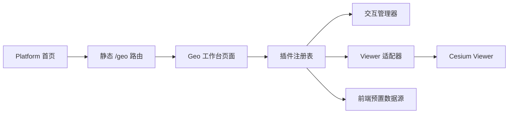

# Geo 前端空间可视化工作台

## 背景与目标

Geo 延续维护者开源项目 `vue3-cesium-typescript-start-up-template` 的定位：面向使用者提供一个可直接操作的 Cesium 三维地球页面。旧项目保留为功能需求、交互经验和算法实现的参考，但不整体迁移其目录、Vuex 状态树、全局 Cesium 对象或 Ribbon 式界面。

本阶段只建设 Cyber-Sight 前端中的 Geo 页面，目标是：

- 把旧项目已验证的通用 Cesium 能力迁入一个清晰、可拆分、可释放资源的前端模块；
- 以地图为视觉主体，重新设计工具导航、上下文面板和状态反馈；
- 所有已接入能力直接提供给进入页面的使用者，不建设管理后台、配置审批或 Geo 专属权限；
- 通过编译期内置插件隔离不同能力，避免再次形成一个相互穿透的巨大页面和状态树；
- 保留 Cyber-Sight 现有 Platform 外壳、主题、本地化和 AI 辅助开发基础设施，但不在 Geo 中新增用户侧 AI 功能。

## 范围与非目标

### 当前范围

- 一个桌面优先、地图全屏的 `/geo` 前端页面；
- Cesium Viewer 创建、销毁、相机、场景模式和交互生命周期管理；
- 影像、地形、模型与 3D Tiles 的前端预置资源管理；
- 环境效果、标绘、测量、模型/3D Tiles 工具和地形分析；
- 编译期插件注册、互斥交互工具管理、局部失败隔离和统一清理协议；
- 对旧项目通用 Geo 能力的分阶段迁移与现代化 UI 重组；
- 前端构建、类型、格式和维护者人工浏览器验收。

### 明确不做

- 不新增 Geo 后端模块、HTTP API、共享 API 契约或数据库表；
- 不接入 PostgreSQL、PostGIS、对象存储或服务端空间分析；
- 不建设场景、图层、用户、权限、审计或数据源管理后台；
- 不让用户上传插件代码，不加载远程 JavaScript，也不设计插件市场；
- 不保存或共享业务场景；刷新页面后交互结果和运行状态可以重置；
- 不新增聊天、自然语言命令、模型提供商、提示词或任何用户侧 AI 界面；
- 不迁移旧项目中的行业大屏等特定业务应用；这类应用以后应作为独立业务模块消费 Geo 公共能力；
- 不整体复制旧项目目录、示例数据、全局对象或过时 UI；
- 不创建或运行前端自动化、端到端或浏览器测试，交互与视觉由维护者人工验收。

## 旧项目现状与重设计依据

2026-08-14 对旧站和源码进行了只读核对。旧界面主要由约 122px 高的顶部 Ribbon、约 300px 宽的常驻左栏和地图画布组成。功能按照“视图、效果、工具、地形、其他、应用”平铺，图标、文字和开关密度高；左栏长期占用地图面积，工具被激活后缺少统一的上下文和互斥反馈。

旧源码采用宽泛的 `components/`、`views/`、`store/` 和 `libs/` 目录，并在深层 Vuex 模块中按工具继续嵌套状态。Cesium 生命周期、工具状态和界面组织因而容易相互耦合。新实现只复用仍有价值的功能算法，进入模块前必须去除全局依赖，并适配新的 Viewer 与交互生命周期。

## 模块边界

稳定模块名为 `geo`，当前只存在前端所有权目录：

```text
apps/frontend/src/platform/modules/geo/
```

Geo 拥有 Viewer 适配、工作台页面、内置插件、Geo 运行状态和地图专属组件。Foundation 不得依赖 Geo；其他 Platform 模块不得导入 Geo 页面、Cesium 实例、插件内部状态或内部组件。

### 公共文件

初始只登记两个公共文件：

- `geo.routes.ts`：声明 `/geo` 的稳定静态路由并延迟加载工作台页面；
- `geo.plugins.ts`：登记随应用构建的 Geo 插件定义，供 Geo 页面组合使用。

若后续其他 Platform 模块出现真实的地图嵌入需求，再评审并登记最小公共端口；本阶段不预先导出 Cesium Viewer、store 或组件集合，也不创建 `index.ts` barrel。

### 建议内部结构

目录按真实职责逐步创建，不预建空层级：

```text
geo/
├─ geo.routes.ts
├─ geo.plugins.ts
├─ pages/
│  └─ GeoWorkspacePage.vue
├─ core/
│  ├─ geo-context.ts
│  ├─ viewer-adapter.ts
│  ├─ plugin-registry.ts
│  ├─ interaction-manager.ts
│  └─ disposable.ts
├─ state/
│  ├─ geo.store.ts
│  └─ geo.types.ts
├─ plugins/
│  ├─ view/
│  ├─ layers/
│  ├─ environment/
│  ├─ drawing/
│  ├─ measurement/
│  ├─ tileset/
│  └─ terrain/
└─ components/
   ├─ shell/
   ├─ panels/
   └─ controls/
```

## 前端接入方式

Geo 不依赖数据库菜单或后端权限目录。Platform 组合入口把 `geo.routes.ts` 注册为静态前端路由，Platform 首页提供进入 Geo 的产品入口。该路由仍处于 Cyber-Sight 现有应用会话内，但不增加 Geo 专属角色、功能权限或数据权限。

工作台使用独立的地图全屏布局，不套用面向列表和表单的 `AdminLayout`。页面保留返回 Platform 首页、品牌和必要的全局能力入口，但不显示常规后台侧边栏，从而把主要画布留给地图。



## 前端插件架构

插件是源码内、编译期注册的功能单元，不是可下载的软件包。插件定义至少包含：

- 稳定 `id`、排序和本地化标题键；
- 所属任务组、工具栏贡献和可选上下文面板；
- `activate(context)` 与配对的停用或 `dispose()` 清理逻辑；
- 是否占用鼠标主交互，以及不可用原因和错误状态；
- 需要的 Viewer 能力或其他已登记端口。

`GeoContext` 只暴露受控的 Viewer 适配器、交互管理器、轻量事件和 UI 状态端口。插件不能读取其他插件私有状态。需要组合的能力通过已登记端口或事件完成。

只有一个占用鼠标主交互的工具能够处于活动状态。`InteractionManager` 在切换标绘、测量、拾取、分类或地形分析前先停用当前工具，并统一恢复鼠标样式、提示、事件处理器和临时实体。

Cesium Viewer、DataSource、Primitive、ScreenSpaceEventHandler 等对象保持非深度响应式，使用 `markRaw`、浅引用或普通类封装。Vue 状态只保存界面需要的可描述状态；路由离开、Viewer 重建、插件停用和热更新都必须执行幂等清理。

## 功能范围与界面分组

旧项目能力不再按源码技术分类展示，而按用户任务重组：

| 任务组   | 首批迁移能力                                                                     |
| -------- | -------------------------------------------------------------------------------- |
| 数据     | 影像底图和标注、地形、模型与 3D Tiles 的预置列表，显示、隐藏、定位和局部属性调整 |
| 视图     | 全球/中国定位、相机坐标、鼠标坐标、视距、2D/3D/哥伦布模式、相机设置和范围限制    |
| 场景     | 太阳、月亮、大气、光照、天空盒、阴影、地球底色、深度检测                         |
| 标绘     | 点、线、面标绘和清除当前或全部结果                                               |
| 测量     | 点位、距离、面积测量和结果清除                                                   |
| 三维模型 | 3D Tiles 高亮、滑动/点击分类、模型切割或分屏、偏移校正                           |
| 地形分析 | 地形采样、淹没分析、等高线和地形着色                                             |
| 对比     | 影像或场景分屏对比                                                               |

具体算法先核对旧实现的依赖和正确性，再迁移到对应插件；功能名称相同不代表直接复制实现。第三方数据不可用时，对应能力展示局部错误或不可用原因，不阻塞其他插件和 Viewer。

## UI 与交互设计

### 设计原则

- 地图优先：除必要导航外，默认不让永久面板占用地图；
- 渐进披露：首层只显示任务组和常用操作，高级参数进入上下文面板；
- 状态明确：活动工具、下一步操作、完成方式、错误和退出方式始终可见；
- 上下文一致：选择图层、对象或工具后，只显示与当前对象相关的控制；
- 与 Sight 一致：复用现有主题令牌、Element Plus 和图标能力，不引入第二套组件系统。

### 页面结构

- 顶部 48–56px 紧凑栏：返回入口、Geo 标识、当前页面标题和少量全局动作；
- 左侧 48–56px 工具轨：数据、视图、场景、标绘、测量、分析等任务入口；
- 按需上下文面板：默认关闭，打开后约 320px，可折叠；同一时刻只展示一个主要任务面板；
- 右侧属性检查器：仅在选中图层、模型或对象时出现；
- 右上地图控制：相机复位、视角、全屏等高频地图动作；
- 底部轻量状态条：鼠标经纬度、高程、相机高度、FPS/加载状态和活动工具提示。

视觉采用高对比深色半透明表面、克制的强调色、8px 间距体系和至少 40px 的可点击控件。避免旧站的大面积灰色 Ribbon、永久 300px 侧栏、连续装饰动画和无层级图标平铺。

桌面是专业操作目标。宽度低于 1024px 时面板覆盖地图而非压缩画布；手机只保证浏览、图层切换和基础相机操作，不承诺复杂标绘与分析体验。

### 无障碍与反馈

- 图标按钮有可见提示、可访问名称和键盘焦点；
- 活动工具不能只靠颜色区分；
- 加载、空状态、WebGL 不可用、数据跨域和插件异常提供文字说明；
- 尊重 `prefers-reduced-motion`，地图以外的动效不妨碍操作；
- 面板开合不重建 Viewer，切换工具不丢失无关图层状态。

## 状态与数据

Geo 的数据来源仅包括：

- 随前端构建发布的 TypeScript/JSON 配置；
- 维护者明确选择、许可和配置的浏览器可访问影像、地形、GeoJSON、模型或 3D Tiles 服务；
- 用户在当前页面会话中产生的标绘、测量和分析结果。

本阶段不提供数据源新增表单、场景保存或多人共享。除非后续单独设计，业务状态只保存在内存中；可以复用已有浏览器偏好能力保存纯 UI 偏好，但不得把它描述为场景持久化。

访问令牌和授权不明的数据不得提交仓库。必须使用浏览器令牌时，只能通过前端运行时配置提供公开客户端令牌，并明确它可被终端用户看到；需要保密的凭据意味着该数据源不适合当前纯前端阶段。

## 失败模式

- WebGL 不可用或 Viewer 初始化失败：展示阻塞说明和重试，不渲染失效工具面板；
- Cesium Worker、Widget 或 Asset 路径错误：开发与生产构建分别验证，初始化失败时保留可诊断信息；
- 外部服务 CORS、限频、令牌或网络失败：只标记对应数据源/插件失败，不销毁 Viewer；
- 插件激活失败：回滚该插件创建的事件、临时实体和 UI 状态，并恢复可选择工具状态；
- 连续切换工具或路由：幂等清理，防止事件重复、Primitive 泄漏和幽灵提示；
- 分析数据量过大：在插件入口限制输入，保持主线程可响应，并为耗时任务提供取消能力；
- 预置资源许可或可用性不明确：不随产品发布，使用本地或明确授权的替代演示资源。

## 验证策略

自动验证只覆盖仓库允许的前端静态检查：格式、TypeScript、lint、生产构建、架构边界和文档归档门禁。不得新增或运行前端自动化、端到端或浏览器测试。

维护者人工验收至少覆盖：

1. `/geo` 可从 Platform 首页进入并返回，Viewer 只创建一次且离开后释放；
2. 1280×720 与常用桌面宽度下地图是视觉主体，顶部和侧栏不再复制旧 Ribbon 布局；
3. 工具轨、上下文面板、属性检查器和状态条的层级、开合与焦点可理解；
4. 所有已实现任务组均可进入，互斥鼠标工具切换后没有残留事件或临时实体；
5. 影像、地形、模型和 3D Tiles 单项加载失败不影响其他能力；
6. 相机、图层、场景、标绘、测量、三维模型、地形分析和分屏能力按阶段验收；
7. 开发与生产构建的 Cesium Worker、Widget、字体和静态资源路径一致；
8. 连续进入/退出页面和长时间操作后没有明显资源累积或重复响应。

前端静态检查不能代替上述视觉、交互和资源生命周期人工验收。

## 后续演进边界

只有用户明确提出场景保存、共享、管理或服务端空间计算后，才为 Geo 单独设计后端、契约和数据模型。只有出现第二个真实消费者后，才评审把 Viewer 或插件端口提升为跨 Platform 模块公共能力。

AI 辅助开发继续由 Sight 现有仓库能力承担；Geo 文档和源码无需复制一套 AI 基础设施。若以后要向产品用户提供 AI 地图操作，应作为新的业务需求重新设计，不能从本设计推导实现授权。

## 关联记录

- [Geo 前端编译期插件架构](../../decisions/ADR-20260814-geo-frontend-plugin-architecture.md)
- [Geo 前端工作台实施计划](../../plans/active/2026-08-14-geo-frontend-workspace.md)
- [Geo 模块设计协作记录](../../ai-logs/2026/08/2026-08-14-geo-platform-design.md)
