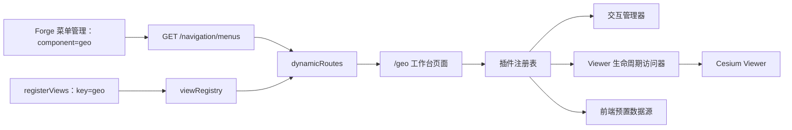
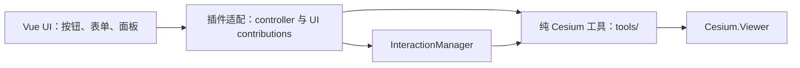

# Geo 前端空间可视化工作台

## 背景与目标

Geo 延续维护者开源项目 `vue3-cesium-typescript-start-up-template` 的定位：面向使用者提供一个可直接操作的 Cesium 三维地球页面。旧项目保留为功能需求、交互经验和算法实现的参考，但不整体迁移其目录、Vuex 状态树、全局 Cesium 对象或 Ribbon 式界面。

本阶段只建设 Cyber-Sight 前端中的 Geo 页面，目标是：

- 把旧项目已验证的通用 Cesium 能力迁入一个清晰、可拆分、可释放资源的前端模块；
- 以地图为视觉主体，重新设计工具导航、上下文面板和状态反馈；
- 所有已接入能力直接提供给进入页面的使用者，不建设管理后台、配置审批或 Geo 专属权限；
- 通过编译期内置插件隔离不同能力，避免再次形成一个相互穿透的巨大页面和状态树；
- 保留 Cyber-Sight 现有 Platform 外壳、主题、本地化和 AI 辅助开发基础设施，但不在 Geo 中新增用户侧 AI 功能。

## 范围与非目标

### 当前范围

- 一个仅面向横向宽屏、地图全屏的 `/geo` 前端页面，最低支持与验收基线为 `1280×720` CSS 像素；
- Cesium Viewer 创建、销毁、相机、场景模式和交互生命周期管理；
- 影像、地形、模型与 3D Tiles 的前端预置资源管理；
- 环境效果、标绘、测量、模型/3D Tiles 工具和地形分析；
- 编译期插件注册、互斥交互工具管理、局部失败隔离和统一清理协议；
- 对旧项目通用 Geo 能力的分阶段迁移与现代化 UI 重组；
- 纯前端模拟航线、Viewer 生命周期和前端会话展示；
- 前后端构建、类型、格式、后端测试和维护者人工浏览器验收。

### 明确不做

- 不新增数据库表、轨迹持久化、场景保存或服务端空间分析；
- 不接入 PostgreSQL、PostGIS、对象存储或服务端空间分析；
- 不建设场景、图层、用户、权限、审计或数据源管理后台；
- 不让用户上传插件代码，不加载远程 JavaScript，也不设计插件市场；
- 不保存或共享业务场景；刷新页面后交互结果和运行状态可以重置；
- 不新增聊天、自然语言命令、模型提供商、提示词或任何用户侧 AI 界面；
- 不迁移旧项目中的行业大屏等特定业务应用；这类应用以后应作为独立业务模块消费 Geo 公共能力；
- 不整体复制旧项目目录、示例数据、全局对象或过时 UI；
- 不为小于 `1280×720` 的窄屏、竖屏、平板或手机提供响应式布局、功能降级或交互保证；
- 不创建或运行前端自动化、端到端或浏览器测试，交互与视觉由维护者人工验收。

## 旧项目现状与重设计依据

2026-08-14 对旧站和源码进行了只读核对。旧界面主要由约 122px 高的顶部 Ribbon、约 300px 宽的常驻左栏和地图画布组成。功能按照“视图、效果、工具、地形、其他、应用”平铺，图标、文字和开关密度高；左栏长期占用地图面积，工具被激活后缺少统一的上下文和互斥反馈。

旧源码采用宽泛的 `components/`、`views/`、`store/` 和 `libs/` 目录，并在深层 Vuex 模块中按工具继续嵌套状态。Cesium 生命周期、工具状态和界面组织因而容易相互耦合。新实现只复用仍有价值的功能算法，进入模块前必须去除全局依赖，并适配新的 Viewer 与交互生命周期。

## 模块边界

稳定模块名为 `geo`，当前只存在于前端 Platform 所有权目录：

```text
apps/frontend/src/platform/modules/geo/
```

Geo 拥有模拟航线、Viewer 生命周期、纯 Cesium 工具、工作台页面、内置插件、Geo 运行状态和地图专属组件。Foundation 不得依赖 Geo；其他 Platform 模块不得导入 Geo 页面、Cesium 实例、插件内部状态或内部组件。Geo 不提供后端、HTTP 契约或外部航班数据访问。

### 公共文件

登记以下表意公共文件：

- `registerViews.ts`：以稳定组件键 `geo` 登记工作台懒加载器，供 Forge 菜单管理生成动态路由。
- `tools/flight/simulated-flight-layer.ts`：前端模拟航线和 Cesium 实体的纯工具边界；

若后续其他 Platform 模块出现真实的地图嵌入需求，再评审并登记最小公共端口；本阶段不预先导出 Cesium Viewer、store 或组件集合，也不创建 `index.ts` barrel。

### 建议内部结构

目录按真实职责逐步创建，不预建空层级：

```text
geo/
├─ registerViews.ts
├─ geo.plugins.ts
├─ pages/
│  └─ GeoWorkspacePage.vue
├─ core/
│  ├─ geo-context.ts
│  ├─ geo-runtime.ts
│  ├─ use-geo-runtime.ts
│  ├─ viewer-access.ts
│  ├─ plugin-registry.ts
│  ├─ interaction-manager.ts
│  └─ disposable.ts
├─ tools/
│  ├─ drawing/
│  ├─ measurement/
│  ├─ layers/
│  ├─ tileset/
│  └─ terrain/
├─ plugins/
│  ├─ view/
│  ├─ layers/
│  ├─ environment/
│  ├─ drawing/
│  ├─ measurement/
│  ├─ tileset/
│  └─ terrain/
└─ components/
   └─ shell/
```

`tools/` 保存不依赖 Vue 的 Cesium 业务工具；插件专属的 controller、面板和控件与 `*.plugin.ts` 一起放在对应 `plugins/<plugin>/` 中。`components/shell/` 只保存工具轨、面板容器、属性检查器和状态条等通用工作台组件。

## 前端接入方式

Geo 页面不声明静态路由。`platform.register.ts` 在启动时发现 `registerViews.ts`，以稳定键 `geo` 把 `GeoWorkspacePage.vue` 的懒加载器登记到 `viewRegistry`。维护者通过 Forge 菜单管理创建页面菜单，推荐配置为：

```ts
const geoPage: RouteComponent = () => import('./pages/GeoWorkspacePage.vue')

export function registerViews(appViews: ViewRegistrar): void {
  appViews.register('geo', { key: 'geo.pageLabel', fallback: 'Geo 空间可视化' }, geoPage)
}
```

- 类型：菜单；
- 路径：`/geo`；
- 组件：`geo`；
- 布局：留空，直接渲染 Geo 页面；
- 功能权限：留空，使已认证用户均可获得该菜单；
- 图标、名称和排序：由 Forge 菜单管理维护。

登录后，`GET /navigation/menus` 返回该菜单，`dynamicRoutes.ts` 使用组件键从 `viewRegistry` 取得页面并生成 `/geo` 动态路由。Geo 不新增菜单 migration、专属角色、功能权限或数据权限，但沿用 Forge 已有的认证、菜单管理和动态路由能力。

工作台使用独立的地图全屏页面，不套用 `AdminLayout`。页面不提供返回 Platform、首页或管理后台的入口，也不渲染常规导航、Header 或 Tags View；离开页面依靠浏览器历史、直接地址或后续由产品外部导航决定。



## Viewer 运行时与访问方式

### 所有权和生命周期

`GeoWorkspacePage.vue` 是每次页面访问的运行时所有者。页面挂载后创建一个 `GeoRuntime`，把地图容器交给运行时初始化 Viewer；页面卸载时只调用一次 `runtime.dispose()`。生命周期固定为：

```text
idle -> mounting -> ready -> disposing -> disposed
                    \
                     -> failed -> disposing -> disposed
```

Viewer 只存在于当前 `GeoRuntime` 实例中，不挂到 `window`、`globalThis`、Vue `app.config.globalProperties` 或 Pinia，也不跨路由复用。这样同一应用将来即使出现多个 Geo 容器，也不会因全局单例互相覆盖。

页面创建运行时后通过 Vue `provide` 提供只读上下文；通用 Shell 使用 `useGeoRuntime()` 读取运行时状态，需要真实 Viewer 的后代组件使用 `useCesiumViewer()`。插件不依赖 Vue 注入，而是在安装时由注册表显式接收 `GeoPluginContext`。普通算法函数不查找运行时，所需 Viewer、Scene、Camera 或数据直接作为参数传入。

```ts
const runtime = createGeoRuntime()
provideGeoRuntime(runtime)

onMounted(async function mountGeo() {
  const container = mapContainer.value
  if (!container) {
    throw new Error('Geo map container is unavailable')
  }
  await runtime.mount(container)
})

onBeforeUnmount(function disposeGeo() {
  runtime.dispose()
})
```

### Viewer 访问端口

`GeoViewerAccess` 是 Viewer 初始化和销毁状态的访问器，内部保存 `markRaw(viewer)`。它不命名为 `viewer`，因为 Geo 代码中没有限定词的 `viewer` 一律表示真实的 `Cesium.Viewer` 对象。

```ts
interface GeoViewerAccess {
  readonly status: 'idle' | 'mounting' | 'ready' | 'failed' | 'disposed'
  whenReady(): Promise<Viewer>
  require(): Viewer
}
```

- `whenReady()`：等待初始化并返回真实 `Cesium.Viewer`；初始化失败或运行时已销毁时拒绝；
- `require()`：同步取得真实 `Cesium.Viewer`；未进入 `ready` 或已经销毁时立即抛出可诊断错误；
- `useCesiumViewer()`：Geo Vue 后代组件使用的便捷 composable，内部调用当前运行时的 `viewerAccess.require()`，返回类型就是 `Cesium.Viewer`；
- 异步加载必须同时使用插件或运行时的 `AbortSignal`。跨 `await` 后先检查取消状态，再通过 `viewerAccess.require()` 取得当前 Viewer 并写入场景，不能继续使用 await 前缓存的实例。

各类代码的使用规则如下：

| 使用位置           | 获取方式                                                    | 约束                                                                    |
| ------------------ | ----------------------------------------------------------- | ----------------------------------------------------------------------- |
| Geo 页面和后代组件 | `useCesiumViewer()` 返回 `Cesium.Viewer`                    | 只在 Viewer ready 后挂载需要它的子树，不把 Viewer 放入响应式状态        |
| Geo 插件           | `install(context)` 获得 `context.viewer: Cesium.Viewer`     | 安装发生在 Viewer ready 后，插件只在自己的 `DisposableScope` 内登记资源 |
| Cesium 工具类/算法 | `Cesium.Viewer`、Scene 或 Camera 作为构造参数或显式函数参数 | 禁止工具文件反向 import 页面运行时、插件或全局 store                    |
| Geo 模块以外       | 不允许访问                                                  | 未来出现真实消费者时另行登记公共端口                                    |

运行时接口用明确命名的访问器表达 Viewer 生命周期：

```ts
interface GeoRuntime {
  readonly viewerAccess: GeoViewerAccess
  readonly interactions: GeoInteractionManager
  readonly plugins: GeoPluginRegistry
  readonly state: Readonly<GeoRuntimeState>
  mount(container: HTMLElement): Promise<void>
  dispose(): void
}
```

`GeoRuntimeState` 只保存活动任务组、面板、选择对象、活动工具、加载和错误等可描述 UI 状态。当前没有跨页面共享需求，因此不创建全局 Geo Pinia store；若未来需要持久化纯 UI 偏好，应通过单独端口接入，`Cesium.Viewer` 仍不得进入 store。

## 前端插件架构

插件是源码内、编译期注册的功能单元，不是可下载的软件包。`geo.plugins.ts` 显式导出有序定义列表，`GeoRuntime` 创建注册表后一次性登记；它是 Geo 内部组合文件，不是跨模块公共 API。

### 插件契约

```ts
interface GeoPluginDefinition {
  readonly id: string
  readonly order?: number
  readonly requires?: readonly string[]
  install(context: GeoPluginContext): GeoPluginInstance | Promise<GeoPluginInstance>
}

interface GeoPluginInstance {
  readonly contributions: GeoPluginContributions
  dispose(): void
}

interface GeoPluginContext {
  readonly viewer: Viewer
  readonly interactions: GeoInteractionManager
  readonly capabilities: GeoCapabilityRegistry
  readonly events: GeoEventBus
  readonly scope: DisposableScope
  readonly signal: AbortSignal
}
```

定义只包含稳定 ID、排序、显式依赖和安装函数。安装完成的实例再提供 UI 贡献，使贡献处理器能够安全闭包当前 `GeoRuntime` 的插件状态，而不会退化为模块级单例。插件实例同时承诺销毁；某个工具的激活/停用由工具贡献和交互管理器负责，不把整个插件反复安装卸载。

### 纯工具、插件适配与 Vue UI

旧项目 `src/libs/cesium/libs/` 中的 `Measure`、`Draw`、`FlyTo`、`Highlight` 等类直接接收 `Cesium.Viewer`，不依赖 Vue；`.vue` 组件和工具栏配置层再取得 Viewer 并调用这些业务工具。新实现保留这个正确边界，同时增加插件适配层统一处理 UI 贡献、互斥交互和资源回收：



| 层次                     | 允许依赖                                       | 主要职责                                                                                                 |
| ------------------------ | ---------------------------------------------- | -------------------------------------------------------------------------------------------------------- |
| `tools/` 纯工具          | Cesium 和领域无关 TypeScript 工具              | 接收真实 `Cesium.Viewer`，实现绘制、测量、图层、地形和模型算法，返回领域结果并释放自己创建的 Cesium 资源 |
| `plugins/<name>/` 适配层 | 纯工具、GeoRuntime 核心端口、插件自有 Vue 组件 | 创建工具实例，接入互斥交互、错误和 busy 状态，构造 controller，声明工具和面板贡献                        |
| 插件自有 `.vue` UI       | controller、展示类型、Element Plus 和本地化    | 收集参数、展示状态和结果、调用 controller；不创建全局工具实例，不直接协调其他插件                        |
| `components/shell/`      | 插件注册表的只读贡献                           | 通用渲染工具轨、面板容器、检查器和状态条，不了解具体 Cesium 业务                                         |

纯工具必须满足：

- 不 import Vue、Pinia、Element Plus、locales、插件注册表或工作台组件；
- 构造函数或函数参数中的 `viewer` 类型就是 `Cesium.Viewer`，不使用自定义端口冒充 Viewer；
- 不通过 `window`、inject 或 store 查找 Viewer；
- 不直接弹消息、打开面板或写 UI busy 状态，只通过返回值、领域事件或回调报告开始、进度、结果和失败；
- 有状态工具提供 `stop()`/`dispose()`，一次交互最好返回独立的 disposable session；
- 不向 `Cesium.Viewer` 挂载 `jt` 等扩展属性。工具实例与 Viewer 分开保存，避免污染 Cesium 公共类型。

例如测量工具保持纯逻辑：

```ts
class MeasurementTool {
  constructor(private readonly viewer: Viewer) {}

  startDistance(options: DistanceMeasurementOptions): MeasurementSession {
    // 只操作 Cesium 并返回可停止的会话。
  }

  clear(): void {}
  dispose(): void {}
}
```

测量插件在每个 `GeoRuntime` 中创建一次工具和 controller，并把 controller 传给自己的 Vue 面板：

```ts
async function installMeasurement(context: GeoPluginContext): Promise<GeoPluginInstance> {
  const tool = markRaw(new MeasurementTool(context.viewer))
  context.scope.use(tool)

  const controller = markRaw({
    startDistance() {
      return context.interactions.activate({
        id: 'measurement.distance',
        start(interactionContext) {
          const session = tool.startDistance({ signal: interactionContext.signal })
          interactionContext.scope.use(session)
        },
      })
    },
    clear() {
      tool.clear()
    },
  })

  return {
    contributions: measurementContributions(controller),
    dispose() {},
  }
}
```

Vue 面板只负责展示和调用：

```ts
const props = defineProps<{ controller: MeasurementController }>()

function startDistance(): void {
  props.controller.startDistance()
}
```

因此纯工具仍可脱离 Geo 页面单独使用：调用方只需创建 `Cesium.Viewer` 并把它传给工具。进入 Cyber-Sight 后，插件适配层负责把同一个工具接入统一 UI 和生命周期。只有完全无状态、无互斥需求的简单 Viewer 操作允许 `.vue` 通过 `useCesiumViewer()` 直接调用纯函数；绘制、测量、拾取等有状态交互必须经过插件 controller 和 `InteractionManager`。

### UI 贡献

`GeoPluginContributions` 可以声明以下编译期贡献：

- `groups`：工具轨任务组；
- `tools`：`action`、`toggle`、`panel` 或 `interaction` 工具；
- `panels`：按需加载的上下文面板组件；
- `inspectors`：根据选中对象类型匹配的属性检查器；
- `statusItems`：底部状态条片段。
- `bottomDocks`：不随任务面板切换、常驻地图底部的工作区组件；只用于时间轴等横向全局上下文，不承载普通插件面板。

每个贡献使用全局唯一的 `${pluginId}.${localId}` 标识、locales 文案键、图标、排序和可用性函数。注册表以浅响应式集合发布贡献：Shell 即使先于异步插件安装计算，也会在成功发布或销毁贡献后重新渲染；集合不深度代理插件自有组件或 controller。工作台 Shell 只渲染注册表提供的排序结果，不 import 具体插件组件，也不包含标绘、测量或地形业务判断。

当存在 `bottomDocks` 时，Shell 让 dock 在工作台底部横向贯通；工具轨和上下文面板使用同一底部预留量，在 dock 与状态条上方结束，不能与其重叠。展开的上下文面板默认宽 420px，使用者可从右侧拖拽到 360px 至 640px 的桌面范围；键盘焦点位于拖拽柄时也可用左右方向键微调。

底部状态条和常驻 dock 共同构成一个视觉工作台，而不是两张上下叠放的浮层卡片：状态条展开且 dock 存在时，dock 只保留顶部圆角，状态条只保留底部圆角，两者共用左右边缘、边框与单一阴影。状态条以紧凑信息搁板展示坐标、高程、FPS 与活动提示，省略相机高度等次要字段；用户仍可独立收起状态条。每个 dock 可向 Shell 报告自己的收起状态：展开时保留完整控制与内容，收起时显示带播放状态、当前时间和展开按钮的 44px 把手。状态条收起时，dock 恢复独立圆角并下沉到底部，同时为状态条展开按钮保留独立点击区域。Shell 不导入任何具体插件组件，也不读取其业务 controller；它只向动态 dock 传递通用的 `collapsed`、`joined-with-status` 视觉状态并接收 `update:collapsed` 布局事件。

### 仿真时间与太阳光照

Geo 只使用 Viewer 自带的 `viewer.clock` 作为仿真时间源，并关闭 DataSource 自动接管 Clock，避免后加载数据源改写全局时间范围。Cesium 原生 `Animation` 和 `Timeline` 继续关闭；Time 插件通过 `bottomDocks` contribution 发布符合当前工作台视觉的底部时间轴，页面与 Shell 不直接导入 Time 组件。

Time 插件把 `viewer.clock` 配置为 `ClockRange.UNBOUNDED`，并把可见窗口和仿真时间分开：`viewportStart`/`viewportStop` 只决定刻度显示，`currentTime` 才驱动太阳和动态对象。时间轴可持续平移，单屏缩放钳制在 1 分钟至 10 年；滚轮围绕指针缩放，拖动空白刻度平移，拖动游标或点击刻度定位并暂停播放。“回到现在”将仿真时间设为当前 UTC 时刻并恢复当天 24 小时窗口。内部时间保持 `JulianDate`，界面明确显示 UTC。播放时主动请求场景渲染并只低频同步 Vue 展示状态；单纯平移或缩放窗口不请求场景渲染，也不在每次 tick 中手工更新动态实体位置。

Scene 插件拥有太阳显示、地球光照和 ShadowMap 设置，并通过 `scene.solarLighting` capability 暴露最小太阳光照端口。Time 插件声明依赖 Scene，只消费该端口；禁止穿透导入 Scene controller。首版动态光照只实现：

- 太阳驱动的地球昼夜光照，默认开启；
- 太阳阴影，默认关闭并独立开关，以明确 GPU 成本；
- 不实现月光、人工光源、天气或额外大气散射模拟。

阴影是否可见还取决于地形、模型的阴影模式与设备能力，必须进入浏览器人工验收，静态检查和生产构建不能替代该结论。

工具贡献使用判别联合，避免一个充满可选字段的万能接口：

```ts
type GeoToolContribution = GeoActionTool | GeoToggleTool | GeoPanelTool | GeoInteractionTool

interface GeoActionTool extends GeoToolMetadata {
  readonly kind: 'action'
  run(context: GeoToolContext): void | Promise<void>
}

interface GeoToggleTool extends GeoToolMetadata {
  readonly kind: 'toggle'
  read(context: GeoToolContext): boolean
  write(context: GeoToolContext, enabled: boolean): void | Promise<void>
}

interface GeoPanelTool extends GeoToolMetadata {
  readonly kind: 'panel'
  readonly panelId: string
}

interface GeoInteractionTool extends GeoToolMetadata {
  readonly kind: 'interaction'
  create(context: GeoToolContext): GeoInteractionDefinition
}
```

`GeoToolMetadata` 只包含 ID、组、文案、图标、排序和 `isAvailable(context)`；Shell 不直接调用贡献函数，而是把贡献 ID 交给注册表的 `executeTool(id)`，由注册表统一检查插件状态、可用性、重复执行、busy 状态和错误隔离。

### 注册与安装流程

1. `GeoRuntime` 把 `geo.plugins.ts` 中的定义交给注册表；
2. 注册表校验插件 ID、贡献 ID、依赖是否存在以及依赖图是否有环；
3. 按依赖拓扑和稳定排序确定安装顺序；
4. Viewer 进入 `ready` 后，为每个插件创建独立 `DisposableScope` 与 `AbortController`；
5. 调用 `install(context)`，成功后发布其 UI 贡献；
6. 单插件失败时立即销毁其 scope、记录局部错误并隐藏或禁用该插件贡献，不回滚已成功插件；
7. 页面卸载时先取消活动交互，再按安装逆序中止插件 signal、调用实例 `dispose()` 并销毁插件 scope，最后销毁 Viewer。

### 工具执行与互斥交互

普通 `action` 直接在当前插件 scope 中执行；`toggle` 必须提供读写当前状态的方法；`panel` 只改变 Shell 的当前面板；`interaction` 交给 `InteractionManager.activate()`：

```ts
interface GeoInteractionDefinition {
  readonly id: string
  readonly cursor?: string
  readonly hint?: string
  start(context: GeoInteractionContext): void | Promise<void>
}
```

`InteractionManager` 为每次激活创建子 `DisposableScope`。开始新交互前，它以 `switch` 原因取消旧交互，销毁旧 scope，清理鼠标样式、提示、事件处理器和临时对象，再启动新交互。完成、用户取消、插件失败、Viewer 失败和页面卸载分别使用明确原因结束；重复取消必须安全。

Geo 地图画布默认使用 `grab` 光标；标绘和测量交互声明 `crosshair`，仅在这些交互激活期间覆盖为十字光标。

完整调用路径为：

```text
用户点击工具
  -> Shell 传递 contributionId
  -> PluginRegistry.executeTool()
  -> 校验插件 ready / 工具 available / 非重复 busy
  -> action 或 toggle：在插件 scope 中执行
  -> panel：更新 runtime.state.activePanelId
  -> interaction：InteractionManager 取消旧工具并创建交互子 scope
  -> 成功时更新状态，失败时清理本次资源并记录插件局部错误
```

### 资源所有权与跨插件协作

`DisposableScope` 提供 `use(disposable)`、`defer(cleanup)`、`child()` 和面向 Cesium 对象的登记辅助方法。插件创建的纯工具、交互 session、ScreenSpaceEventHandler、Entity、DataSource、Primitive、PostProcessStage、Cesium event listener、DOM listener、定时器和 AbortController 必须在创建位置立即登记。临时交互资源进入交互子 scope，插件常驻资源进入插件 scope。

scope 按后进先出顺序执行清理，`dispose()` 幂等；单个清理函数抛错时继续清理剩余资源，最终把聚合后的安全错误交给运行时记录。插件不得依赖 Viewer 的最终 `destroy()` 代替自己的资源释放。

插件不得 import 其他插件内部文件或读取其状态。确需同步调用时，由提供方以类型化 token 向 `GeoCapabilityRegistry` 登记最小能力，消费方通过 `requires` 和 token 获取；只需广播变化时使用类型化 `GeoEventBus`。能力注册在提供方 scope 销毁时自动撤销，避免悬空引用。

Cesium Viewer、DataSource、Primitive、ScreenSpaceEventHandler 等对象保持非深度响应式。所有 UI 状态由运行时只读暴露并通过专用方法修改；插件不持有 Shell 组件实例，也不能直接改变整个工作台布局。

## 功能范围与界面分组

旧项目能力不再按源码技术分类展示，而按用户任务重组：

| 任务组   | 首批迁移能力                                                                     |
| -------- | -------------------------------------------------------------------------------- |
| 数据     | 影像底图和标注、地形、模型与 3D Tiles 的预置列表，显示、隐藏、定位和局部属性调整 |
| 视图     | 全球/中国定位、相机坐标、鼠标坐标、视距、2D/3D/哥伦布模式、相机设置和范围限制    |
| 场景     | 太阳、月亮、大气、光照、天空盒、阴影、地球底色、深度检测                         |
| 标绘     | 点、线、面标绘和清除当前或全部结果                                               |
| 测量     | 点位、距离、面积测量和结果清除                                                   |
| 三维模型 | 3D Tiles 高亮、滑动/点击分类、模型切割或分屏、偏移校正                           |
| 地形分析 | 地形采样、淹没分析、等高线和地形着色                                             |
| 对比     | 影像或场景分屏对比                                                               |

具体算法先核对旧实现的依赖和正确性，再迁移到对应插件；功能名称相同不代表直接复制实现。第三方数据不可用时，对应能力展示局部错误或不可用原因，不阻塞其他插件和 Viewer。

## UI 与交互设计

### 设计原则

- 地图优先：除必要导航外，默认不让永久面板占用地图；
- 渐进披露：首层只显示任务组和常用操作，高级参数进入上下文面板；
- 状态明确：活动工具、下一步操作、完成方式、错误和退出方式始终可见；
- 上下文一致：选择图层、对象或工具后，只显示与当前对象相关的控制；
- 与 Sight 一致：复用现有主题令牌、Element Plus 和图标能力，不引入第二套组件系统。

### 数据目录交互约定

数据插件的底图与注记目录采用“角色筛选 + 搜索 + 局部滚动”的渐进披露方式：

- 底图、注记和候选源按 `role` 分组，首屏显示分组数量和当前筛选结果；
- 源卡片收敛展示名称、坐标系、当前状态和添加按钮；描述通过可访问的 `i` 图标 tooltip 提供，warning 不在卡片中展开；
- 数据面板以 Tab 分开展示“底图与注记”“地形”“外部数据”，避免把三类内容堆叠在同一个长面板中；
- 高德 GCJ-02 坐标校正由启动配置默认启用；影像适配层按源坐标系自动选择 GCJ-02 到 WGS84 的瓦片校正策略，并以可扩展策略类型预留其他坐标系转换；
- 目录列表拥有独立的最大高度和 Geo 样式滚动条，新增源不会无限拉长整个上下文面板；
- 用户主动加载远程候选源时，加载中、已加载和瓦片请求失败均在源卡片和当前图层列表中反馈，失败只影响对应源。
- Geo 启动阶段只加载 Google · 混合底图；Natural Earth II、天地图影像和天地图注记均保留在目录中，只有用户主动添加时才创建图层。Google 服务不可用时只反馈该图层的可恢复降级状态，不自动切换或叠加其他底图。
- 单次瓦片请求失败只把对应图层标记为可恢复的 `degraded`，并保留最近错误用于诊断；后续任一真实瓦片请求成功后恢复为 `ready` 并清除最近错误。不得把一次异步瓦片错误永久解释为整套服务不可用。

### 前端模拟航班交互约定

- Flight 插件作为独立“航班”任务组编译期注册，默认关闭；开启后立即创建 30 条内置模拟航线、不发出 HTTP 请求、框选全部三维航线，并经 Time 的最小播放 capability 启动既有共享时间轴；
- 每架航空器使用固定起终点、每日 UTC 起飞秒数、飞行时长和物理合理的模拟巡航高度，通过按 `JulianDate` 求值的循环位置属性在每天同一时刻重复；航段外不显示飞机，航线以相同测地线与高度剖面采样为三维折线，起降点落地而航段不贴地，`VelocityOrientationProperty` 根据速度方向给出航向；
- 模拟航线只消费已有 `viewer.clock`，播放、暂停、拖动或回到现在都会反映在飞机位置；不得创建第二个 Clock 或在 `clock.onTick` 逐帧重写实体位置。Flight 不导入 Time controller；Time 只通过 capability 暴露 `setPlaying`；
- 航线与飞机按五种高对比主题色成对渲染；面板可独立隐藏航线而保持动态飞机、其高度标签和仿真时间不变；
- 面板、任务描述和实体名称必须明确标示为模拟数据，不宣称真实航班、时刻表、机场或覆盖范围；
- 关闭或页面销毁立即清空 `CustomDataSource` 及其实体；不保留数据、不访问网络且不产生上游错误。

### 地形分析交互约定

- 等高线是当前地形表面的全局可视化，不要求用户输入坐标；用户只调整等高距并启用、更新或关闭等高线；
- 地形面板按“地形剖面”“等高线”“地形着色”“交互淹没”分区；地形剖面通过地图画线取得路径，淹没分析通过地图绘制多边形边界，不要求输入经纬度，也不与等高线共享前置条件；
- 用户启动地形剖面后，单击地图添加折点，双击完成；该交互必须接入 `InteractionManager`，支持 `Esc`/取消并与标绘、测量等鼠标工具互斥；
- 完成路径后按各线段表面距离等距插值，整条路径最多生成 500 个采样点并调用当前 terrain provider 的高精度采样；结果同时保留地图采样线，并在面板中以累计距离为横轴、高程为纵轴显示剖面、最低/最高高程和总距离；
- 采样失败、取消、清除或切换工具时必须释放事件处理器和临时预览实体；面板提供独立的“清除采样线”操作，且不得停止不相关的淹没动画；静态渲染模式下的交互与结果写入都显式请求重绘；
- 当前 provider 为椭球体时，等高线控件保持禁用并明确提示“未加载地形”，同时引导用户到数据面板加载 World Terrain 或自定义地形；
- 地形 provider 变化必须实时反映到面板；切回椭球体时自动清除依赖真实地形的等高线材质，避免界面与 Viewer 状态不一致。
- 地形切换采用“最新请求生效”语义：每次切换生成递增请求版本，只有仍为最新版本的异步结果可以提交到 `globe.terrainProvider`；旧请求迟到成功或失败都不得覆盖用户最后一次选择、当前地形快照或错误状态。
- 数据面板在请求开始时立即把目标地形标为 `loading`，显示局部旋转提示并禁用重复切换；只有当前请求成功才切换为 `ready`，失败则保留目标和可诊断错误。
- 坡度和坡向着色为 Cesium `SlopeRamp`/`AspectRamp` 提供浏览器生成的完整色带 Canvas，不能以不完整的占位图片作为材质输入。

### 影像图层与对比会话一致性

- 数据插件通过登记的 `data.imageryLayers` capability 发布当前影像图层的稳定 ID、标签、顺序和真实 `ImageryLayer` 引用；对比插件声明依赖数据插件，只消费该 capability，不读取数据 controller 或图层管理器内部状态；
- 对比面板的选择值使用稳定图层 ID，不使用会随增删和排序变化的数组索引。图层新增、移除和排序后，候选项必须自动同步；
- 活动对比会话继续绑定启动时选择的真实图层。任一参与图层被移除时必须自动关闭会话并给出可诊断提示，不能保留 `enabled`/`hasSession` 的幽灵状态；仅发生排序时会话保持有效。

### 页面结构

- 左侧 48–56px 工具轨：数据、视图、场景、标绘、测量、分析等任务入口；
- 按需上下文面板：默认关闭，打开后约 320px，可折叠；同一时刻只展示一个主要任务面板；
- 右侧属性检查器：仅在选中图层、模型或对象时出现；
- 右上地图控制：网页定位、2D/3D、真实指南针和全屏等高频地图动作；指南针跟随相机 heading 旋转，点击后只把当前视角回正到正北朝上，不改变位置或俯仰角；
- 底部工作台：状态条提供鼠标经纬度、高程、FPS/加载状态和活动工具提示；与常驻时间轴相邻时变为紧凑信息搁板，相机高度保留在独立状态栏时显示。状态条与时间轴都允许用户手动收起，收起后分别只保留可访问的展开把手。

视觉采用高对比深色半透明表面、克制的强调色、8px 间距体系和至少 40px 的可点击控件。避免旧站的大面积灰色 Ribbon、永久 300px 侧栏、连续装饰动画和无层级图标平铺。

### 首版审定视觉基线

维护者已确认首版高保真方向稿，实施时采用以下具体基线：

- 地图画布铺满视口并保持绝对视觉主体，所有工作台表面浮于地图之上，不压缩 Viewer；
- 不设置重复 Platform 页面标题、场景名称和会话状态的 Geo 顶栏，让地图画布与任务工具直接承担工作台上下文；
- 左侧任务轨按“数据、视图、场景、标绘、测量、分析”分组，活动项同时使用形状、边框和文字反馈；
- 上下文面板紧邻任务轨覆盖地图，首个垂直切片以距离测量状态展示参数、开始操作、当前结果和退出提示；
- 右上地图控制保持紧凑，底部工作台以一张连续表面承载时间轴与状态信息：时间轴是主操作层，状态信息是紧凑搁板；任一层收起都保留清晰、独立的展开入口，二者都收起时不显示无信息的大面积栏位；
- 表面使用炭黑与海军蓝半透明层、轻微模糊、细边框和冷蓝强调色，避免紫色渐变、赛博朋克霓虹和游戏 HUD；
- 实际文本由 Vue 组件和本地化资源渲染，视觉稿中的生成式文字误差不进入实现。

### 当前实现状态

Geo 前端工作台的计划内代码能力已经落地：

- `registerViews.ts` 登记组件键 `geo`，页面继续依赖 Forge 菜单的 `/geo`、空布局配置，不增加静态路由；
- `GeoWorkspacePage.vue` 创建带内置插件定义的页面级 `GeoRuntime`，由运行时统一安装插件、取消活动交互、逆序释放插件资源并销毁 Viewer；面板关闭后清除任务轨活动项，导航按钮不保留高亮；
- 插件注册表、capability registry、event bus、独立 `DisposableScope`、`AbortSignal`、拓扑安装、重复/缺失/循环依赖校验、局部错误隔离和动态 UI contributions 已实现；贡献集合为浅响应式，Shell 在异步安装完成后会重新渲染新发布的 dock、任务组等 UI；
- 动态任务轨、上下文面板、右侧属性检查器、插件错误提示、网页定位、右上地图控制、可收起状态条以及初始化、失败和重试状态均按审定方向实现；状态条收起后不渲染坐标、FPS 或活动工具信息，右上指南针显示真实相机 heading 并支持点击回正；
- Shell 已移除按视口宽度隐藏、重排、缩窄或裁剪内容的媒体查询，上下文面板、属性检查器和错误提示使用审定的桌面固定宽度；
- 数据插件提供多源影像目录、图层显示/排序/定位、GeoJSON、glTF/GLB 和 3D Tiles 会话加载；外部 glTF/GLB 使用 WGS84 经度、纬度、椭球高和本地 heading/pitch/roll 构造固定坐标框架，支持加载前取当前视图中心、设置统一缩放，加载成功后自动飞到模型，并可继续编辑变换或按真实包围球再次定位；启动只加载 Google · 混合底图，底图目录支持角色筛选、搜索、局部滚动和可恢复的瓦片降级状态；`activeTilesetCapability` 向模型插件发布当前 3D Tiles，而不是穿透导入插件内部实现；
- 数据插件启动时只添加 Google · 混合底图；Natural Earth II、天地图影像/矢量/注记与其他候选源均由用户主动添加，`VITE_GEO_TIANDITU_TOKEN` 不再改变启动图层集合；影像 provider 的瓦片错误以可恢复降级状态局部反馈；
- 高德候选源由影像适配层按默认 `auto` 策略执行 GCJ-02 到 WGS84 的瓦片坐标校正；当前图层同时展示坐标校正与降级状态；
- 视图和场景插件提供全球/中国定位、相机参数、2D/3D/哥伦布模式、视距限制以及太阳、月亮、大气、光照、阴影、地球底色、深度检测等设置；视图 controller 订阅相机变化、移动结束和场景模式切换完成事件，让面板快照跟随真实 Viewer，并保证最小视距不高于最大视距。Cesium 场景形态过渡帧中的 heading、pitch 和 roll 可能暂不可用，快照与 Shell 指南针必须保留上一次有效朝向或使用稳定默认值，不能把未定义值传给角度转换；
- Time 插件通过 `bottomDocks` contribution 提供无界 UTC 时间轴：可见窗口可持续平移，单屏范围可在 1 分钟至 10 年缩放，刻度按秒、分、时、天、月、年自动适配；播放/暂停、游标定位、回到当前时刻和 `1×` 至 `3600×` 倍速仍只操作唯一 `viewer.clock`。时间轴可独立收起为持续显示播放状态、当前 UTC 时间与展开按钮的紧凑把手。工作台 Shell 根据状态条和 dock 的开合状态调整所有底部占位：两者展开时共享连续底部工作台，状态条收起时 dock 下沉到底部并避让展开按钮，时间轴收起时相应释放侧栏和 Cesium credits 的垂直空间；Viewer 禁止 DataSource 自动接管 Clock，Scene 通过 capability 向时间轴提供默认开启的太阳光照与默认关闭的太阳阴影；
- Flight 插件默认关闭，用户开启后以独立 `CustomDataSource` 显示 30 条内置模拟航线、框选全部航线并启动共享时间轴；飞机和航线由同一高度采样的测地线驱动，航段以 9.4–11.8 km 的模拟巡航高度离开地面，起降端点自然落地。飞机标签显示当前模拟高度，机头按相邻位置的屏幕前进方向旋转；五种高对比主题色应用于航线及对应 Canvas 飞机轮廓；用户可隐藏所有航线并保留动态飞机。位置由唯一 `viewer.clock` 的 UTC 每日航段确定性计算，航段外隐藏且到次日同一时刻从起点重启；关闭或页面销毁会清空图层且不会产生网络请求；
- 标绘插件提供点、线、面交互和当前/全部结果清理；测量插件提供点位、距离、面积、历史结果定位、单项删除和全部清理；距离按米/千米显示，面积按平方米/平方千米显示，点位不显示单位选择；两者统一经 `InteractionManager` 互斥；
- 模型插件提供 3D Tiles 高亮、分类、偏移、裁剪和平面分屏，并通过动态属性检查器展示选中对象；
- 地形插件提供坐标批量采样、淹没动画、无需坐标的全地形等高线以及高程、坡度、坡向着色；等高线会跟随真实 terrain provider 状态禁用或自动清除，异步地形切换只提交最新请求；对比插件通过 `data.imageryLayers` capability 自动同步稳定图层 ID，任一参与图层移除时关闭会话；暂停只取消左右分屏方向并保持影像可见，恢复只能作用于仍存在的对比会话；
- 所有 Cesium 算法保留在不依赖 Vue 的 `tools/**`，插件 controller 负责接入生命周期和 UI，`.vue` 面板只收集输入、展示状态并调用 controller。

旧站通用能力的处理结论如下：

| 旧能力                                         | 当前结论             | 实现方式                                                              |
| ---------------------------------------------- | -------------------- | --------------------------------------------------------------------- |
| 相机、坐标、场景模式与环境效果                 | 已迁移并重组         | `view`、`scene` 插件和统一状态条                                      |
| 多源影像、GeoJSON、模型与 3D Tiles             | 已迁移并收敛         | `data` 插件；令牌、CORS 和坐标限制显式展示                            |
| 点线面标绘、点位/距离/面积测量                 | 已迁移并重写生命周期 | 纯工具、controller、互斥交互和插件面板                                |
| 3D Tiles 高亮、分类、偏移、裁剪与分屏          | 已迁移并重组         | `model` 插件消费当前 3D Tiles capability                              |
| 地形采样、淹没、等高线与地形着色               | 已迁移并按任务分区   | `terrain` 插件；画线生成地形剖面和淹没边界，等高线使用地形材质        |
| 影像对比                                       | 已迁移               | `compare` 插件使用真实图层选择与 split position                       |
| `viewer.jt`、全局 Vuex、常驻 Ribbon 和行业大屏 | 废弃或不迁移         | 由页面运行时、编译期插件和现代工作台替代；行业应用不属于 Geo 核心范围 |

### 布局适用边界

Geo 是专业横向宽屏工作台，不是响应式网页。支持的浏览器视口最低为 `1280×720` CSS 像素，并要求横向使用；常用更宽桌面分辨率继续保持地图为视觉主体。任务轨、上下文面板、属性检查器、地图控制、错误提示和状态条使用审定的桌面位置与尺寸，不因视口宽度缩窄而隐藏、改成底栏、压缩字段或重排为移动端布局。

小于该基线的窄屏、竖屏、平板和手机均属于明确不支持的运行环境，允许出现遮挡或内容超出视口，不作为缺陷或验收项。Geo 源码不得为这些环境新增 `max-width` 响应式断点、移动端专用结构或功能降级分支；与屏幕宽度无关的可访问性和运行策略（例如 `prefers-reduced-motion`、低高度下缩短任务项、Viewer 尺寸变化后的渲染分辨率重算）继续保留。

### 无障碍与反馈

- 图标按钮有可见提示、可访问名称和键盘焦点；
- 活动工具不能只靠颜色区分；
- 加载、空状态、WebGL 不可用、数据跨域和插件异常提供文字说明；
- 尊重 `prefers-reduced-motion`，地图以外的动效不妨碍操作；
- 面板开合不重建 Viewer，切换工具不丢失无关图层状态。

## 状态与数据

### 渲染性能策略

Geo 默认使用 Cesium 显式渲染模式：场景只有在相机、瓦片、数据或工具状态发生变化时才请求新帧，仿真时间本身不触发空闲重绘。直接修改 Scene、Globe、ImageryLayer、Primitive 或 `CallbackProperty` 所依赖状态的工具必须在同一操作中调用 `scene.requestRender()`；持续动画在每个动画步请求一帧，并在停止或取消后终止请求。

Viewer 的 `resolutionScale` 由页面级运行时拥有，不交给单个插件修改。运行时先根据画布 CSS 像素数计算 `0.6` 到 `1` 之间的初始上限，使高分辨率显示器不会无条件以全尺寸渲染；有连续有效帧时再按帧时长进行小步调整。调节忽略后台标签页和空闲间隔，使用降级、恢复阈值与冷却时间避免在临界帧率附近反复振荡。窗口尺寸变化后重新计算上限并请求重绘。

底部坐标只用于操作反馈，不要求与浏览器鼠标事件同频。运行时将地球拾取限制在约 `20 Hz`，相机移动期间暂停拾取，并在相机停止后用最后一个指针位置补一次更新。FPS 统计忽略后台页和长时间无渲染的空闲间隔，避免把浏览器后台节流或显式渲染的静止状态误报为真实性能下降。

### 首版运行依赖基线

- 维护者已把本地运行环境升级为 Node `24.19.0`；Geo 从兼容 Node 20 的临时基线升级到当前 npm 稳定版 `cesium@1.144.0`，其官方 Node 要求为 `>=22.0.0`；
- Vite 使用 `vite-plugin-static-copy@3.1.4` 复制 Cesium 的 `Workers`、`ThirdParty`、`Assets` 和 `Widgets` 到 `/cesiumStatic/`，开发和生产共用同一 `CESIUM_BASE_URL`；
- 默认底图只加载 Google · 混合底图；目录仍提供 Natural Earth II、天地图影像/矢量及独立注记、高德影像/矢量及注记、Google 影像/道路/地形候选源，具体可用项由浏览器网络、CORS、许可和运行时配置共同决定，除默认 Google · 混合底图外的所有源只在用户主动选择后加载；
- 不复制旧项目中硬编码的天地图令牌。天地图令牌只能通过 `VITE_GEO_TIANDITU_TOKEN` 这类公开客户端运行时配置传入，并在界面中明确客户端令牌会暴露给最终用户；没有令牌时对应源显示为不可用，不影响其他底图；
- 高德源的 GCJ-02 偏移由启动时的自动坐标校正策略转换到 WGS84 瓦片请求；坐标校正策略以可扩展类型保留其他转换实现，第三方公开瓦片仍仅作为可配置候选源，不承诺服务稳定性或商业使用许可；
- Viewer 自带的后台式控件默认关闭，工作台 Shell 负责相机复位、2D/3D、全屏和状态反馈。
- Geo 页面被编译为独立懒加载 chunk；当前完整功能构建的 Geo JavaScript chunk 为 `4,319.18 kB`，gzip 为 `1,171.23 kB`，Geo CSS 为 `75.36 kB`，gzip 为 `13.58 kB`。该体积不进入主应用首屏，功能稳定后再评估 `@cesium/engine`/widgets 拆分，不以牺牲 Viewer 契约和可维护性换取过早优化。

Geo 的数据来源仅包括：

- 随前端构建发布的 TypeScript/JSON 配置；
- 维护者明确选择、许可和配置的浏览器可访问影像、地形、GeoJSON、模型或 3D Tiles 服务；
- 随前端构建发布的模拟航线和航空器展示数据；
- 用户在当前页面会话中产生的标绘、测量和分析结果。

本阶段不提供数据源新增表单、场景保存或多人共享。除非后续单独设计，业务状态只保存在内存中；可以复用已有浏览器偏好能力保存纯 UI 偏好，但不得把它描述为场景持久化。

访问令牌和授权不明的数据不得提交仓库。必须使用浏览器令牌时，只能通过前端运行时配置提供公开客户端令牌，并明确它可被终端用户看到；需要保密的凭据意味着该数据源不适合当前纯前端阶段。

## 失败模式

- WebGL 不可用或 Viewer 初始化失败：展示阻塞说明和重试，不渲染失效工具面板；
- Cesium Worker、Widget 或 Asset 路径错误：开发与生产构建分别验证，初始化失败时保留可诊断信息；
- 外部服务 CORS、限频、令牌或网络失败：影像图层按既有 `degraded -> ready` 规则恢复；Google · 混合底图失败不会自动加载 Natural Earth II 或天地图；模拟航班不依赖网络，当前 terrain provider 不受影响；
- 数据插件增删或排序影像图层：通过稳定 ID capability 同步对比候选；活动会话的参与图层被移除时立即恢复 split 状态并关闭会话，排序不得让会话误绑定到其他图层；
- 插件激活失败：回滚该插件创建的事件、临时实体和 UI 状态，并恢复可选择工具状态；
- 连续切换工具或路由：幂等清理，防止事件重复、Primitive 泄漏和幽灵提示；
- 分析数据量过大：在插件入口限制输入，保持主线程可响应，并为耗时任务提供取消能力；
- 预置资源许可或可用性不明确：不随产品发布，使用本地或明确授权的替代演示资源。

## 验证策略

自动验证只覆盖仓库允许的前端静态检查：格式、TypeScript、lint、生产构建、架构边界和文档归档门禁。不得新增或运行前端自动化、端到端或浏览器测试。

实施时优先用现有 lint 或架构检查验证 `tools/**` 不导入 Vue、Pinia、Element Plus、插件和 UI 目录，并阻止通用 Shell 穿透导入具体工具；当前工具不能表达的边界进入人工 diff 验收。若需要新增可复用的 Foundation 检查能力，应先在 Forge 上游单独设计和实现，不能在 Geo 任务中直接修改下游 Foundation。该约束只验证依赖方向，不替代 Cesium 行为的人工验收。

维护者人工验收至少覆盖：

1. `registerViews.ts` 登记键 `geo`，Forge 菜单以 `/geo`、组件 `geo`、空布局动态加载页面；页面不显示返回 Platform 的入口，Viewer 只创建一次且离开后释放；
2. 在横向 `1280×720` 最低基线及常用更宽桌面视口下，地图是视觉主体，顶部和侧栏不再复制旧 Ribbon 布局；窄屏、竖屏、平板和手机不进入验收矩阵；
3. 工具轨、上下文面板、属性检查器和底部工作台的层级、开合与焦点可理解；状态条和时间轴同时展开时共用一张连续表面且没有双重阴影或间隙，任一层或两层收起时各自展开按钮可见、可键盘操作且不互相遮挡；
4. 所有已实现任务组均可进入，互斥鼠标工具切换后没有残留事件或临时实体；
5. 影像、地形、模型和 3D Tiles 单项加载失败不影响其他能力；
6. 时间轴在 1 分钟、24 小时、1 月和 10 年窗口下刻度可读；持续平移不改变昼夜，游标定位/播放会改变昼夜，缩放锚点稳定且重复进出无残留监听器；模拟航班默认关闭，开启后应立即播放并取景 30 条航线，飞机与航线应在同一非贴地高度剖面上对齐，飞机标签显示当前模拟高度、机头沿屏幕可见航线前进方向对齐，五种配色在当前地图主题下可区分；隐藏航线后仅保留飞机，并在不同日期同一 UTC 时刻重复、航段外隐藏，关闭和页面离开后无残留实体或网络错误；
7. 相机、图层、场景、标绘、测量、三维模型、地形分析和分屏能力按阶段验收；
8. 开发与生产构建的 Cesium Worker、Widget、字体和静态资源路径一致；
9. 连续进入/退出页面和长时间操作后没有明显资源累积或重复响应。

前端静态检查不能代替上述视觉、交互和资源生命周期人工验收。

## 后续演进边界

当前 Geo 不包含后端。只有用户明确提出场景保存、共享、管理、服务端空间计算或真实航班数据后，才重新设计后端和数据接入边界。只有出现第二个真实消费者后，才评审把 Viewer 或插件端口提升为跨 Platform 模块公共能力。

AI 辅助开发继续由 Sight 现有仓库能力承担；Geo 文档和源码无需复制一套 AI 基础设施。若以后要向产品用户提供 AI 地图操作，应作为新的业务需求重新设计，不能从本设计推导实现授权。

## 关联记录

- [Geo 前端编译期插件架构](../../decisions/ADR-20260814-geo-frontend-plugin-architecture.md)
- [Geo Google 混合默认底图](../../decisions/ADR-20260831-geo-google-hybrid-default.md)
- [Geo 单一仿真时间与太阳光照](../../decisions/ADR-20260830-geo-simulation-time-and-solar-lighting.md)
- [Geo 前端模拟航班数据](../../decisions/ADR-20260831-geo-simulated-flight-data.md)
- [Geo OpenSky 实时航线展示计划](../../archive/plans/2026-08-31-geo-opensky-live-flights.md)
- [Geo 前端工作台实施计划](../../archive/plans/2026-08-14-geo-frontend-workspace.md)
- [Geo 底图目录交互与默认加载修复计划](../../archive/plans/2026-08-20-geo-imagery-ui-and-loading.md)
- [Geo 前端交互完善计划](../../archive/plans/2026-08-20-geo-frontend-interaction-completion.md)
- [Geo 时间轴与太阳光照实施计划](../../archive/plans/2026-08-30-geo-time-and-solar-lighting.md)
- [Geo 无界时间轴与每日循环航线实施计划](../../archive/plans/2026-08-31-geo-unbounded-timeline-and-daily-flight-cycle.md)
- [Geo 航班视图、航线与播放联动实施计划](../../plans/active/2026-09-01-geo-flight-visualization-and-playback.md)
- [Geo 底部工作台折叠交互实施计划](../../archive/plans/2026-08-31-geo-bottom-workbench.md)
- [Geo 工作台与地形人工验收问题修复计划](../../archive/plans/2026-08-31-geo-workbench-terrain-acceptance-fixes.md)
- [Geo 模块设计协作记录](../../archive/ai-logs/2026/08/2026-08-14-geo-platform-design.md)
- [Geo 前端交互完善协作记录](../../archive/ai-logs/2026/08/2026-08-20-geo-frontend-interaction-completion.md)
- [Geo 底图目录交互与默认加载修复协作记录](../../archive/ai-logs/2026/08/2026-08-20-geo-imagery-ui-and-loading.md)
- [Geo 底部工作台折叠交互协作记录](../../archive/ai-logs/2026/08/2026-08-31-geo-bottom-workbench.md)
