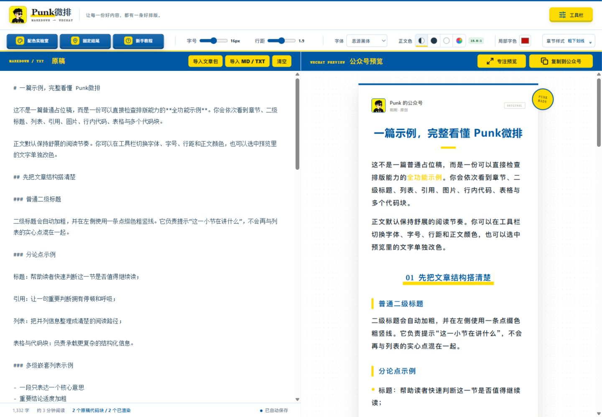
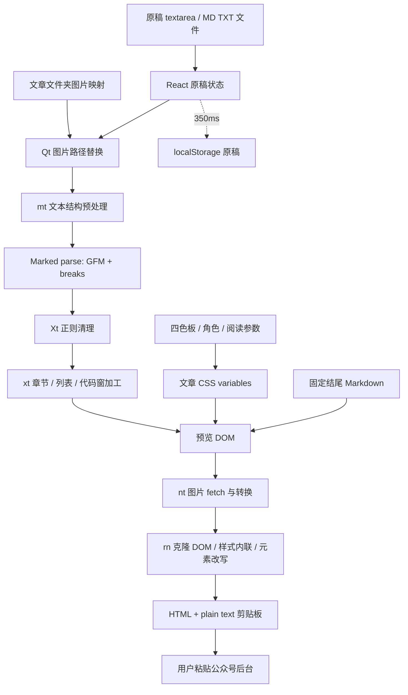

# Punk 微排技术架构、功能与 Cyber-Sight 复刻调研报告

本报告记录 2026-10-04 对目标网站和公开部署产物的核验。原站取证保持不变；产品方案现以[桀士排版独立应用设计](apps/jlab-wechat-editor.md)及其 ADR 为准。应用尚未实现。

## 1. 结论与证据边界

Punk 微排的核心是一条浏览器排版流水线：**Markdown 原稿 → 结构处理 → HTML → 文章主题 → 预览 → 图片处理与样式内联 → 富文本剪贴板 → 用户粘贴到公众号后台**。价值主要在文章视觉规则和公众号输出适配，而不是原稿输入框本身。[目标网站](https://weipai.iamadrianpunk.com/)及[部署业务脚本](https://weipai.iamadrianpunk.com/_next/static/chunks/page-u6Xrluxd.js)是主要证据。

维护者已确定独立应用“桀士排版 · Markdown 公众号排版助手 / JLab WeChat Editor”，在 `apps/wechat-editor/` 使用 Vue 3、Pinia、Element Plus、Vite、TypeScript，纯前端单页、无路由/后端，不集成 apps/frontend。排除新手教程、文章包和全部 IP 功能；工具栏、抽屉与拖拽双栏按现行独立应用设计实施。

证据分为三类：

| 标记     | 含义                                     | 本轮覆盖                                     |
| -------- | ---------------------------------------- | -------------------------------------------- |
| 已核验   | 页面可见，或部署资源中存在明确代码       | 界面、渲染、主题、文件夹导入、存储、复制算法 |
| 静态推断 | 根据代码状态及调用关系推导，尚未操作验证 | 局部颜色丢失、图片恢复缺口、伪元素复制缺失等 |
| 产品方案 | 维护者确认的独立应用约束                 | 当前权威设计见桀士排版应用文档               |

本次未找到可确认归属的公开源码仓库、依赖清单或许可证；不能提供作者源码目录和精确依赖版本。部署脚本经过压缩，短函数名仅用于定位。没有登录公众号、上传用户稿件或发布文章，也没有证明所有浏览器与公众号阅读模式兼容。

## 2. 产品工作流与界面



常规桌面界面包含顶部排版工具栏、左侧 Markdown/TXT 原稿、右侧公众号预览。配色和固定结尾使用弹窗；专注模式隐藏编辑区，提供手机/电脑预览宽度。首次打开有教程，之后可以重新查看。

这里的“复制到公众号”产生富文本剪贴板内容，用户仍需手动粘贴到公众号网页编辑器。未发现登录公众号、同步草稿箱或自动发布的实现证据。

## 3. 功能清单

| 能力           | 原站已核验行为                               | 实现与范围                                                 |
| -------------- | -------------------------------------------- | ---------------------------------------------------------- |
| 原稿编辑       | 普通多行输入框，实时预览、清空               | React 受控 `textarea`；未发现 CodeMirror/Monaco            |
| 文件导入       | MD、Markdown、TXT                            | FileReader 读取文本；无编码选择界面                        |
| 文章包导入     | 选择含正文和图片的文件夹                     | `webkitdirectory`；不是 ZIP 解包，默认取最大正文文件       |
| 基础排版       | 标题、段落、粗体、删除线、链接、引用、分隔线 | Marked，启用 GFM 与单换行转换                              |
| 列表           | 有序、无序、嵌套、任务列表                   | GFM 列表；另有短段落自动转列表规则                         |
| 标题层级       | 主标题、自动章节号、子标题装饰               | 章节重新编号；更深层级会扁平化                             |
| 章节外观       | 9 种样式，可加入 IP 图片                     | 下划线、斜线、竖线、方框、方括号、双圆、点阵、上置号、引号 |
| 代码块         | macOS 窗口外观、多个连续代码块、数量提示     | 逐行 span；未发现代码语法着色器                            |
| 表格           | 三线表视觉                                   | 全部单元格居中，不保持每列原始对齐                         |
| 阅读参数       | 字号、行距、字体、正文色                     | 字号 14–18px；行距 1.6–2.2；默认 16px/1.9                  |
| 配色预设       | Punk、复古潮流、红蓝 CP、活力橙              | 四色主题，经颜色角色分配到文章元素                         |
| 自定义配色     | 名称、HEX、颜色用途、底色开关                | 单色可承担多用途；有对比度显示                             |
| IP 提色        | 上传图像、生成三套配色、保存 IP              | 本地 Canvas 算法；未发现 AI 调用                           |
| 章节 IP        | 名称、头像、章节使用/不使用                  | 简易去背景，章节随主题渲染                                 |
| 局部改色       | 选中预览文字后设颜色                         | 直接改 DOM，未进入可恢复文档模型                           |
| 固定结尾       | 内容、启停、保存、清空                       | 独立 Markdown，追加到预览及复制结果                        |
| 草稿保存       | 原稿在当前浏览器自动恢复                     | localStorage，350ms 防抖；不同配置保存机制不同             |
| 字数与阅读时长 | 字数、预计分钟数                             | 界面辅助估算，不是稿件审核                                 |
| 专注预览       | 手机/电脑模式、返回编辑                      | CSS 宽度与布局切换，不模拟真实微信渲染器                   |
| 富文本复制     | HTML 与纯文本                                | 图片转换、样式内联、标签适配、现代/旧式复制分支            |
| 新手教程       | 首次引导、再次查看                           | 本地记录完成状态                                           |

本次业务脚本未发现数学公式、Mermaid、AI 改写/封面生成、协同编辑、云版本管理、主题收藏库、主题/固定结尾文件导入导出。不能把 CSS 中遗留的类名当作当前可用功能。

## 4. 技术架构

### 4.1 技术栈判断

| 层次        | 判断                                      | 依据与不确定性                                                                                              |
| ----------- | ----------------------------------------- | ----------------------------------------------------------------------------------------------------------- |
| UI 与交互   | React + Hooks                             | `useState/useMemo/useEffect/useRef`、JSX runtime、HTML 注入                                                 |
| 页面运行时  | 存在 vinext/Vite RSC 运行时               | 响应含 `vinext.navigationRuntime`、`vite-rsc/importer-resources`、RSC 流与 Rolldown runtime；无作者构建配置 |
| Markdown    | Marked 家族                               | 部署包含其 lexer/parser/renderer 和官方错误链接；版本未知                                                   |
| UI 图标     | SVG 图标，出现 Lucide 标记                | 不能据此确定依赖包版本                                                                                      |
| 样式        | CSS、CSS variables、媒体查询              | 文章和工具栏有独立色变量；精确源码样式工具链未知                                                            |
| 本地存储    | localStorage；图片用 Blob URL/data URL    | 已核验存储 key；未见 IndexedDB 文档持久化                                                                   |
| 图像处理    | FileReader、Canvas、Image、Object URL     | 本地提色、去背景、缩放和复制编码                                                                            |
| 输出        | DOM 克隆、getComputedStyle、ClipboardItem | 实际有 `text/html` 与 `text/plain`                                                                          |
| 服务端业务  | 本轮未发现依赖证据                        | 页面本身有服务端输出；不能由前端审查断言网站没有任何后端                                                    |
| 部署/数据库 | 未知                                      | 无配置、数据库 Schema 或可确认公开仓库                                                                      |

`/_next/` 路径不足以证明使用传统 Next.js 构建。vinext 官方说明它在 Vite 上实现 Next.js API 表面，并支持 RSC；这解释了当前响应中的兼容路径与 Vite 标记，但不证明网站部署到 Cloudflare 或使用某个具体版本。[vinext 官方仓库](https://github.com/cloudflare/vinext)

### 4.2 浏览器中的调用链



主要业务集中在一个较大的 React 页面组件，状态、文件、主题、素材、复制都由该组件编排。它适合解释原站实现；桀士排版独立应用按能力组件化，业务规则与工作台组装分开。

## 5. Markdown 到文章结构的逻辑

### 5.1 输入预处理

`Qt` 先替换本地图片地址；`mt` 扫描文本并跟踪围栏代码块，避免把代码内容当标题。若原稿已有 H2–H6，则不再自动猜章节；否则将符合“第 N 章”“一、…”等短行规则的内容改成章节标题。它还在某些列表/引用后补空行，减少普通正文被解析为上一结构的一部分。

这是显式启发式，适合一定格式的 TXT，不是自然语言结构理解。自动规则会改变显示结构，复刻时宜允许用户关闭并查看诊断。

### 5.2 Markdown 解析与 HTML 加工

Marked 以 `gfm: true, breaks: true` 输出 HTML，再经 `Xt` 清理和 `xt` 视觉加工。没有发现应用注册自定义 Marked renderer，代码中解析器自身的 `use/options` 定义不能算应用调用。

- 只有第一个标题为 H1 时，才保留为主标题。
- 除主标题外，全文最浅标题级别成为章节级别，统一渲染为带装饰的 H2。
- 正文章节统一生成 `01/02/...`，并尝试移除旧的中文或数字前缀。
- 更深层标题统一输出 H3，因此原 H3–H6 的多层语义可能消失。
- 带 IP 的章节标题根据文字长度采用并列或上下布局。
- 连续至少三个符合编号、冒号短句、分号结尾等规则的段落，可自动组合为列表。

### 5.3 代码与表格

代码块由默认解析器转义，再把 `<pre><code>` 包成 macOS 外观，每行放入 span。语言信息仅表现为 `language-*` 类，本次未发现语法高亮引擎。额外逻辑比较原稿 lexer 中代码块数与生成的代码窗数，帮助发现遗漏；数量一致仍不能证明内容和换行完全保真。

表格保留 HTML 表格结构，文章 CSS 和导出规则都统一居中并设置三线表边框。因此 Markdown 的左/右对齐不会按原设置保留。任务列表来自 GFM，复选框是禁用控件；公众号最终如何接收仍需验收。

## 6. 主题、IP 与局部改色

### 6.1 主题是颜色角色系统

```text
四色 palette
  → base / primary / bright / soft 通用角色
  → elementRoles 分配文章元素
  → CSS variables
  → 预览样式
  → 导出时计算为具体内联值
```

元素用途覆盖正文底色、标题、重点加粗、标题装饰、分割线、列表标记、代码块、表格、行内代码文字及底色、引用。字号、行距和字体同样传入文章根节点。正文色可自动、黑、白或自定义；自动模式比较深色/白色对背景的对比度，并显示低于 4.5:1 的提示。

“思源黑体”和“微软雅黑”是字体 fallback stack；检查的 CSS 没有 `@font-face`。不能认定网站提供在线中文字体，实际字形依赖操作系统。浏览器预览和微信阅读端也可能采用不同 fallback。

### 6.2 IP 提色不需要 AI

图像上传后，本地生成最长边不超过 600px 的头像与 IP 处理图。提色过程将图片缩到 64×64、间隔采样，排除透明、极亮极暗及低饱和像素，RGB 按 32 量化分桶，再依数量/饱和度/明度评分选取至多两种有明显距离的代表色。

三套色板分别用近似色、互补色、双 IP 色延展，经 HSL 与混白生成“两种鲜明色＋两种近白色”。去背景以四角平均色为基准从边缘 flood-fill，按色差生成透明度，是简单背景算法；复杂背景和主体边缘同色时可能误删。

因此这项能力可在本地浏览器实现，不需要推理模型。原生颜色输入面板是否提供吸色由环境决定；本次未发现 `EyeDropper` API。

### 6.3 局部文字颜色的模型缺口

原站监听预览中的 selectionchange，保存 Range。选择颜色时创建内联颜色 span，以 `surroundContents` 或 `extractContents/insertNode` 修改预览 DOM。

**已核验：**修改不回写 Markdown，也不保存为结构化标注。**静态推断：**正文或章节设置导致 HTML 重算时，局部颜色可能消失；刷新也没有恢复来源。本次未对局部改色做动态保留试验。

Cyber-Sight 应先决定原始 Markdown 与附加样式的权威来源。建议使用版本化文档及节点/来源区间标注，并设计编辑后的重定位或失效提示；不能只保存一段可能过期的 DOM Range。

## 7. 文章包、本地图片与固定结尾

### 7.1 文件夹导入

文章包流程读取文件夹所有文件，从 `.md/.markdown/.txt` 中按体积降序取最大文件为正文。图片以 MIME 或后缀识别，建立完整相对路径、相对正文目录路径和 basename 三类映射，再生成 Object URL。重新导入时释放上一批 URL。

路径替换支持 URL 解码、去开头 `./`、反斜杠转 `/`，也识别 Obsidian 的 `![[图片|参数]]`。HTTP、HTTPS、data、blob 地址保留。未见完整 `../` 路径正规化；文件名 fallback 会使同名图片产生歧义。

这解释了“本地文章＋图片”为什么不用上传服务器也能预览，同时揭示两个需改进的问题：多篇文章时应让用户选正文；同名图片和无法解析的路径应显式报错，不能悄悄选错素材。

### 7.2 素材不是完整持久化的草稿

Markdown 自动存 localStorage，图片映射和 Blob 只留在组件状态。刷新后可恢复文字，却没有重新构造本地图片的存储来源。**这是静态状态分析得出的恢复缺口，未做刷新试验。**本地稿件完整恢复需要把素材与文档一起保存，例如 IndexedDB 的 Blob 与稳定 assetId。

### 7.3 固定结尾

固定结尾有独立原稿、启用开关、清空与保存，使用同一渲染链，关闭结尾的章节自动编号和 IP，追加主题分隔线。它只进入预览/复制产物，不改主 Markdown。界面调整会实时预览，但点击保存才持久化。

本次没有发现多结尾模板库或固定结尾文件导入导出。

## 8. 状态管理与保存机制

| key                           | 保存内容                            | 时机                         |
| ----------------------------- | ----------------------------------- | ---------------------------- |
| `wewrite-draft`               | 原始 Markdown                       | 350ms 防抖自动保存，启动恢复 |
| `wewrite-ip-profile`          | IP 图/头像/名称、配色与部分阅读配置 | 点击保存 IP                  |
| `punk-weipai-fixed-ending-v1` | 结尾内容与 enabled                  | 点击保存固定结尾             |
| `punk-weipai-theme-names-v1`  | 色板名称映射                        | 独立自动保存                 |
| `punk-weipai-onboarding-v4`   | 教程完成标记                        | 完成或跳过                   |

不同设置并非全部自动保存。配置恢复包含部分类型判断，坏 JSON 会清除对应配置；没有完整 Schema、版本迁移、备份、历史版本或跨标签冲突机制证据。IP 保存有空间错误提示，原稿等写入没有统一异常处理。状态栏的保存文字未绑定真实写入成功状态。

业务包还含按示例标题识别旧演示稿并替换为新示例的逻辑。Cyber-Sight 的真实稿件迁移必须使用明确版本，不能用文章标题子串猜测并重置用户内容。

## 9. 复制到公众号的实现

下文描述原站实现。微信官方规范与 Cyber-Sight 候选导出规则另见[公众号兼容规则与实施准备](wechat-editor-wechat-compatibility.md)，两者不能混同为已验收的公众号支持范围。

### 9.1 为什么要另做输出转换

文章预览依赖类名、CSS variables、布局与浏览器样式。复制时原站不只取 `innerHTML`，而是把样式计算为内联值，并对文章元素再加工，以减少离开网站后的样式丢失。


### 9.2 图片处理

复制前遍历图片，fetch 成 Blob，转换为 data URL；PNG/JPEG/WebP 可 Canvas 重采样。正文尺寸受 1440×2400 边界约束，头像受 128×160 边界约束。章节头像始终编码为 PNG；需重新编码的正文图片有透明度时采用 PNG，否则采用 JPEG quality 0.88。正文大图、WebP、需缩放或裁剪时进入重新编码流程。

正文图片还会分析透明/近白边缘；达到面积收益阈值才裁剪并保留 padding。这可能改变作者刻意保留的白边或完整画面，Cyber-Sight 宜提供可见的开关。远程图片 fetch/CORS 失败时可能保留原地址；本地 blob/data 失败会报错。data URL 能进入剪贴板，不代表公众号一定接收并托管成功。

### 9.3 样式与标签处理

`rn` 克隆文章，按原节点/克隆节点对应关系获取计算样式，写入内联属性；然后处理：

- 表格的宽度、边框与居中；列表标记色与正文色分别设置。
- 九种章节装饰转成具体字符、尺寸、边框和阴影。
- 代码块逐行布局、空行高度、字号和行距。
- 图片旧尺寸/对齐属性清理、居中、最大宽度和 contain；章节 IP 单独限制。
- 行内字体、断行、行高统一；移除 class/id。
- 普通文字块的行高换算为 px，至少为字号的 1.5 倍；PRE、代码窗与装饰元素有独立规则。另检查图片宽度/max-width 和异常行高。

预览 H1 的某些装饰依赖伪元素，未发现导出物化该伪元素的代码，复制后可能缺失；这是静态推断。内置检查范围有限，不是公众号兼容性的完整证明。

### 9.4 剪贴板分支

支持现代接口时，创建一个 `ClipboardItem`，同时写 `text/html` 与 `text/plain`；API 不存在时，创建屏幕外 contentEditable、Range 选中，再调用 `execCommand('copy')`。HTML 超过 10,000,000 个字符时拒绝复制，这不是精确的 10MB 文件限制。[ClipboardItem 文档](https://developer.mozilla.org/en-US/docs/Web/API/ClipboardItem)

现代 write 被拒绝时没有自动进入旧分支，旧复制分支也没有检查返回布尔值。复刻应明确权限失败、图片失败、导出过大和复制结果状态，不能单凭固定成功文案判断完成。

### 9.5 本轮实际复制证据

在新建调研浏览器中使用原站默认示例，没有上传用户文件。点击复制后，读取该浏览器的剪贴板得到：

| 指标       | 实际结果                      |
| ---------- | ----------------------------- |
| MIME       | `text/html`、`text/plain`     |
| HTML 长度  | 188,061 个字符                |
| 纯文本长度 | 1,169 个字符                  |
| 代码块     | 2 个 `<pre>`                  |
| 图片       | 1 个 ``，包含 data:image |
| 内联样式   | 156 处 `style=`               |

这验证了默认样例成功生成富文本，并保留代码块数量和嵌入图片。未进行公众号后台粘贴、保存、图片接收、手机阅读或深色阅读验收；不能据此宣称公众号显示完全保真。

## 10. 复刻时需要明确处理的限制

| 事项                | 证据性质                          | 对实现的影响与建议                                         |
| ------------------- | --------------------------------- | ---------------------------------------------------------- |
| HTML 安全清理       | 已见三类正则；未做攻击试验        | 不应照搬。按标签/属性/URL/CSS 白名单清理并限制原始 HTML    |
| 局部颜色保留        | DOM 改动已见；丢失为静态推断      | 进入文档标注模型，定义编辑重定位和持久化                   |
| 本地图片恢复        | 静态状态推断                      | IndexedDB 保存 Blob，稳定 assetId，不只保存正文            |
| 多稿/同名素材       | 最大文件和 basename fallback 已见 | 正文显式选择，路径正规化、冲突及缺图提示                   |
| 标题结构与自动列表  | 算法已见                          | 可选规则，保留源层级与来源区间，避免静默改结构             |
| 图片自动裁剪        | 算法已见                          | 默认保全画面，裁剪需可见可关闭                             |
| 字体、伪元素与布局  | 字体栈已见；伪元素损失为推断      | 发布输出采用独立兼容策略，不能完全依赖预览 CSS             |
| 复制降级与成功提示  | 分支已见                          | 处理权限失败和返回值，提供明确恢复动作                     |
| 保存配额/损坏       | 部分处理已见                      | 真实状态、统一错误处理、版本校验、恢复/备份                |
| 公众号图片/链接/CSS | 尚未验收                          | 人工粘贴、保存及阅读验收，不把 DOM 检查当成最终结果        |
| 未知源码与版本      | 搜索和资源边界                    | 独立实现功能，后续选择依赖并锁定版本；产品品牌素材自行准备 |

`Xt` 只剔除成对 script/style/iframe/object、带引号 on* 属性和字面 javascript:，之后注入 HTML。原始 HTML、无引号事件属性、混淆协议等没有完整白名单处理。Marked 官方也明确说明它不负责 HTML 安全清洗。桀士排版需在浏览器预览前主动清洗输入，并建议以独立 origin 部署隔离管理系统状态；具体安全边界见独立应用设计。[Marked 官方文档](https://marked.js.org/)

以上是调研范围内的实现限制，不是本轮对 Cyber-Sight 代码的缺陷结论；本轮未修改业务代码。

## 11. 独立应用决定与仓库现状

维护者已选择 monorepo 中的独立应用，原先注册到 apps/frontend 的 Platform 页面方案未实施，现不采用。正式产品边界与交互以[独立应用设计](apps/jlab-wechat-editor.md)为权威来源，长期决定记录在[应用 ADR](../decisions/ADR-20261004-jlab-wechat-editor-standalone-app.md)。

当前 workspace 的 apps/* 已覆盖独立应用目录；根递归 build 与显式筛选的 dev 启动方式不同。现有 frontend 的动态路由、菜单、认证、PRISM 与 Geo 注册机制只是既有应用事实，不是桀士排版的接入点。新应用的所有权分类及架构检查覆盖仍需在写代码前登记。

## 12. 已选方案与职责

中文名“桀士排版 · Markdown 公众号排版助手”，英文名“JLab WeChat Editor”。计划在 apps/wechat-editor/ 独立创建，以 Vue 3、Pinia、Element Plus、Vite、TypeScript 实现纯前端单页，无 Router、后端、业务 HTTP 契约或账号依赖。

独立应用内部包含文章、排版、结尾、素材、公众号导出及工作台组件职责。模型、选区映射、稳定素材 id、IndexedDB 保存和输出 profile 详见现行设计，不在研究报告复制第二套接口。

| 原站能力                              | 桀士排版范围                                   |
| ------------------------------------- | ---------------------------------------------- |
| 编辑/预览、配色、章节、阅读参数、复制 | 保留并独立组件化                               |
| 原站两层顶部栏                        | 合并为单层；正文色、局部字色、章节样式直接显示 |
| 文字参数、配色实验室、固定结尾        | 平行按钮，左侧向右的非模态抽屉，修改实时预览   |
| 双栏编辑/预览                         | 保留，分隔线可拖拽修改比例                     |
| 单文件导入、本地草稿、专注预览        | 保留；不依赖云端或管理系统                     |
| 教程、文章包、IP/提色/去底            | 不纳入；第 3、6、7、8 节相关内容仍是原站取证   |

## 13. 实施顺序与验收

当前只调整文档，没有开发应用代码。分期按现行设计的 P0 接入/兼容准备、P1 独立工作台、P2 排版与恢复、P3 公众号复制闭环执行；不设云端扩展阶段。依赖、许可、部署和规则版本在实施前锁定。

人工验收覆盖单层顶栏、三类抽屉占位与实时预览、拖拽/键盘比例、局部颜色在改稿和刷新后恢复、单文件/图片与存储失败、代码/表格/外链/字体，以及公众号粘贴、保存和真机明暗。默认不创建或运行前端自动化测试；格式、类型和生产构建不能替代这些验收。

## 14. 来源与证据定位

### 14.1 外部一手来源

| 编号 | 来源                                                                                                   | 用途                                 |
| ---- | ------------------------------------------------------------------------------------------------------ | ------------------------------------ |
| S1   | [目标网站](https://weipai.iamadrianpunk.com/)                                                          | 当前界面、默认示例与交互核对         |
| S2   | [业务发布脚本 page-u6Xrluxd.js](https://weipai.iamadrianpunk.com/_next/static/chunks/page-u6Xrluxd.js) | 解析、渲染、状态、图片、复制算法     |
| S3   | [入口脚本 index-BuvsT2xS.js](https://weipai.iamadrianpunk.com/_next/static/chunks/index-BuvsT2xS.js)   | 页面运行时和入口辅助                 |
| S4   | [样式 index.CI6Ok2sr.css](https://weipai.iamadrianpunk.com/_next/static/css/index.CI6Ok2sr.css)        | 文章视觉、字体规则与响应式           |
| S5   | [vinext 官方仓库](https://github.com/cloudflare/vinext)                                                | 运行时标记解释，不能据此证明网站宿主 |
| S6   | [Marked 官方文档](https://marked.js.org/)                                                              | Markdown 库职责与安全边界            |
| S7   | [ClipboardItem 文档](https://developer.mozilla.org/en-US/docs/Web/API/ClipboardItem)                   | 富文本剪贴板接口                     |

搜索结果中的转载、用户评价不作为技术实现证据。GitHub 查询未找到可确认归属的公开项目，不等同于证明项目未开源。

### 14.2 固定部署样本

| 文件               | 实际字节 | SHA-256                                                            |
| ------------------ | -------- | ------------------------------------------------------------------ |
| page-u6Xrluxd.js   | 113,594  | `91abfd83d6498ecc0a8417fa2bf8e5502142f9cec05166b313fac58e765c3e32` |
| index-BuvsT2xS.js  | 176,558  | `7ab6e482eef7d0a392a1e928483629ccaf9deeb92f385e55104453f3d343d23b` |
| index.CI6Ok2sr.css | 116,501  | `46a10f9c130e2fab8eaee7c172eab19b2aa97845b43e521f7a6194d39ed89026` |

下载与格式化副本只存于系统 TEMP；仓库保存分析、来源、hash 和截图，不加入原站压缩包。复核者应先校验资源 hash；网站更新后旧结论不能视为新版本结论。

S2 可按以下打包短符号定位。偏移是 UTF-8 解码后 JavaScript 字符串的近似字符位置，不是字节位置，也不是作者源文件行号。

| 符号/标记                          | 定位                                 | 所支持结论                                   |
| ---------------------------------- | ------------------------------------ | -------------------------------------------- |
| `mt / gt / bt / yt / vt / xt / St` | 搜索函数声明                         | 文本预处理、自动列表、章节与代码窗、代码数量 |
| `Vt / Ht / Ut`                     | 约 58,487 起                         | 亮度、对比度与文字色                         |
| `qt / Jt / Yt`                     | 约 59,668 / 60,321 / 61,155          | 三套色板生成、像素提色、边缘去背景           |
| `Xt / Zt / Qt`                     | 约 62,222 / 62,382–62,899            | HTML 清理、图片路径替换                      |
| `nn / rn / Ot`                     | 搜索函数声明                         | 图像复制编码、DOM 样式内联、行高             |
| `an / wewrite-draft`               | 约 76,473–79,093                     | 页面状态、恢复、350ms 保存                   |
| `qe / Ye / Xe / Qe`                | 约 81,072 / 82,622 / 83,170 / 83,477 | IP 上传/保存、局部改色、结尾保存             |
| `et / tt / nt`                     | 约 83,856 / 84,077 / 85,090          | 文本导入、文件夹导入、复制                   |
| `dangerouslySetInnerHTML`          | 约 107,329                           | HTML 注入预览                                |

## 15. 本轮交付与未决事项

后续已补充[公众号 HTML/CSS 兼容规则与实施准备](wechat-editor-wechat-compatibility.md)：官方结构、字体、深色模式要求及候选标签/样式矩阵。真实公众号粘贴、保存、图片托管与跨端验收仍未完成。

本轮仅形成报告、截图和文档治理记录，没有实现编辑器、修改运行代码、添加依赖或作产品发布。归档计划和日志见下方链接。

名称、独立应用边界、技术栈、裁剪功能、工具栏/抽屉/分栏已由维护者确定。后续仍需锁定解析与清洗依赖、许可、静态部署地址、所有权覆盖和人工兼容结果；不增加文章包/IP、账号或后端路线。本报告不替代现行独立应用设计。

报告提交前验证：`pnpm format`、`pnpm format:check`、`git diff --check` 通过；当时 7 份 Markdown 共 180 条本地链接全部存在；归档 CI 返回 `NOT_DUE`。报告提交为 `45890e734a3ace5171d3b01aa06ce793dbb499ba`。原站复制证据见第 9.5 节，公众号兼容性保留人工验收边界。

### 后续设计与归档复核

维护者已授权两处草案：同步流程改为合并后审查再提交；身份 ADR 明确默认视觉与运行时主题关系。旧身份决定继续有效。兼容调研与独立应用设计分别完成文档交付，公众号人工验收仍未执行。归档状态及本轮完成记录从 [Platform 历史索引](../archive/README.md)查阅，避免保留已失效的待授权结论。

- [独立应用设计](apps/jlab-wechat-editor.md)
- [应用 ADR](../decisions/ADR-20261004-jlab-wechat-editor-standalone-app.md)
- [公众号兼容规则](wechat-editor-wechat-compatibility.md)
- [模块边界](../../foundation/design/module-boundaries.md)
