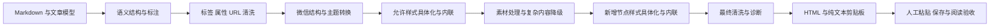

# 公众号编辑器 HTML 与 CSS 兼容规则和实施准备

## 1. 结论与适用范围

已读取微信官方《编辑器插件开发规范》及其关联的官方结构校验仓库。公开规范明确了 HTML 结构、CSS 使用、字体和深色模式规则，但没有列出完整的粘贴过滤标签、属性及 CSS 白名单。因此，能够确定的是官方明确说明的结构与兼容要求；下文的导出允许集合是 Cyber-Sight 的实现建议，尚未经过公众号粘贴、保存和阅读验收。

本文提供规范研究与实施准备，没有新增应用代码或依赖。产品约束见[桀士排版独立应用设计](apps/jlab-wechat-editor.md)及其 ADR：只做纯前端手动复制，API 信息是参照资料，不属于应用路线。微排输出是取证对象，不能直接成为微信支持标准。

| 链路                                | 本轮依据                            | 仍需核验                                 |
| ----------------------------------- | ----------------------------------- | ---------------------------------------- |
| 浏览器复制 → 公众号粘贴             | HTML 富文本输出、官方结构与排版规则 | 后台实际保留的标签、属性、样式和图片     |
| 后台保存 → 再次打开                 | 结构规范可能导致整理或删除          | 保存后结构是否稳定、再次编辑是否可用     |
| 预览/发布 → 电脑、iOS、Android 阅读 | 响应式及深色模式规范                | 长行、宽表、字体、图片与明暗可读性       |
| HTTP 草稿 API                       | `content`、正文图片及接口字段文档   | 账号权限、大小歧义、服务端返回及保存保真 |

API 限制不直接套用到手动粘贴；后台预览正常也不能证明客户端效果。来源编号与固定版本见第 10 节。

## 2. 官方规范可直接约束的规则

本节对照 W1/W2 的章节号记录事实，措辞中的“建议”与“违规场景”保持原有强度；并非所有项目防护都属于微信过滤规则。

| 编号  | 规范定位              | 可确定要求                                                    | 导出准备                                  |
| ----- | --------------------- | ------------------------------------------------------------- | ----------------------------------------- |
| WX-01 | 1.1 opacity           | 隐藏真实图片并用 SVG 背景代替会影响后台替换图片               | 不生成这种替身结构                        |
| WX-02 | 1.2 caret-color       | 透明光标影响编辑定位                                          | 输出不携带光标样式                        |
| WX-03 | 1.3 line-height       | 多行叠字需规避；单行或无文字图片拼接有例外                    | 文字和装饰节点分别处理                    |
| WX-04 | 1.4 width             | 跨屏居中、宽度比例与溢出需核验；建议记录图片原始宽度 `data-w` | 相对宽度优先，长行/宽表单独验收           |
| WX-05 | 1.5 height            | 避免文字被零高或固定高度裁切；SVG/无文字/可滚动情形有例外     | 正文高度随内容增长                        |
| WX-06 | 1.6 text-align        | 规避 `start`、`end` 的跨端差异                                | 按文章方向转换成 `left`、`right` 等明确值 |
| WX-07 | 1.7 begin             | SVG 动画仅触摸触发不能兼顾 PC                                 | 若后续启用交互 SVG，单独处理触摸与点击    |
| WX-08 | 1.8 pre               | 普通段落不应借用 `pre`；推荐 `section`/`p`                    | `pre` 只用于代码候选方案                  |
| WX-09 | 2.1 嵌套              | 同标签、同内联样式、单子节点连续冗余链不超过 10 层            | 检查该特定链，不能理解为全部 DOM 深度上限 |
| WX-10 | 2.2 span[leaf]        | 只容纳文本和行内元素                                          | 不用它包裹段落、表格或引用块              |
| WX-11 | 2.3 section[nodeleaf] | 仅用于指定组件或图片                                          | 普通排版不伪造官方组件容器                |
| WX-12 | 3 字体                | 不建议自定义 `font-family`                                    | 默认公众号输出省略字体族                  |
| WX-13 | 4.1 颜色              | 深色转换会调整可读性，文字渐变背景可能被合成纯色              | 主题不能承诺最终色值不变                  |
| WX-14 | 4.2 结构              | 共用背景放共同容器；视觉顺序应与结构顺序对应                  | 避免定位文字到无从属关系的背景上          |
| WX-15 | 4.3–4.4 图片/SVG      | 普通图片不做文字颜色识别；透明深色图与 SVG 要考虑深底         | 正文保留文本；图表另查明暗可读性          |
| WX-16 | 4.5.2 !important      | 不建议使用，会干扰公共样式及深色转换                          | 输出移除优先级标记                        |

三个属性的职责不同：`data-ignore-width` 跳过节点及子树的宽度检测；`data-no-dark` 跳过当前节点实际深色转换；`data-ignore-dm` 跳过当前节点指定深色校验。后两者均不能推断为对子树全部生效。默认导出不添加豁免，防止用“通过校验”掩盖问题。W1/W2 §1.4.4、§4.5.1、§4.6。

官方没有规定所有行高必须转成 px，也没有规定行高至少为字号的 1.5 倍。微排的 px 转换与最低行高是其输出策略。Cyber-Sight 可以独立选择行高策略，但要说明它属于工程选择。

## 3. HTML 标签矩阵

“规范提及”表示官方说明了使用或结构，不代表公开承诺所有输入形式都能穿过粘贴过滤。“源码实践”表示第三方工具实际生成，亦不等于本轮已验证微信接收。

| 标签/内容                                            | 证据                                            | 建议处理                                          | 验收重点                         |
| ---------------------------------------------------- | ----------------------------------------------- | ------------------------------------------------- | -------------------------------- |
| `section`、`p`                                       | W1 §1.8 推荐普通正文使用                        | 核心输出候选，合法块结构                          | 段落间距、回车编辑、保存稳定     |
| `span`、`strong`、`img`                              | W1 §2.2 说明行内叶子元素；图片另有规范          | 核心输出候选；图片走独立素材策略                  | 局部颜色、加粗、图片接收         |
| `br`、`em`                                           | 开源导出实践；Markdown 基础语义                 | 核心输出候选                                      | 连续换行、斜体与中文表现         |
| `h1`–`h6`                                            | M1/M2 导出实践                                  | 语义扩展；保留层级或转换成带标题角色的 `section`  | 后台标题样式重写与再次编辑       |
| `b`、`i`、`u`、`s`、`del`、`mark`                    | 不作为本轮官方支持结论                          | 输入统一成 `strong`/`em`/带具体样式的 `span`      | 转换后强调语义不丢失             |
| `blockquote`                                         | M1/M2 引用实践                                  | 语义扩展；必要时转换成 `section`，保留引用标识    | 内部段落、侧边线、段前后编辑     |
| `ul`、`ol`、`li`                                     | M1/M2 列表实践                                  | 语义扩展；原生列表与可见编号方案分别验收          | 嵌套、起始编号、粘贴后缩进       |
| `pre`、`code`                                        | W1 明确限制普通正文用 `pre`；M1/M2 代码实践     | 代码扩展；长行采用可换行或可滚动候选方案          | 空格、空行、长 URL、字符复制     |
| `table`、`thead`、`tbody`、`tr`、`th`、`td`          | W1 讨论宽表问题；M1/M2 表格实践                 | 表格扩展；禁止把宽表默认视为可用                  | 窄屏溢出、单元格换行、保存后结构 |
| `a`                                                  | W4 说明已群发公众号文章链接；M1/M2 链接转换实践 | 条件保留，任意站外链接默认转换为可见 URL/参考文献 | 账号权限、跳转、文字与目标一致   |
| `hr`                                                 | 开源分隔线实践                                  | 可转换成仅带边框的 `section`                      | 空段落、分隔线可编辑性           |
| `div`、`figure`、`figcaption`、`small`、`sub`、`sup` | 不作为完整官方允许集合                          | 按语义转成 `section`、`p`、`span`；上下标作为扩展 | 注释、图片说明和上下标基线       |
| `svg`、`g`、`path`、`animate` 等                     | W1 §1.7、§4.4 明确讨论 SVG/交互                 | 原生 SVG 是待独立验收扩展；首期图表可转成图片     | 静态/交互、编辑能力、深色对比度  |
| 数学/流程图输出                                      | M1 有相关输出实践；不是微信完整标准             | 生成受控图片或独立 SVG profile；保留源内容        | 清晰度、文本说明、明暗可读性     |
| 任务 `input`、表单控件                               | 本轮未确认可用                                  | 任务状态转成可见字符；丢弃交互控件                | 勾选状态与文字保留               |
| `script`、`iframe`、`object`、`embed`、`form` 等     | W3 明确去除 JS；其余属于项目安全范围            | 项目导出拒绝主动/嵌入内容，记录诊断               | 不执行输入；不吞掉相邻正文       |
| 官方视频、音频、小程序、商品组件                     | 官方组件不等于任意网页标签                      | 首期提示后台手动插入，不仿造内部属性              | 以后按专门接口和权限验收         |

建议首期核心候选集合为 `section p span br strong em img`，语义扩展按标题、列表、引用、代码、表格逐类晋升。这样可以先验证基础复制链，再复刻微排的高级外观；不是要求把所有 Markdown 首期都降成无层次正文。

未知普通容器可在保持文本顺序和语义的前提下转换；脚本等主动内容整节点丢弃。代码中的 `<script>` 等字样必须作为转义文本保留，不能按标签误删。

## 4. 属性及 URL 矩阵

| 属性                                                  | 项目策略草案                               | 依据/限制                                   |
| ----------------------------------------------------- | ------------------------------------------ | ------------------------------------------- |
| `style`                                               | 仅保留经过解析和值校验的内联声明           | M1/M2 内联实践；允许属性名不等于允许任意值  |
| `class`、`id`                                         | 可用于内部渲染定位，最终输出不依赖         | 不宣称官方一律过滤；移除后仍应维持外观      |
| `img.src`、`alt`                                      | 允许受控图片来源和转义替代文本             | URL 状态与资源是否可迁移分开判断            |
| `img.data-w`                                          | 由真实素材宽度生成，不能填显示宽度         | W1 §1.4.3；该属性辅助校验，不保证图片被托管 |
| `width`、`height`                                     | 图片可保留真实尺寸信息，显示使用响应式规则 | 固定尺寸不能造成跨屏裁切                    |
| `a.href`                                              | 先按协议校验，再按目标/输出链路处理        | `https` 合法不等于公众号可点击              |
| `title`、`lang`                                       | 只有存在明确用途才保留                     | 不依赖其最终保存或展示                      |
| `ol.start`、单元格跨度                                | 语义扩展单独验收后保留                     | 不把浏览器 HTML 能力当公众号保证            |
| `leaf`、`nodeleaf`                                    | 默认不主动生成                             | W1 规定内部结构，但未要求第三方文章自行添加 |
| `data-src`、微信内部组件属性                          | 不伪造；只由正式素材适配器按已核实协议生成 | 任意 `data-*` 不形成通用白名单              |
| `data-ignore-width`、`data-no-dark`、`data-ignore-dm` | 仅经明确选择和验收的高级功能使用           | 校验豁免、深色转换、校验规则豁免三者不同    |
| `on*`、`srcdoc`、未知交互属性                         | 拒绝                                       | 项目主动内容防护；不是依靠微信兜底          |

URL 按解析后的协议和用途处理，拒绝 `javascript:`、`vbscript:`、`file:` 等来源。`data:` 仅允许已解析并重新编码的受控栅格图片，不接收任意 HTML/SVG data 内容；`blob:` 仅供本地预览和素材读取，最终输出必须转换。CSS 中的 `url()` 同样需要素材/协议处理，不能只检查 `img.src`。

### 图片链路

手动复制时，微排把部分图片转为 data URL，本轮只证明它们进入剪贴板，未证明公众号已接收、保存及托管。因此可保留为待验收复制策略，并在粘贴后检查实际图片来源。远程图片、CORS 失败、超大图、透明图、GIF/WebP 各自给出诊断，失败时不能静默留下本地 blob URL 或忽略图片。

API 草稿时，W3 明确要求正文图片用 uploadimg 返回 URL，外部 URL 会被过滤。W4 当前支持 jpg/png、图片小于 1MB；这是该接口的要求，不能直接当成所有手动粘贴图片的统一格式限制。正文 URL 与封面永久 `media_id` 是不同用途。转换为 jpg 会丢透明、转换动图会丢动画，应先告知并保留原素材。

## 5. CSS 导出范围草案

以下是建议的项目 profile，不是腾讯公开的 CSS 许可表。默认只输出用到的规则与明确值，不把 `getComputedStyle()` 全部属性复制出去。

| 分组        | 候选属性/值                                                                                | 处理与边界                                                                                                            |
| ----------- | ------------------------------------------------------------------------------------------ | --------------------------------------------------------------------------------------------------------------------- |
| 颜色        | `color`、`background-color`，具体 HEX/RGB 值                                               | 基础候选；半透明色与多层背景单独验收，深色模式可能改色                                                                |
| 字体        | `font-size`、`font-weight`、`font-style`                                                   | 基础候选；字号与粗细采用受控值                                                                                        |
| 行高        | `line-height`                                                                              | 按节点角色输出；可选择无单位或 px，检查混合字号多行；不冒充官方强制单位                                               |
| 文本        | `text-align:left/center/right/justify`、`text-decoration`、`letter-spacing`、`text-indent` | 明确方向；缩进/两端对齐列入窄屏验收                                                                                   |
| 间距        | `margin-*`、`padding-*`，受控非负长度                                                      | 避免过大偏移；默认不允许负边距                                                                                        |
| 边框        | `border-*-width/style/color`、`border-radius`                                              | 可用于引用、高亮与分隔线；圆角需检查图片与背景裁切                                                                    |
| 基础盒子    | `display:block/inline/inline-block`、`box-sizing:border-box`                               | 项目候选；避免依赖组件布局和绝对定位；表格/列表扩展保留对应原生 table、row/group/cell、list-item 语义，不统一转 block |
| 宽度        | `width`、`max-width`，百分比/受控尺寸                                                      | 图片 `max-width:100%` 与正文自适应；不把桌面预览像素宽度冻结进正文                                                    |
| 图片        | `height:auto`、`vertical-align`                                                            | 候选；`object-fit` 裁剪效果作为扩展，不能改变图片重要内容而不提示                                                     |
| 代码        | `white-space:pre-wrap`、换行属性，或 `overflow-x:auto`                                     | 属于代码扩展；换行/滚动两种策略分别验收，普通段落不用 `pre`                                                           |
| 列表        | `list-style-type`、缩进及编号样式                                                          | 条件候选；不依赖 `::marker` 或 CSS counter 自动生成必要编号                                                           |
| 表格        | `border-collapse`、`border-spacing`、`table-layout`、单元格对齐/边框                       | 条件候选；长内容仍须检查，`table-layout:fixed` 不是自动解决宽表                                                       |
| 字体族      | `font-family`、`font` 简写、外部字体                                                       | 默认省略；显式选择的字体/代码字体作为需验收例外，预览与导出一致并提示设备差异；避免简写重新引入字体族                 |
| 变量/样式表 | CSS 变量、`var()`、类选择器、`style/link`、`@media`、`@font-face`                          | 导出前解析为具体节点样式；最终片段不依赖外部样式表                                                                    |
| 伪元素      | `::before`、`::after`、`::marker`、`content`、counter                                      | 将必要文字/装饰实体化为实际节点；开源工具也有伪元素内联策略                                                           |
| 复杂布局    | flex/grid、float、position、transform、z-index                                             | 默认 profile 不生成；不能因此声称微信全部不支持                                                                       |
| 高级视觉    | 渐变、背景图片、box/text-shadow、filter、动画                                              | 独立扩展；文字渐变背景有官方深色转换风险，背景图也走素材策略                                                          |
| 编辑/交互   | caret、pointer、user-select、cursor 等                                                     | 不带入文章；移除 `!important`，不输出 `display:none`/透明文字隐藏正文                                                 |

样式校验还需要拒绝未经处理的 URL、可执行历史 CSS 语法和不在值域内的函数。允许属性名后仍须验证值；不使用正则去掉几个危险字符串便认为整体安全。

主题编辑可以保留丰富预览，但输出要通过同一 profile 生成。桀士排版自身 UI 与文章主题分别定义，不依赖管理系统 PRISM 壳；不能把应用深色 CSS 当成微信阅读端算法。本轮未承诺任意字号、颜色、背景或字体在保存后完全保留。

## 6. 开源实践的意义与局限

M1/M2 使用 CSS 内联及伪元素处理；其中列表、链接、代码、表格等存在平台适配。它们支持“导出必须单独处理”的架构选择，不构成完整微信白名单。

| 实践          | 固定源码定位                                                                                                                                                                                                                                                                               | 可用于后续实现的判断                                                     |
| ------------- | ------------------------------------------------------------------------------------------------------------------------------------------------------------------------------------------------------------------------------------------------------------------------------------------ | ------------------------------------------------------------------------ |
| 内联与伪元素  | [doocs clipboard.ts](https://github.com/doocs/md/blob/a7c17fc4cda92e3c13aa7e24f06615cfa4219b31/apps/web/src/services/export/clipboard.ts#L13)、[mdnice converter.js](https://github.com/mdnice/markdown-nice/blob/6525a5aba371209c2840593e8f537b4a69137a4b/src/utils/converter.js#L104)    | 内联失败也要有诊断；mdnice 历史 `preserveImportant` 不能覆盖当前官方建议 |
| 代码换行/空白 | [doocs languages.ts](https://github.com/doocs/md/blob/a7c17fc4cda92e3c13aa7e24f06615cfa4219b31/packages/core/src/utils/languages.ts#L69)                                                                                                                                                   | 可见空格、换行与高亮结构需专门转换；该文件也包含 flex 模板               |
| 表格与列表    | [doocs 表格渲染](https://github.com/doocs/md/blob/a7c17fc4cda92e3c13aa7e24f06615cfa4219b31/packages/core/src/renderer/renderer-impl.ts#L423)、[列表结构转换](https://github.com/doocs/md/blob/a7c17fc4cda92e3c13aa7e24f06615cfa4219b31/apps/web/src/services/export/clipboard-dom.ts#L162) | 输出存在平台转换，不能直接等同浏览器默认语义                             |
| SVG 与数学    | [doocs SVG 适配](https://github.com/doocs/md/blob/a7c17fc4cda92e3c13aa7e24f06615cfa4219b31/apps/web/src/services/export/wechat-svg.ts#L1368)、[mdnice 数学转换](https://github.com/mdnice/markdown-nice/blob/6525a5aba371209c2840593e8f537b4a69137a4b/src/utils/converter.js#L13)          | 原生 SVG 路径需要引用展开、样式/尺寸/色彩处理，不直接透传任意 raw SVG    |
| 内嵌资源      | [doocs inlineEmojiImages.ts](https://github.com/doocs/md/blob/a7c17fc4cda92e3c13aa7e24f06615cfa4219b31/apps/web/src/lib/export/inlineEmojiImages.ts#L45)                                                                                                                                   | 仅证明特定资源内嵌，不能推导任意 data 图片接收                           |
| 外链参考      | [doocs 链接渲染](https://github.com/doocs/md/blob/a7c17fc4cda92e3c13aa7e24f06615cfa4219b31/packages/core/src/renderer/renderer-impl.ts#L396)、[mdnice 外链转换](https://github.com/mdnice/markdown-nice/blob/6525a5aba371209c2840593e8f537b4a69137a4b/src/utils/editorKeyEvents.js#L70)    | 有 `a` 节点与最终链接可点击是两个结论                                    |

flex、背景图、SVG 等不能一概写成不支持：官方规范直接讨论其中部分场景，成熟工具也有相关输出。首期限制复杂布局是为了缩小待验收范围。微排使用自定义字体族、批量内联计算样式和 data 图片，也不表示这些选择符合当前官方建议或已经通过公众号验收。

源码中为 Juice 解析或 SVG 兼容而命名的 sanitize 方法，不作为完整 XSS 清洗证明；导出仍须独立处理标签、属性、URL 和 CSS 值。

## 7. 建议的实现职责与输出流程

最终清洗放在转换之后，避免图片转换或伪元素实体化重新引入未允许内容。降级新生成的节点再次经过允许样式具体化和内联。两次清洗都不执行输入脚本；必需文本、编号、引用与图片说明尽量保留，结构转换需报告语义损失。

异步处理开始前固定文章 revision 和 profile 版本，等待素材完成或返回明确诊断，避免将用户编辑过程中的不同版本混入同一次输出。

建议在独立应用 `apps/wechat-editor` 的公众号导出职责中定义版本化 `ExportProfile`，至少包含：

- `id/version/channel`：比如 `wechat-clipboard-core@0.1-draft`；当前应用只做手动复制，不建 API 草稿 profile，不把未验收版本标为 stable。
- 标签/属性允许集合、输入到输出转换、CSS 属性和值域、素材与 URL 规则、复杂内容策略。
- `Diagnostic`：规则编号、证据类型、级别、节点/源位置、原因、转换动作；区分“不允许”“未验收”“素材失败”“账号限制”。
- `ExportResult`：`html`、`plainText`、诊断、素材状态、文章 revision、profile 版本、字节数与字符数。

这些是职责提案，尚未登记运行公共接口。预览、导出片段、公众号保存后的 HTML 是不同产物。复制失败须给出可恢复的富文本复制入口；静默只复制纯文字会使用户误以为格式已复制。接口草稿创建成功也不等于最终发布成功。

## 8. 官方校验器的采用边界

W2/W8 提供结构检查和冗余嵌套清理；完整布局检查依赖 Puppeteer/Chromium。它是布局诊断来源，不能替代剪贴板接收、后台保存或微信手机验收，也不是通用安全清洗器。

固定版本需留意：`cli/engine/nest.ts` 使用 `MAX_STYLE_LEVEL = 15` 做候选扫描和冗余展开；规范 §2.1 描述的是特定重复单子链的 10 层要求，两者判定口径不同。CLI 通过不能单独证明已满足这个规范句子的全部条件。`cli/engine/darkmode.ts` 的 whitelist 用于跳过颜色处理，不能当成 HTML 标签或 CSS 许可白名单；CLI 文档也说明深色规则缺少 spec 回归用例覆盖。

本轮未安装或运行该 CLI。按当前仓库前端验证边界，后续若要引入其浏览器自动化检查，需要任务明确授权；当前先提供人工验收材料和可实现的静态规则。规则源更新必须记录固定版本、差异和人工复核，不能直接跟随 main 自动替换兼容结论。

## 9. 首期人工验收样本与通过条件

实施前先做一篇合并样稿，每类使用可辨识的样本编号。下表是人工验收准备，不是本轮测试结果。

| 样本              | 内容                                                    | 需要观察                                |
| ----------------- | ------------------------------------------------------- | --------------------------------------- |
| C01 正文/强调     | 中文英文、粗体斜体、彩色 span、连续段落与换行           | 复制文字完整、颜色层次与编辑位置正常    |
| C02 标题/装饰     | H1–H6、编号章标题、左右边框、实体化装饰                 | 层级与编号保留，后台可插入文字          |
| C03 引用/列表     | 引用内多段、嵌套有序/无序列表、非 1 起始编号、任务状态  | 标记不丢、顺序和缩进合理                |
| C04 代码          | 多行空格、空行、中文注释、HTML 字样、超过一屏的长行     | 不执行内容、无叠字/截断、复制字符一致   |
| C05 表格          | 短表、宽表、长 URL、中英混排、对齐方式                  | 窄屏可完整阅读；必要时选择卡片降级      |
| C06 图片          | 本地 PNG、透明图、远程 HTTPS、较大图、GIF/WebP          | 接收/上传状态、保存后 URL、再次打开可见 |
| C07 链接          | 已群发公众号链接、站外 URL、参考文献                    | 目标正确；不可点击时仍保留可识别来源    |
| C08 明暗/混合字号 | 深浅文字、高亮背景、透明深色图、行内大字、上下标        | 真实手机明暗可读，无错位或叠字          |
| C09 结构极限      | 正常嵌套、超过限制的重复单子链、带块的 leaf、固定高文字 | 转换诊断明确，不依赖后台修复坏结构      |
| C10 高级扩展      | 静态 SVG、图表/公式图、渐变、横向滚动                   | 单独记录；不通过则不启用该扩展          |

每次记录：样本版本/导出 profile、桌面浏览器、账号类型/能力、微信与操作系统版本、粘贴结果、保存再打开结果、素材来源、手机明暗阅读、缺失/降级、维护者结论。截图只作补充，代码空格/列表编号还要与源内容对照。

先验收 core，再逐类验收扩展；失败类别保留源内容并采用明确降级或阻止导出。至少经过“粘贴 → 保存再打开 → 手机明暗预览”后，才将某条策略标为该环境已验收。发布范围由维护者决定，本轮不要求真实群发。

## 10. 来源与版本

核对日期：2026-10-04。官方网页通过 agent-reach 的 Jina Reader 路由读取；网页工具直接打开开发者文档失败后采用该只读路径。缓存置于系统 TEMP，未把原始规范或源码复制进仓库。Reader 的 Published Time 是页面元数据，不能据此认定规范初次发布日期。

| 编号 | 一手来源                                                                                                                                                                                                                                                                                                                                                                                                                           | 用途                                                                                    |
| ---- | ---------------------------------------------------------------------------------------------------------------------------------------------------------------------------------------------------------------------------------------------------------------------------------------------------------------------------------------------------------------------------------------------------------------------------------- | --------------------------------------------------------------------------------------- |
| W1   | [微信编辑器插件开发规范](https://developers.weixin.qq.com/doc/service/guide/product/plugin_spec.html)                                                                                                                                                                                                                                                                                                                              | 结构、CSS、字体、深色；明确关联 W2 为官方实现                                           |
| W2   | [官方规范固定版本](https://github.com/wechatjs/verify-article-structure-spec/blob/1340988eccbb63181a56141a5c2171d55cd42521/verify_article_structure.md)                                                                                                                                                                                                                                                                            | 章节定位；仓 SHA `1340988eccbb63181a56141a5c2171d55cd42521`，2026-09-29，release 0.2.17 |
| W3   | [新增草稿](https://developers.weixin.qq.com/doc/service/api/draftbox/draftmanage/api_draft_add.html)                                                                                                                                                                                                                                                                                                                               | HTML 输入、去除 JS、外部图片过滤；不代替粘贴规范                                        |
| W4   | [上传正文图片](https://developers.weixin.qq.com/doc/service/api/material/permanent/api_uploadimage)                                                                                                                                                                                                                                                                                                                                | uploadimg 格式/尺寸与正文公众号链接说明                                                 |
| W5   | [更新草稿](https://developers.weixin.qq.com/doc/service/api/draftbox/draftmanage/api_draft_update.html)                                                                                                                                                                                                                                                                                                                            | 对照 content 大小规则                                                                   |
| W6   | [订阅号新增草稿](https://developers.weixin.qq.com/doc/subscription/api/draftbox/draftmanage/api_draft_add.html)                                                                                                                                                                                                                                                                                                                    | 与 service 新增文档交叉核对                                                             |
| W7   | [发布草稿](https://developers.weixin.qq.com/doc/service/api/public/api_freepublish_submit)                                                                                                                                                                                                                                                                                                                                         | 发布任务提交与最终结果的边界                                                            |
| W8   | [官方 CLI 固定版本说明](https://github.com/wechatjs/verify-article-structure-spec/blob/1340988eccbb63181a56141a5c2171d55cd42521/cli/README.md)、[嵌套引擎](https://github.com/wechatjs/verify-article-structure-spec/blob/1340988eccbb63181a56141a5c2171d55cd42521/cli/engine/nest.ts)、[深色引擎](https://github.com/wechatjs/verify-article-structure-spec/blob/1340988eccbb63181a56141a5c2171d55cd42521/cli/engine/darkmode.ts) | 实现口径和检查局限                                                                      |
| M1   | [doocs/md 固定源码](https://github.com/doocs/md/tree/a7c17fc4cda92e3c13aa7e24f06615cfa4219b31)                                                                                                                                                                                                                                                                                                                                     | 导出内联、平台结构转换实践，非腾讯保证                                                  |
| M2   | [mdnice 历史源码](https://github.com/mdnice/markdown-nice/tree/6525a5aba371209c2840593e8f537b4a69137a4b)                                                                                                                                                                                                                                                                                                                           | 2023-08-14 开源快照，仅用于对照实践，不当现行服务规范                                   |

### API 大小规则的未决歧义

W3/W6 当前 `content` 描述同时给出“2kb”、少于 2 万字符、小于 1M；W5 更新草稿只给出后两项。公开文档不一致，不能擅自将其中一项当成已确认统一硬上限。若未来另行决定接入 API，需先澄清或在授权账号上核验实际错误与保存结果；这不属于桀士排版当前方案。大小应分别计数字符与 UTF-8 字节；当前手动剪贴板 profile 的资源限制单独设定。微排的 10,000,000 字符保护也不是微信标准。

W3 当前摘要为 120 字，文内 2026-07-14 更新记录明确调整；旧 SDK/博客中的 128 字不作为现行字段依据。`content_source_url` 是阅读原文地址，与正文链接能力不同。本轮没有新增 API 实现或错误码。

## 11. 交付状态

规范阅读、允许范围草案、结构/素材策略和人工样本是本轮交付。没有真实公众号粘贴、API 调用、保存或客户端验收，所有候选规则仍是待验证建议。

维护者已授权并完成两处既有文档同步。研究计划、协作记录和归档复核结果从 [Platform 历史索引](../archive/README.md)查阅；独立应用当前方案见[产品设计](apps/jlab-wechat-editor.md)，尚未开发或完成真实公众号验收。
